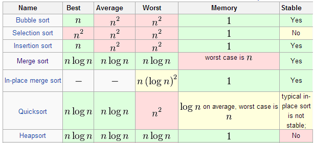

# 排序算法稳定性分析(Sorting algorithm stability)

## 概述

​		假定在待排序的记录序列中，存在多个具有相同的关键字的记录，**若经过排序，这些记录的相对次序保持不变**，即在原序列中，$r[i]=r[j]$，且$r[i]$在$r[j]$之前，而在排序后的序列中，$r[i]$仍在$r[j]$之前，则称这种排序算法是稳定的；否则称为不稳定的

* 对于不稳定的排序，只要举出一个实例，即可说明它的不稳定性；而对于稳定的排序算法，必须对算法进行分析从而得到稳定的特性。
* 需要注意的是，**排序算法是否为稳定的是由具体算法决定的，不稳定的算法在某种条件下可以变为稳定的算法，而稳定的算法在某种条件下也可以变为不稳定的算法**

## 示例代码

* 选择排序（不稳定）

  ```python
  def swap(lyst, m, n):
      """
  	交换list元素
      :param n:
      :param m:
      :return:
      """
      lyst[m], lyst[n] = lyst[n], lyst[m]
  
  
  def select_sort(lyst):
      """
      选择排序（不稳定）
      :param lyst:
      :return:
      """
  
      for i in range(len(lyst) - 1):
          min_index = i
          for j in range(i+1, len(lyst)):
              if lyst[j] < lyst[min_index]:
                  min_index = j
          swap(lyst, i, min_index)
  
      return lyst
  ```

* 改进的选择排序（稳定）

  ```python
  def displacement(lyst, m, n):
      """
      移动 list 元素位置 同时保持其他元素相对位置不变
      :param lyst:
      :param m:
      :param n:
      :return:
      """
      v = lyst[n]
      # move index between (m, n-1) to (m+1, n)
      for i in range(n, m, -1):
          lyst[i] = lyst[i-1]
      lyst[m] = v
      
      
  def stable_select_sort(lyst):
      """
      选择排序（稳定）
      不交换元素
      :param lyst:
      :return:
      """
      for i in range(len(lyst) - 1):
          min_index = i
          for j in range(i+1, len(lyst)):
              if lyst[j] < lyst[min_index]:
                  min_index = j
          custom_displacement(lyst, i, min_index)
      return lyst
    
  ```

  

## 常见排序算法的稳定性分析



​		常见算法的稳定性(无特殊处理)：选择排序、快速排序、希尔排序、堆排序不是稳定的排序算法，而冒泡排序、插入排序、归并排序和基数排序是稳定的排序算法

## 参考资料

