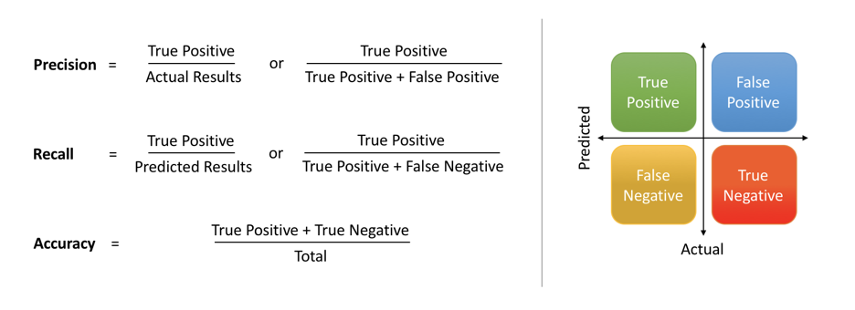
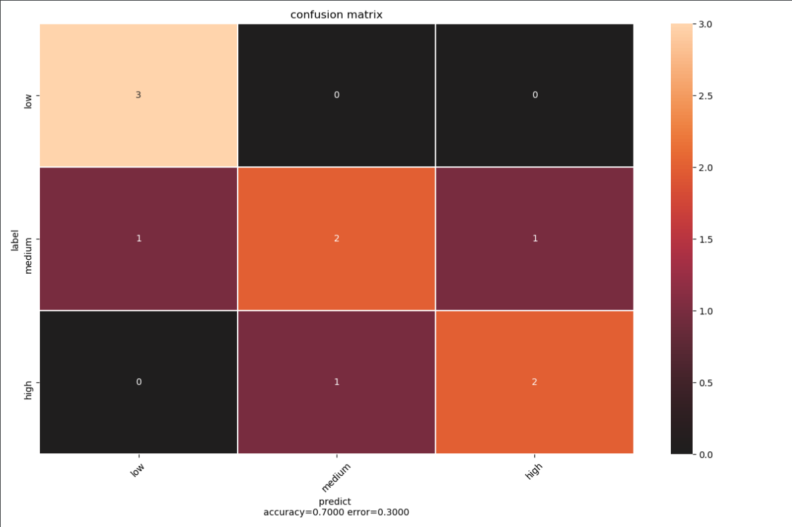
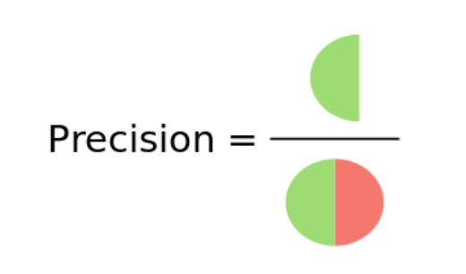
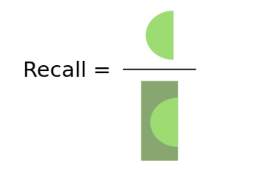
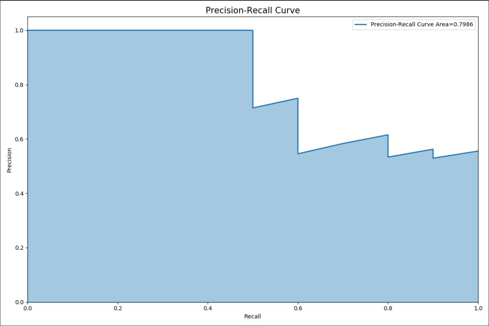
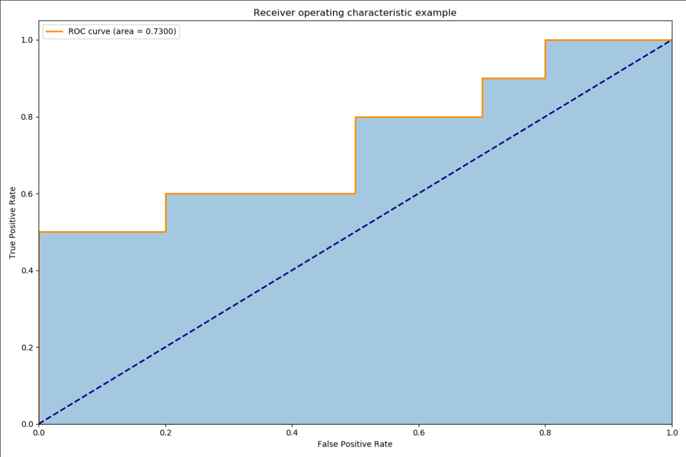

# 单标签和多标签分类模型的性能度量指标总结

**最近在做多标签分类相关的项目, 因此就想系统地总结下分类任务中的相关性能度量的指标, 同时也加深了对相关概念的理解.**

## 基本概念


上图为分类问题的示例图， 图中点代表样本， 其中**实心点代表标签为正例的样本**， **空心点代表标签为负例的样本**。**圆圈实线代表分类边界， 圆内的样本分类为正例， 圆外的样本分类为负例。**

### 真正例（True Positive， TP）：正样本预测为正类的数量

### 假负例（False Negative， FN）：正样本被预测为负类的数量

### 假正例（False Positive， FP）：负样本被预测为正类的数量

### 真负例（True Negative， TN）：负样本被预测为负类的数量

### 混淆矩阵(confusion matrix)



* 混淆矩阵实现代码

  ```python
  import seaborn as sns
  import numpy as np
  from sklearn.metrics import confusion_matrix
  import matplotlib.pyplot as plt
  
  
  def get_confusion_matrix(y_label, y_pred):
      """
  
      :param y_label:
      :param y_pred:
      :return:
      """
      y_label = np.asarray(y_label, dtype=np.int32)
      y_pred = np.array(y_pred, dtype=np.int32)
      # get unique label
      labels = np.asarray(sorted(set(y_label)))
      # num classes
      num_labels = labels.size
      # label_to_ind = {y: x for x, y in enumerate(labels)}
      # # # convert yt, yp into index
      # y_pred = np.array([label_to_ind.get(x, num_labels + 1) for x in y_pred])
      # y_label = np.array([label_to_ind.get(x, num_labels + 1) for x in y_label])
      cm = np.zeros((num_labels, num_labels), dtype=np.int32)
  
      for l_index, p_index in zip(y_label, y_pred):
          cm[l_index, p_index] += 1
  
      return cm
  
  
  def visual_confusion_matrix(cm, normalize=False, title='confusion matrix', ticklabel=None):
      """
  
      :param cm:
      :param normalize:
      :param target_name:
      :return:
      """
      accuracy = np.trace(cm) / float(np.sum(cm))
      error = 1 - accuracy
  
      plt.figure(figsize=(12, 8))
      plt.title(title)
      if normalize:
          cm = cm.astype('float') / cm.sum(axis=1)[:, np.newaxis]
      sns.heatmap(cm, annot=True, center=0, linewidths=.5)
  
      if ticklabel is not None:
          tick_marks = np.arange(len(ticklabel)) + 0.5
          plt.xticks(tick_marks, ticklabel, rotation=45)
          plt.yticks(tick_marks, ticklabel)
  
      plt.tight_layout()
      plt.ylabel('label')
      plt.xlabel('predict \naccuracy={:0.4f} error={:0.4f}'.format(accuracy, error))
      plt.show()
  
  
  def main():
      class_name = ['low', 'medium', 'high']
  
      y_label = [0, 1, 2, 1, 1, 0, 2, 1, 0, 2]
      y_pred =  [0, 1, 1, 2, 1, 0, 2, 0, 0, 2]
  
      # cm = confusion_matrix(y_label, y_pred)
      cm = get_confusion_matrix(y_label, y_pred)
      visual_confusion_matrix(cm, ticklabel=class_name)
      print('Done')
  
  
  if __name__ == "__main__":
      main()
  ```

  

## 错误率和准确率

### 错误率

分类错误样本占样本总数的比例

$$ Error = \frac{FN+FP}{TP+FN+FP+TN}$$

### 准确率（精度）

分类争取的样本占样本总数的比例

$$ Accuracy = \frac{FN+FP}{TP+FN+FP+TN}$$

## 查准率、查全率 与 F1

**准确率是所有类别整体性能的平均，如果希望对每个类都进行性能估计，就需要计算查准率和查全率。  **

### 准确率/查准率(precision) 

类别 c 的查准率为是所有预测为类别 c 的样本中，预测正确的比例

$$P_c = \frac{TP}{TP+FP}$$




### 召回率/查全率(recall)

类别c的查全率为是所有真实标签为类别 c 的样本中，预测正确的比例

$$R_c = \frac{TP}{TP+FN}$$



### F 分数

* F 分数是一个综合指标，为查准率和查全率的加权调和平均。

$F_1$是基于查准率和查全率的**调和平均（harmonic mean）**:
$$
\frac{1}{F_1} = \frac{1}{2}\left(\frac{1}{P} + \frac{1}{R}\right)
$$
更一般的表示
$$
F_1 = \frac{2\times P \times R}{P+R}
$$
$F_{\beta}$是基于查准率和查全率的**加权调和平均（weighted harmonic mean）**:
$$
\frac{1}{F_{\beta}} = \frac{1}{1 + \beta^2}\left(\frac{1}{P} + \frac{\beta^2}{R}\right)
$$
更一般的表示
$$
F_{\beta} = \frac{(1+{\beta}^2)\times P \times R}{{\beta}^2 \times P + R}
$$
$\beta>0$ 度量了查全率对查准率的相对重要性, 

* 当$\beta=1$时， 退化为调和平均, 查全率和查准率具有相同的权重，称为**F1度量**
* 当 $\beta < 1$, 查准率与查全率相比具有相对更大的权重， 因此查准率具有更大影响
* 当$\beta>1$，同理查全率具有相对更大的权重，因此查全率具有更大的影响

### 宏平均和微平均

宏平均和微平均主要针对多分类任务.

* 宏(macro)平均是每一类的性能指标的算术平均值  

  $$P_{macro} = \frac{1}{C} \sum\limits_{c=1}^C P_c$$

  $$R_{macro} = \frac{1}{C} \sum\limits_{c=1}^C R_c$$

  $$F1_{macro} = \frac{2 \times P_{macro} \times R_{macro}}{P_{macro} + R_{macro}}$$

* 微(micro) 微平均是每一个样本的性能指标的算术平均

  $$P_{micro} = \frac {\bar{TP}}{\bar{TP}+\bar{FP}}$$

  $$R_{micro} = \frac {\bar{TP}}{\bar{TP}+\bar{FN}}$$

  $$F1_{micro} = \frac{2 \times P_{micro} \times R_{micro}}{P_{micro} + R_{micro}}$$

**当不同类别的样本数量不均衡时，使用宏平均会比微平均更合理些。宏平均会更关注于小类别上的评价指标。**  

### P-R 曲线 / AP

查准率(P) 和查全率(R)是一对矛盾的度量,一般查准率高(设置高的阈值)时, 查全率往往偏低;而查全率较高时(设置低的阈值), 查准率往往偏低.

* P-R 曲线

  Precison-Recall 曲线, 一般情况下横轴为Recall值, 纵轴为Precision值.

  P-R 曲线 绘制过程:

  * 首先根据预测结果的预测分数, **由高到低将预测结果和对应标签进行排序**

  * 根据排序后的结果,  **每次迭代, 逐个把样本预测为正例**(这里可以理解为依次将每个样例的预测值作为之心度阈值) 计算并存储当前的查全率和查准率

  * 逐个连接查全率和查准率点对,得到PR曲线

    

  P-R 曲线理解: 

  * 对于查准率, 前期,样本为正例的预测分数较高, 因此将样本预测标签设置为正例所得到准确率也较高, 后期样本的为正例的预测分数逐渐降低, 导致负例样本被误分类为正例. 最后, 查准率的值等于样本中正例所占的比例. 因此查准率的大小的**变化趋势**是, **随着阈值的降低,查准率逐渐降低(可能会有一定的波动)**
  * 对于查全率, 随着预测标签设置为正例的数目的增加, 逐渐覆盖的所有的正例, 最后所有的正例被预测为正例. 因此**查全率值的大小随着阈值降低逐渐从0 增加到1.**

* AP(Average Precision)

  **P-R 曲线下方区域面积**

* P-R 曲线的特点

  * PR 曲线的两个指标P 和 R都聚焦于正例.
  * 在类别不平衡的情况下, 准确率(P) 和召回率(R) 仍然能够有效低判断分类器对于正例的分类性能.

* P-R 曲线 实现代码

  实现思路参考[sklearn P-R](https://scikit-learn.org/stable/auto_examples/model_selection/plot_precision_recall.html#sphx-glr-auto-examples-model-selection-plot-precision-recall-py)

  ```python
  import numpy as np
  import matplotlib.pyplot as plt
  
  
  def get_precision_and_recall(y_label, y_prob):
      """
  
      :param y_label: true label
      :param y_score: predict probability
      :param n:
      :return:
      """
      assert len(y_label) == len(y_prob)
      # invert sort y_pred
      score_indices = np.argsort(y_prob, kind="mergesort")[::-1]
      y_prob = np.array(y_prob)[score_indices]
      y_true = np.array(y_label)[score_indices]
  
      # ------------------get tps and fps at distinct value -------------------------
      # extract the indices associated with the distinct values
      distinct_value_indices = np.where(np.diff(y_prob))[0]
      threshold_idxs = np.r_[distinct_value_indices, y_true.size - 1]
      # accumulate the true positives with decreasing threshold
      tps = np.cumsum(y_true)[threshold_idxs]
      # computer false positive
      fps = threshold_idxs + 1 - tps
      #------------------------ computer precision and recall------------------------
      # computer precision
      precision = tps / (tps + fps)
      precision[np.isnan(precision)] = 0
      # computer recall
      recall = tps / tps[-1]
  
      # stop when full recall attained
      last_ind = tps.searchsorted(tps[-1])
      sl = slice(last_ind+1)
  
      # add (0, 1) vertex to P-R curve
      final_precision = np.r_[1, precision[sl]]
      final_recall = np.r_[0, recall[sl]]
      #------------------------ computer AP------------------------------------------
      height = np.diff(final_recall)
      bottom = np.convolve(final_precision, v=[1, 1], mode='valid')
      ap = np.sum(height * bottom / 2)
  
      return final_precision, final_recall, ap
  
  
  def pr_plot(precision, recall, area):
  
      plt.figure(figsize=(12, 8))
      plt.plot(recall, precision, linestyle='-', linewidth=2,
               label='Precision-Recall Curve Area={:.4f}'.format(area))
      plt.fill_between(recall, precision, color='C0', alpha=0.4, interpolate=True)
      plt.xlim([0, 1.0])
      plt.ylim([0, 1.05])
      plt.xlabel('Recall')
      plt.ylabel('Precision')
      plt.title('Precision-Recall Curve', fontsize=15)
      plt.legend(loc="upper right")
      plt.show()
  
  def main():
      y_label = [1, 1, 1, 1, 1, 0, 1, 0, 1, 0, 0, 1, 0, 0, 1, 0, 0, 0, 1, 0]
  
      y_prob = [-0.20079125, 0.30423529, 0.2010557, 0.27523383, 0.42592946, -0.15043958,-0.08794977, -0.12733765, 0.22931154, -0.23913774, -0.0638661, -0.14958713,-0.04915145, 0.09898199, 0.05155884, -0.1142967, 0.16105883, 0.04871601,-0.08258422, -0.26105925]
  
      precision, recall, ap = get_precision_and_recall(y_label, y_prob)
      pr_plot(precision, recall, ap)
  
      print('Done')
  
  if __name__ == "__main__":
      main()
  ```
  
  

### ROC 与 AUC

概率学上的意义：随机选取一个正例和一个负例，分类器给正例的打分大于分类器给负例的打分的概率率。**与P-R 曲线的一个共同点是, ROC 曲线也选择召回率(Recall)作为指标**

* ROC (Receiver Operation Characteristic)

  受试者工作特征, 横轴为假正例率(False Positive  Rate), 纵轴为真正例率(True, Positive Rate)

  $$TPR = \frac{TP}{TP + FN}$$

  表示所有真实类别为正例的样本中,  被预测为正例的比率, 其中$$TP+FN$$为固定值

  $$FPR = \frac{FP}{FP + TN}$$

  表示所有真实类别为负例的样本中, 被预测为正例的比率,  其中$$FP+TN$$为固定值

  ROC曲线绘制过程:

  * 首先根据预测结果的置信度分数, **由高到低将预测结果和对应标签进行排序**
  * 根据排序后的结果, 将分类阈值依次设置为每个样例的预测值, 即依次将每个样例划分为正例

  ROC 曲线的理解:

  * 把ROC 看作一条曲线, 容易得到曲线梯度公式

    $$\Delta = \frac{TPR}{TPN} = \frac{FP+TN}{TP+FN}\frac{TP}{FP}$$

    由于 $ \frac{FP+TN}{TP+FN}$ 为固定值, 因此曲线的斜率主要取决于$\frac{TP}{FN}$, 前期,置信度阈值较高, 将预测标签设置为正例, 得到的预测正例中真实正例(TP)所占的比率较高, 因此 $\frac{TP}{FP}$对应的值较大, 曲线的斜率也较大; 后期随着置信度阈值的降低, 得到的预测正例中真实正例(TP)所占的比率逐渐降低, 假正例(FP)所占的比率逐渐升高.  $\frac{TP}{FP}$对应的值也组件减小, 曲线的斜率也逐渐降低.

  * 对于真正例率(TPR) / 召回率,  **其分子$TP$表示已经预测的样本中对应真正例的数量, 分母$TP+FN$的值表示数据样本中所有的正例的数量,为固定值**, 因此随着阈值的降低, $$TP$$ 逐渐增加并逐渐覆盖所有的真正例, 所有的正例被预测为正例, 即$TP$接近于$TP+FN$, 因此**TPR 的数值随着阈值降低,逐渐由0逐渐变为1.**
  * 对于假正例率(FPR),  同理**其分子$FP$表示已经预测的样本中对应假正例的数量, 分母$FP+TN$的值表示数据样本中所有负例的数量,为固定值**, 因此随着阈值的降低, $$FP$$ 逐渐增加并逐渐覆盖所有的假正例, 最后所有的负例被预测为正例, 即$FP$接近于$FP+TN$, 因此 **FPR 的数值随着阈值降低,逐渐由0逐渐变为1.**

* AUC (Area Under ROC Curve) 

  **ROC 曲线 下方区域面积**, 

* ROC 曲线的特点:

  * ROC曲线的两个指标 TPR 和 FPR分别**兼顾正例和负例*(*, 是一个比较均衡的评估方法
  * ROC曲线的两个指标TPR 和 FPR分别只考虑正例和负例, **这意味着两个指标不依赖于具体的类别分布**, 更进一步说, 即使正例(P)和负例(N)的比例发生很大的变化, ROC 曲线也不会发生变化. 这可以看作是ROC曲线的一个优点.
  * 根据第二点说明, ROC 曲线的一个优点是曲线不会随着类别分布的改变而改变, 即对类别分布不敏感, **但这某种程度也是一种缺点**, 当正负例类别很明显不平衡的情况下, 根据公式$FPR = \frac{FP}{FP +TN}$, 在**负例数目远远大于正例的情况下(即$FP+TN$的值很大)**, 即使FP数值大幅增长, 大量的负例被错判成正例, 只能换来FPR 很微小的改变,  **此时上查准率(Precision)$P = \frac{TP}{TP+FP}$由于FP 的增加已经发生了急剧下降**, 但是此时ROC曲线的变化无法体现出这种变化.

* ROC 曲线实现代码

  实现思路参考[sklearn ROC](https://scikit-learn.org/stable/auto_examples/model_selection/plot_roc.html#sphx-glr-auto-examples-model-selection-plot-roc-py)

  ```python
  import numpy as np
  import matplotlib.pyplot as plt
  
  
  def get_roc(y_label, y_score):
  
      """
  
      :param y_label:
      :param y_score:
      :return:
      """
      assert len(y_label) == len(y_score)
      # invert sort y_pred
      score_indices = np.argsort(y_score, kind="mergesort")[::-1]
      y_prob = np.array(y_score)[score_indices]
      y_true = np.array(y_label)[score_indices]
  
      # ------------------get tps and fps at distinct value -------------------------
      # extract the indices associated with the distinct values
      distinct_value_indices = np.where(np.diff(y_prob))[0]
      threshold_idxs = np.r_[distinct_value_indices, y_true.size - 1]
  
      # accumulate the true positives with decreasing threshold
      tps = np.cumsum(y_true)[threshold_idxs]
  
      # computer false positive
      fps = threshold_idxs + 1 - tps
      # ------------------------------ computer tpr and fpr---------------------------
      # Add an extra threshold position
      # to make sure that the curve starts at (0, 0)
      tps = np.r_[0, tps]
      fps = np.r_[0, fps]
      if fps[-1] <= 0:
          fpr = np.repeat(np.nan, fps.shape)
      else:
          fpr = fps / fps[-1]
      if tps[-1] <= 0:
          tpr = np.repeat(np.nan, tps.shape)
      else:
          tpr = tps / tps[-1]
      # -------------------------------computer auc------------------------------------
      height = np.diff(fpr)
      bottom = np.convolve(tpr, v=[1, 1], mode='valid')
      auc = np.sum(height * bottom / 2)
  
      return tpr, fpr, auc
  
  
  def roc_plot(tpr, fpr, auc):
      """
  
      :param tpr:
      :param fpr:
      :param auc:
      :return:
      """
      plt.figure(figsize=(12, 8))
  
      plt.plot(fpr, tpr, color='darkorange',
               lw=2, label='ROC curve (area = {:.4f})'.format(auc))
      plt.plot([0, 1], [0, 1], color='navy', lw=2, linestyle='--')
      plt.fill_between(fpr, tpr, color='C0', alpha=0.4, interpolate=True)
      plt.xlim([0.0, 1.0])
      plt.ylim([0.0, 1.05])
      plt.xlabel('False Positive Rate')
      plt.ylabel('True Positive Rate')
      plt.title('Receiver operating characteristic example')
      plt.legend(loc="upper left")
      plt.show()
  
  
  def main():
      y_label = [1, 1, 1, 1, 1, 0, 1, 0, 1, 0, 0, 1, 0, 0, 1, 0, 0, 0, 1, 0]
  
      y_score = [-0.20079125, 0.30423529, 0.2010557, 0.27523383, 0.42592946, -0.15043958, -0.08794977, -0.12733765, 0.22931154, -0.23913774, -0.0638661, -0.14958713, -0.04915145, 0.09898199, 0.05155884, -0.1142967, 0.16105883, 0.04871601,-0.08258422, -0.26105925]
  
      tpr, fpr, auc = get_roc(y_label, y_score)
      roc_plot(tpr, fpr, auc=auc)
      print('Done')
  
  
  if __name__ == "__main__":
      main()
  ```
  
  

### P-R 曲线和 ROC 曲线的使用场景

* ROC 曲线同时考虑了正例和负例, 因此适用于评估分类器的整体性能.而P-R曲线则专注于正例 
* 如果类别分布想剔除类别分类改变的影响, 只单纯比较分类器的性能, ROC 曲线比较合适.
* 如果类别分布平均且正例和负例都重要的情况下, ROC 曲线也是不错的选择.
* 在类别不平衡的情况下(比如负例较多), 由于 ROC 曲线 的使用了FPR 指标, 会使得FP的增长会被稀释, 这种情况下,ROC 曲线会呈现出过度乐观了的结果. 因此在类别不平衡的情况下, P-P曲线是更好的选择. (比如在目标检测任务中的检测起的性能评价指标)
* 如果想要评估在相同类别分布下正例的预测情况, 宜选P-R曲线.

## 单标签分类

单标签分类可以分为二分类和多分类两类, 这里分别实现了micro 和 macro 两种模式下的查准率(Precision),查全率(Recall) 和 F1指标. **容易得出, 对于二分类任务来说, micro 和 macro 两种模式得到的指标是相同的**

### 实现步骤

### 自定义实现

* 代码

```python
import numpy as np
import warnings

from sklearn.metrics import precision_score, recall_score, f1_score


def get_multi_confusion_matrix(y_label, y_pred):

    y_label = np.array(y_label, dtype=np.int32)
    y_pred = np.array(y_pred, dtype=np.int32)

    # label_ind = np.where(y_label)
    labels = np.asarray(sorted(set(y_label)))
    # num classes
    num_labels = labels.size

    multi_cm = []
    # computer tp fp fn tn per class
    for l in range(num_labels):
        class_label = y_label == l
        class_pred = y_pred == l

        tp = np.sum(class_label * class_pred)
        fp = np.sum((1 - class_label) * class_pred)
        fn = np.sum(class_label * (1 - class_pred))
        tn = np.sum((1 - class_label) * (1 - class_pred))

        multi_cm.append([tn, fp, fn, tp])

    multi_cm = np.array(multi_cm).reshape(-1, 2, 2)

    return multi_cm


def single_label_precision_recall_f(y_true, y_pred, beta=1.0, average='micro'):

    # ----------------------get confusion matrix of per class------------------------------
    multi_cm = get_multi_confusion_matrix(y_true, y_pred)

    # ----------------------computer precision recall and f-score-------------------------
    tp = multi_cm[:, 1, 1]
    fp = multi_cm[:, 0, 1]
    fn = multi_cm[:, 1, 0]

    tp_sum = tp
    pred_sum = tp + fp
    label_sum = tp + fn

    if average == 'micro':
        tp_sum = np.array([tp.sum()])
        pred_sum = np.array([pred_sum.sum()])
        label_sum = np.array([label_sum.sum()])

    # removing warnings if zero_division is set to something different than its default value
    warnings.filterwarnings("ignore")

    precision = tp_sum / pred_sum
    recall = tp_sum / label_sum
    f1_score = (1+ beta **2) * precision * recall / ( beta **2 * precision + recall)
    f1_score[np.isnan(f1_score)] = 0

    precision = np.average(precision)
    recall = np.average(recall)
    f1_score = np.average(f1_score)

    return precision, recall, f1_score


def main():

    # binary class classify
    binary_class_true = [0, 1, 1, 0, 1, 0, 0, 1, 0, 0]
    binary_class_pred = [0, 1, 0, 0, 1, 1, 0, 1, 0, 1]

    # multi class classify
    multi_class_true = [0, 2, 2, 1, 1, 0, 2, 1, 0, 2]
    multi_class_pred = [0, 1, 1, 2, 1, 0, 2, 0, 0, 2]

    # micro precision recall f1_score
    binary_precision = precision_score(binary_class_true, binary_class_pred, average='micro')
    binary_recall = recall_score(binary_class_true, binary_class_pred, average='micro')
    binary_f1 = f1_score(binary_class_true, binary_class_pred, average='micro')
    print('slearn result of binary-class classify: P={} R={} F={}'.format(binary_precision, binary_recall, binary_f1))
    binary_precision_custom, binary_recall_custom, binary_f1_custom = single_label_precision_recall_f(binary_class_true, binary_class_pred, average='micro')
    print('custom result of binary-class classify: P={} R={} F={} '.format(binary_precision_custom, binary_recall_custom, binary_f1_custom))

    multi_class_precision = precision_score(multi_class_true, multi_class_pred, average='micro')
    multi_class_recall = recall_score(multi_class_true, multi_class_pred, average='micro')
    multi_class_f1 = f1_score(multi_class_true, multi_class_pred, average='micro')
    print('slearn result of multi-class classify: P={} R={} F={}'.format(multi_class_precision, multi_class_recall, multi_class_f1))
    multi_class_precision_custom, multi_class_recall_custom, multi_class_f1_custom = single_label_precision_recall_f(multi_class_true,multi_class_pred,average='micro')
    print('custom result of multi_class classify: P={} R={} F={} '.format(multi_class_precision_custom, multi_class_recall_custom,
                                                              multi_class_f1_custom))

    

if __name__ == "__main__":
    main()
```

* 输出结果

  ```
  slearn result of binary-class classify: P=0.7 R=0.7 F=0.7
  custom result of binary-class classify: P=0.7 R=0.7 F=0.7 
  slearn result of multi-class classify: P=0.6 R=0.6 F=0.6
  custom result of multi_class classify: P=0.6 R=0.6 F=0.6 
  ```

  

## 多标签分类

对于多标签分类任务的评估可以理解为, 分别对结果的每一类标签做二分类评估, 最后再根据不同模式,完成最后的综合评估

### 实现步骤

### 自定义实现

* 代码

```python
import numpy as np
import warnings
from sklearn.metrics import precision_score, recall_score, f1_score


def get_multi_confusion_matrix(y_label, y_pred):

    y_label = np.array(y_label, dtype=np.int32)
    y_pred = np.array(y_pred, dtype=np.int32)

    # label_ind = np.where(y_label)
    labels = np.asarray(sorted(set(y_label)))
    # num classes
    num_labels = labels.size

    multi_cm = []
    # computer tp fp fn tn per class
    for l in range(num_labels):
        class_label = y_label == l
        class_pred = y_pred == l

        tp = np.sum(class_label * class_pred)
        fp = np.sum((1 - class_label) * class_pred)
        fn = np.sum(class_label * (1 - class_pred))
        tn = np.sum((1 - class_label) * (1 - class_pred))

        multi_cm.append([tn, fp, fn, tp])

    multi_cm = np.array(multi_cm).reshape(-1, 2, 2)

    return multi_cm


def multi_label_precision_recall_f(y_label, y_pred, beta=1.0, average='micro'):
    """

    :param y_label:
    :param y_pred:
    :param beta:
    :return:
    """
    y_label = np.asarray(y_label, dtype=np.int32)
    y_pred = np.asarray(y_pred, dtype=np.int32)

    assert y_label.shape == y_pred.shape

    # ----------------------get confusion matrix of per class------------------------------
    num_class = y_label.shape[1]

    multi_cms = np.zeros((0, 2, 2))

    for i in range(num_class):
        multi_cm = get_multi_confusion_matrix(y_label[:, i], y_pred[:, i])
        multi_cms = np.concatenate([multi_cms, multi_cm[1][np.newaxis, :]])

    # ----------------------computer precision recall and f-score-------------------------
    tp = multi_cms[:, 1, 1]
    fp = multi_cms[:, 0, 1]
    fn = multi_cms[:, 1, 0]

    tp_sum = tp
    pred_sum = tp + fp
    label_sum = tp + fn

    if average == 'micro':
        tp_sum = np.array([tp.sum()])
        pred_sum = np.array([pred_sum.sum()])
        label_sum = np.array([label_sum.sum()])

    precision = tp_sum / pred_sum

    # removing warnings if zero_division is set to something different than its default value
    warnings.filterwarnings('ignore')

    recall = tp_sum / label_sum
    f1_score = (1 + beta ** 2) * precision * recall / (beta ** 2 * precision + recall)
    f1_score[np.isnan(f1_score)] = 0

    precision = np.average(precision)
    recall = np.average(recall)
    f1_score = np.average(f1_score)

    return precision, recall, f1_score


def main():

    # multi label classify
    multi_label_true = [[1, 1, 0, 0, 1],
                        [1, 0, 0, 1, 0],
                        [0, 1, 1, 0, 1]]

    multi_label_pred = [[1, 0, 0, 1, 1],
                        [1, 0, 1, 1, 0],
                       [0, 1, 0, 0, 1]]

    multi_label_precision = precision_score(multi_label_true, multi_label_pred, average='micro')
    multi_label_recall = recall_score(multi_label_true, multi_label_pred, average='micro')
    multi_label_f1 = f1_score(multi_label_true, multi_label_pred, average='micro')
    print('slearn result of multi-label classify: P={} R={} F={}'.format(multi_label_precision, multi_label_recall, multi_label_f1))
    multi_label_precision_custom, multi_label_recall_custom, multi_label_f1_custom = multi_label_precision_recall_f(multi_label_true, multi_label_pred, average='micro')
    print('custom result of multi_label classify: P={} R={} F={} '.format(multi_label_precision_custom, multi_label_recall_custom,                                                                         multi_label_f1_custom))


if __name__ == "__main__":
    main()
```

* 输出结果

  ```
  slearn result of multi-label classify: P=0.75 R=0.75 F=0.75
  custom result of multi_label classify: P=0.75 R=0.75 F=0.75 
  ```

## 总结

本文代码的思路主要是参考[scikit-learn](https://scikit-learn.org/stable/)库并结合自己的理解实现, 主要目的是深入理解相关的知识点, 当然还有很大的优化空间. 

通过这个总结感触最深的就是scikit-learn真的是一个强大的库, 里面的实现代码真的可以用优雅来形容, 最关键的一点是多看这些优秀的代码也会有助于自己编程能力的提高会有很大帮助.

## 参考资料

* <https://medium.com/datadriveninvestor/confusion-matric-tpr-fpr-fnr-tnr-precision-recall-f1-score-73efa162a25f>
* <https://scikit-learn.org/stable/auto_examples/model_selection/plot_precision_recall.html>
* https://zhuanlan.zhihu.com/p/88896868
* <https://zhuanlan.zhihu.com/p/34655990>

