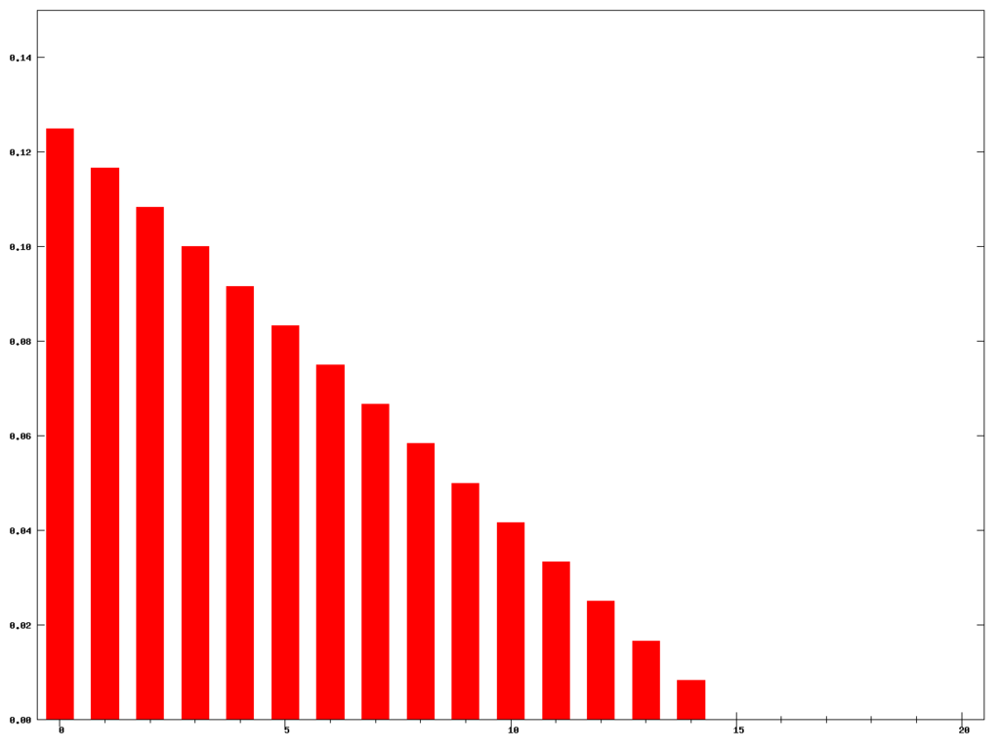
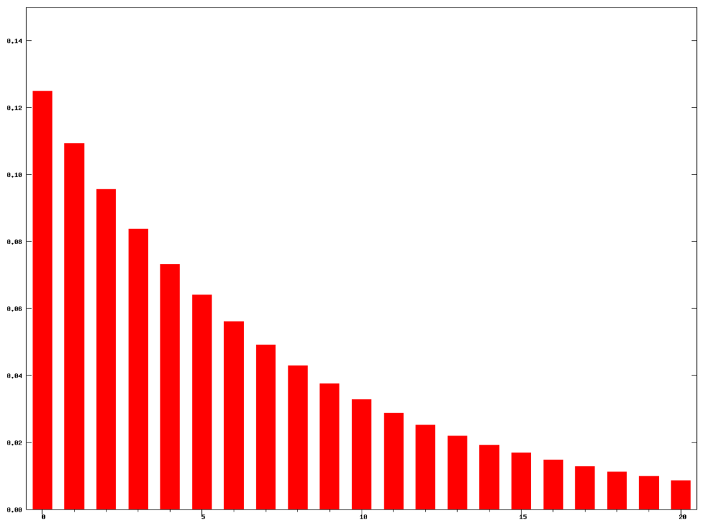
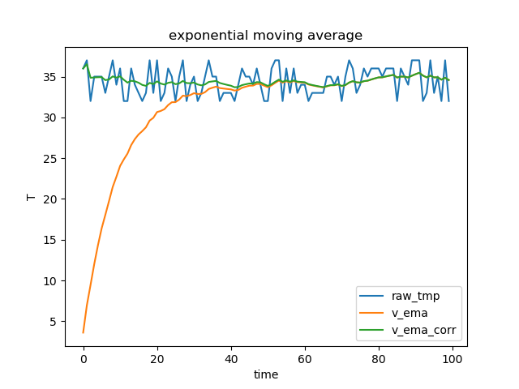
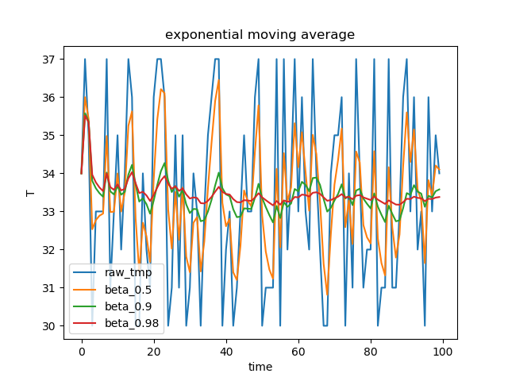

#  滑动平均

**滑动/移动平均(Moving Average, MA)**, 又称移动平均线，是技术分析中一种分析时间序列的常用工具。常见的移动平均包括**简单移动平均(Simple Moving Average, SMA)**、**权重移动平均(Weight Moving Average, WMA)**和**指数移动平均(Exponential Moving Average,EMA)**等，它们的主要区别是计算平均值的公式不同。

**特别指出，指数移动平均(ENA)，在深度学习中的各种优化算法和批归一化(Batch Normalization)等过程中都有使用**

## 简单移动平均

### 概念

计算公式如下 
$$
SMA_t = \frac{P_1 + P_2+ ...+P_n}{n}  \tag{1-1}
$$
这里$n$为时间周期

### 实例推导

计算某段时期温度的移动平均值，滑动的周期为5

| 日期 | 2020/06/04 | 2020/06/05 | 2020/06/06 | 2020/06/07 | 2020/06/08 | 202/06/09 |
| :--: | :--------: | :--------: | :--------: | :--------: | :--------: | :-------: |
| 温度 |     35     |     34     |     37     |     36     |     35     |    38     |

$$
SMA_i = \frac{35+34+37+36+35}{5} = 35.4 \tag{1-2}
$$

## 加权移动平均

### 概念

在计算**加权滑动平均（Weighted Moving Average, WMA）**时，窗口内的过滤函数的取值从当前数据到之前第$T-1$期的数据依次线性递减。下图为周期为15时的滑动窗口对应的权重系数。



计算公式如下
$$
WMA_t = \frac{Ty_t + (T-1)y_{t-1} + ... + 2y_{t-T+2} + y_{t-T+1}}{T(T-1)/2} \tag{2-1}
$$
这里n为时间周期

### 实例推导

计算某段时期温度的移动平均值，滑动的周期为5

| 日期 | 2020/06/04 | 2020/06/05 | 2020/06/06 | 2020/06/07 | 2020/06/08 |
| :--: | :--------: | :--------: | :--------: | :--------: | :--------: |
| 温度 |     35     |     34     |     37     |     36     |     35     |
| 权重 |    1/15    |    2/15    |    3/15    |    4/15    |    5/15    |

$$
WMA_i = \frac{35\times1+34\times2+37\times3+36\times4+35\times5}{15} \approx 35.533 \tag{2-2}
$$

## 指数移动平均

### 概念

**指数移动平均（Exponential Moving Average, EMA）**和加权移动平均类似，但不同之处是各数值的加权按**指数递减**，而非线性递减。

下图为周期为15时的滑动窗口对应的权重系数。



计算公式如下
$$
EMA_t=
\begin{cases}
y_1& \text{t=1}\\
\alpha y_t+ (1-\alpha)EMA_{t-1}& \text{t>1}  
\end{cases}       \tag{3-1}
$$
这里$\alpha\in(0,1)$表示权重的衰减程度。 $\alpha$越大，表示过去的观测值衰减的越快
$$
\alpha = \frac{2}{1+T} \tag{3-2}
$$
**$T$是用来计算** $\alpha$**的参数，它不表示指数衰减在 T 期后结束**。

**关于指数移动平均的计算，这里参考吴恩达深度学习课程中的计算公式进行描述**，与上述公式本质上没有区别。计算公式如下
$$
v_t = 
\begin{cases}
0& \text{t=0}\\
\beta v_{t-1}+ (1-\beta)\theta_t& \text{t>1}
\end{cases} \tag{3-3}
$$
$\beta$为权重因子, 通常取值为接近于1的值，如0.9， 0.98， 0.99， 0.999等。**$\beta$越小，过去过去累计值的权重越低，当前抽样值的权重越高，移动平均值的实时性就越强。反之$\beta$越大，吸收瞬时突发值的能力变强，平稳性更好。**

$\theta$为某一时刻真实值

$v$为某一时刻指数移动平均值

指数移动平滑的近似周期计算公式为
$$
T \approx \frac{1}{1-\beta} \tag{3-4}
$$

### 权重因子如何确定

**权重因子是指数移动平均计算中最关键的参数，如何确定权重因子的大小成为一个关键问题。**下面重新推导指数移动平均公式，进一步理解指数移动平均的含义，从而确定权重因子的大小。

根据公式$(3-3)$,可以得到如下推导公式，设$\beta=0.9$，求解$v_{100}$的表达式，过程如下
$$
\begin{align}
v_{100} =&  0.1\times \theta_{100} + 0.9\times v_{99} \\
v_{100} =& 0.1v_{100} + 0.9(0.1\theta_{99}+0.9v_{98})\\
=& 0.1\times \theta_{100} + 0.1\times0.9\times \theta_{99}+0.9^2 \times v_{98}\\
v_{100} =& 0.1\theta_{100} + 0.1\times0.9\times \theta_{99}+0.9^2(0.1\theta_{98}+0.9v_{97}) \\
=& 0.1\times v_{100} + 0.1\times0.9\times \theta_{99}+0.1\times0.9^2\times \theta_{98} + 0.1\times 0.9^3\times v_{97}\\
....\\
v_{100} =& 0.1\times \theta_{100}+0.1\times0.9\times \theta_{99}+0.1\times0.9^2\times \theta_{98}+...+0.9^{98}(0.1\theta_{2} + 0.9v_{1}) \\
=& 0.1\times \theta_{100}+0.1\times0.9\times \theta_{99}+0.1\times0.9^2\times \theta_{98}+...+0.1\times0.9^{98}\times\theta_2 + 0.9^{99}\times v_1\\
v_{100} =& 0.1\times \theta_{100}+0.1\times0.9\times \theta_{99}+0.1\times0.9^2\times \theta_{98}+...+0.1\times0.9^{98}\times\theta_2 + 0.1 \times 0.9^{99} \times \theta_{1}

\end{align} \tag{3-5}
$$
由$(3-5)$最后一行的推导结果可以得出，$v_{100}$指数移动平均值，本质上前100项数值的加权平均。**这时我们考虑，到底需要平均多少项的数值。实际上，在计算当前项的指数移动平均值时，我们会加权平均，包含当前项的之前所有项的值。**

但是，通过公式可以看出项的权重随着指数系数的增加而减小，并趋近于零，如当权重系数大小为$0.99^{99} \approx 0$，这一项可以忽略。这意味指数移动平均值近似于当前项之后一定数量有效项的加权平均的结果（我们假设存在一个阈值，当项的权重系数大于阈值时为有效项；，当权重系数衰减到下雨阈值则为无效项。

**权重因子的作用本质上是控制指数权重平均计算中有效项的数目，即指数平滑有效窗口的大小**。

下面引入一个重要的公式
$$
（1-\epsilon）^{\frac{1}{\epsilon}} \approx \frac{1}{e} \tag{3-6}
$$
这里的权重衰减阈值设为自然数的倒数为$\frac{1}{e} \approx 0.368$，进一步说，当权重系数小于$\frac{1}{e}$时忽略当前项及之后项的加权值。

实际上，我们关心的并不是权重因子的大小，而是指数移动平滑的步长大小，即权重系数中
$$
\beta^n \tag{3-7}
$$
$n$对应的数值。

权重因子$\beta$表示为
$$
\beta = 1-\epsilon \tag{3-8}
$$
将公式$(3-8)$带入式$(3-6)$可以得到
$$
\beta^{\frac{1}{1-\beta}} \approx \frac{1}{e} \tag{3-9}
$$
结合公式$(3-7)$易得到，有效滑动窗口大小$n$
$$
\frac{1}{1-\beta} \approx n
$$
假设权重因子$\beta=0.9$
$$
(0.9)^{\frac{1}{0.1}} = (0.9)^{10} \approx 0.3487 \approx \frac{1}{e} \tag{3-10}
$$
此时对应的有效窗口大小$n$为10

假设权重因子$\beta=0.98$
$$
(0.98)^{\frac{1}{0.05}} = (0.8)^{50} \approx 0.3642 \approx \frac{1}{e} \tag{3-11}
$$
此时对应的有效窗口大小$n$为50

### 实例推导

计算某段时期温度的移动平均值，权重衰减系数为0.9

| 日期 | 2020/06/04 | 2020/06/05 | 2020/06/06 | 2020/06/07 | 2020/06/08 | 202/06/09 | 2020/06/10 | 2020/06/11 | 2020/0612 | 2020/06/13 | 2020/06/14 |
| :--: | :--------: | :--------: | :--------: | :--------: | :--------: | :-------: | ---------- | ---------- | --------- | ---------- | ---------- |
| 温度 |     35     |     34     |     37     |     36     |     35     |    38     | 37         | 37         | 39        | 38         | 37         |

$$
\begin{align}
v_0=&0 \\
v_1 =&  0.9\times0 + 0.1\times35= 3.5 \\
v_2 =&  0.9\times35 + 0.1\times34 = 6.55  \\
v_3 =&  0.9\times6.55 + 0.1\times37 = 9.595 \\
v_4 =&  0.9\times9.595 + 0.1\times36 = 12.2355 \\
v_5 =&  0.9\times12.2355 + 0.1\times35 =14.512\\
v_6 =&  0.9\times14.512 + 0.1\times38 =16.8608\\
v_7 =&  0.9\times16.8608 + 0.1\times37 =18.87472\\
v_8 =&  0.9\times18.87472 + 0.1\times37 =20.687248\\
v_9 =&  0.9\times20.687248 + 0.1\times39 =22.5185\\
v_{10} =&  0.9\times22.5185 + 0.1\times38 =24.067\\
v_{11} =&  0.9\times24.067 + 0.1\times37 =25.360\\
\end{align}
$$

可以看出，随着样本的增大，移动平均值会逐渐接近当前值(这里由于移动平均操作的步数较少，因此还有较大偏差)。容易得到上述公式有一个问题，就是在开始阶段的滑动平均值偏小，与真实值之间具有较大偏差，因此这里引入偏差修正公式(Bias correction in exponentially weighted averages  ) , 修正$v_t$后的计算公式如下
$$
v_t = \frac{v_t}{1 - \beta^t} \tag{3-12}
$$
可以发现发现随着$t$增加， $\beta_t$逐渐接近于 0。当$t$很大的时候，偏差修正项就几乎没有作用了。 

修正后的结果
$$
\begin{align}
v_0=&0 \\
v_1 =&  \frac{v_1}{1-0.9^1} = 35 \\
v_2 =&  \frac{v_2}{1-0.9^2} = 34.474  \\
v_3 =&  \frac{v_3}{1-0.9^3} = 35.406 \\
v_4 =&  \frac{v_4}{1-0.9^4} =35.578\\
v_5 =&  \frac{v_5}{1-0.9^5} =35.437 \\
v_6 =&  \frac{v_6}{1-0.9^6} =35.984\\
v_7 =&  \frac{v_7}{1-0.9^7} = 36.179  \\
v_8 =&  \frac{v_8}{1-0.9^8} = 36.323 \\
v_9 =&  \frac{v_9}{1-0.9^9} =36.760\\
v_{10} =&  \frac{v_{10}}{1-0.9^{10}} =36.950 \\
v_{11} =&  \frac{v_{11}}{1-0.9^{11}} =36.957\\
\end{align}
$$


### 代码验证

#### 指数移动平均和修正指数移动平均对比

通过random函数生成样本容量大小为100的数据，模拟一段时间连续时间内的温度变化。分别公式$(3-3)$和公式$(3-12)$计算指数移动平均结果和修正后结果

完整代码

```python
# @ Author     : Alex Chung
# @ Contact    : yonganzhong@outlook.com
# @ License    : Copyright (c) 2017-2018
# @ Time       : 2020/6/29 上午11:49

import matplotlib.pyplot as plt
import numpy as np


def main():
    beta = 0.9
    num_samples = 100

    # step 1 generate random seed
    np.random.seed(0)
    raw_tmp= np.random.randint(32, 38, size=num_samples)
    x_index = np.arange(num_samples)
    # raw_tmp = [35, 34, 37, 36, 35, 38, 37, 37, 39, 38, 37]  # temperature
    print(raw_tmp)

    # step 2 calculate ema result and do not use correction
    v_ema = []
    v_pre = 0
    for i, t in enumerate(raw_tmp):
        v_t = beta * v_pre + (1-beta) * t
        v_ema.append(v_t)
        v_pre = v_t
    print("v_mea:", v_ema)

    # step 3 correct the ema results
    v_ema_corr = []
    for i, t in enumerate(v_ema):
        v_ema_corr.append(t/(1-np.power(beta, i+1)))
    print("v_ema_corr", v_ema_corr)

    # step 4 plot ema and correction ema reslut
    plt.plot(x_index, raw_tmp, label='raw_tmp')  # Plot some data on the (implicit) axes.
    plt.plot(x_index, v_ema, label='v_ema')  # etc.
    plt.plot(x_index, v_ema_corr, label='v_ema_corr')
    plt.xlabel('time')
    plt.ylabel('T')
    plt.title("exponential moving average")
    plt.legend()
    plt.savefig('./ema.png')
    plt.show()


if __name__ == "__main__":
    main()
```

结果

```
[36 37 32 35 35 35 33 35 37 34 36 32 32 36 34 33 32 33 37 33 37 32 33 36 35
 32 35 37 32 34 35 32 33 35 37 35 35 32 33 33 33 32 34 36 35 35 34 36 34 32
 32 36 37 37 32 36 33 36 33 34 34 32 33 33 33 33 35 35 34 35 32 35 37 36 33
 34 36 35 36 36 36 35 36 36 36 32 36 35 34 37 37 37 32 33 37 33 35 32 37 32]
v_mea: [3.5999999999999992, 6.9399999999999986, 9.445999999999998, 12.001399999999997, 14.301259999999996, 16.371133999999994, 18.034020599999995, 19.730618539999995, 21.457556685999997, 22.711801017399996, 24.040620915659993, 24.836558824093995, 25.552902941684597, 26.597612647516137, 27.337851382764523, 27.904066244488071, 28.313659620039264, 28.782293658035339, 29.604064292231804, 29.943657863008625, 30.649292076707763, 30.784362869036986, 31.005926582133288, 31.505333923919956, 31.85480053152796, 31.869320478375165, 32.18238843053765, 32.664149587483884, 32.597734628735495, 32.737961165861947, 32.964165049275749, 32.867748544348174, 32.880973689913354, 33.092876320922016, 33.483588688829812, 33.635229819946829, 33.771706837952145, 33.594536154156927, 33.535082538741236, 33.481574284867115, 33.433416856380404, 33.290075170742362, 33.36106765366813, 33.624960888301317, 33.762464799471182, 33.886218319524062, 33.897596487571654, 34.107836838814492, 34.097053154933043, 33.887347839439741, 33.69861305549577, 33.928751749946194, 34.235876574951575, 34.512288917456416, 34.261060025710776, 34.434954023139696, 34.291458620825729, 34.46231275874316, 34.316081482868846, 34.284473334581961, 34.256026001123765, 34.03042340101139, 33.92738106091025, 33.834642954819223, 33.751178659337299, 33.676060793403572, 33.808454714063217, 33.927609242656892, 33.934848318391204, 34.041363486552079, 33.837227137896875, 33.953504424107187, 34.258153981696466, 34.432338583526821, 34.289104725174141, 34.260194252656731, 34.434174827391061, 34.490757344651954, 34.641681610186758, 34.777513449168083, 34.899762104251273, 34.909785893826147, 35.018807304443534, 35.11692657399918, 35.205233916599262, 34.884710524939337, 34.996239472445403, 34.996615525200859, 34.896953972680777, 35.1072585754127, 35.296532717871429, 35.466879446084285, 35.120191501475858, 34.908172351328275, 35.117355116195448, 34.905619604575904, 34.915057644118313, 34.623551879706483, 34.861196691735834, 34.575077022562255]
v_ema_corr [36.0, 36.526315789473685, 34.85608856088561, 34.897935446350672, 34.922859026641589, 34.939322475931519, 34.567593330382742, 34.643516381207832, 35.028198463529741, 34.870335047540927, 35.034963785032652, 34.612013853377299, 34.261790353336394, 34.487171234395902, 34.425823067402007, 34.250810596467574, 33.980679239609884, 33.86529236474852, 34.227721997462375, 34.087957725044262, 34.414940025297433, 34.147066630279397, 34.021204921923548, 34.236236754135, 34.318520190026163, 34.070653287473313, 34.169325735636093, 34.468025545943497, 34.209023669647316, 34.187196002593737, 34.271700418392953, 34.036452714197068, 33.929502338815666, 34.039614640650832, 34.343253735298745, 34.410442005975405, 34.470617905412809, 34.218963932255498, 34.095032182715869, 33.983886127614426, 33.88417102532398, 33.69347076098142, 33.724457575985063, 33.95424018981106, 34.059736942645237, 34.154507688435636, 34.138946910329508, 34.326243931325216, 34.293431641340902, 34.062900370860497, 33.85564901958616, 34.070983041975708, 34.364989349501236, 34.629384437965221, 34.365643363425662, 34.529527894925039, 34.376197139799814, 34.538938472549681, 34.384736734058791, 34.3461937986009, 34.311518337796613, 34.080029553956564, 33.971884926881543, 33.874581711906934, 33.78703063881818, 33.708252341272193, 33.83753822894149, 33.953874398357719, 33.958490172017143, 34.062706454523266, 33.856319423115934, 33.970745555360331, 34.273809432101608, 34.44649948148006, 34.301795994708208, 34.271606342396041, 34.444497522030403, 34.500062756971737, 34.650092901008769, 34.785113109380475, 34.906625691102967, 34.915964774677484, 35.024385565162532, 35.121960995217691, 35.209776224475888, 34.888761330174418, 34.999896810334143, 34.999907130271275, 34.899907953164018, 35.109933157010673, 35.298952800423244, 35.469068017111042, 35.122141949455148, 34.90991714752294, 35.118934834796363, 34.907032772723227, 34.916329834192958, 34.624687287274874, 34.862225568935216, 34.575995409368261]
```



这里有两点结论：

* 不经过修正的指数移动平均，在初始阶段的结果与真实的曲线有很大偏差；而经过修正后的指数移动平均的结果，从开始就可以很好的跟踪真实变化趋势；
* 虽然不经过修正的指数移动平均和经过修正指数移动平均在初始的阶段会有很大差异，但是随着步数的增加，两条曲线逐渐重合。因此指数移动平均的修正并不是必须的步骤。事实上，在机器学习中，在计算指数加权平均数的大部分时候，大家不在乎执行偏差修正，因为大部分人宁愿熬过初始时期，拿到具有偏差的估测，然后继续计算下去。  

#### 不同权重因子指数移动平均效果对比

通过random函数生成样本容量大小为100的数据，模拟一段时间连续时间内的温度变化。采用修正指数平均移动方法，对比权重因子$\beta$分别为0.5，0.9和0.98情况下的结果。

```python
# @ Author     : Alex Chung
# @ Contact    : yonganzhong@outlook.com
# @ License    : Copyright (c) 2017-2018
# @ Time       : 2020/6/29 上午14:27

import matplotlib.pyplot as plt
import numpy as np


def ema_corr(data, beta):
    v_ema = []
    v_ema_corr = []
    v_pre = 0
    for i, t in enumerate(data):
        v_t = beta * v_pre + (1 - beta) * t
        v_ema.append(v_t)
        v_pre = v_t

    for i, t in enumerate(v_ema):
        v_ema_corr.append(t / (1 - np.power(beta, i + 1)))
    return v_ema_corr


def ema_beta():

    beta_0 = 0.5
    beta_1 = 0.9
    beta_2 = 0.98
    num_samples = 1000

    # step 1 generate random seed
    np.random.seed(0)
    raw_tmp = np.random.randint(30, 38, size=num_samples)
    x_index = np.arange(num_samples)
    # raw_tmp = [35, 34, 37, 36, 35, 38, 37, 37, 39, 38, 37]  # temperature
    print(raw_tmp)

    # step 2 calculate ema result
    v_ema_5 = ema_corr(raw_tmp, beta_0)
    v_ema_9 = ema_corr(raw_tmp, beta_1)
    v_ema_98 = ema_corr(raw_tmp, beta_2)

    # step 3 plot ema reslut besed on different beta value
    plt.plot(x_index, raw_tmp, label='raw_tmp')  # Plot some data on the (implicit) axes.
    plt.plot(x_index, v_ema_5, label='beta_0.5')  # etc.
    plt.plot(x_index, v_ema_9, label='beta_0.9')
    plt.plot(x_index, v_ema_98, label='beta_0.98')
    plt.xlabel('time')
    plt.ylabel('T')
    plt.title("exponential moving average")
    plt.legend()
    plt.savefig('./ema.png')
    plt.show()


if __name__ == "__main__":
    ema_beta()
```

 结果

```
[34 37 35 30 33 33 33 37 31 33 35 32 34 37 36 30 30 34 32 31 36 37 37 36 30
 31 35 31 35 30 31 34 33 30 33 35 36 37 37 30 32 33 30 31 33 35 33 33 36 37
 30 31 31 31 37 30 37 32 34 37 33 36 33 32 37 34 32 30 30 34 35 35 36 30 34
 31 37 34 31 32 32 37 30 31 31 37 31 31 33 36 37 33 36 32 33 30 36 33 35 34]
v_ema_5 [34.0, 36.0, 35.428571428571431, 32.533333333333331, 32.774193548387096, 32.888888888888886, 32.944881889763778, 34.980392156862742, 32.986301369863014, 32.993157380254154, 33.997068881289692, 32.998290598290595, 33.499206446099379, 35.249710065311604, 35.624866481521039, 32.812390325780115, 31.406184434390521, 32.703097164524706, 32.351547911735366, 31.675773311398803, 33.837887686675877, 35.418944220291188, 36.209472204383871, 36.104736095949178, 33.052367957006929, 32.026183963212134, 33.513091992684394, 32.256545991661199, 33.62827299838564, 31.814136497503274, 31.40706824856208, 32.703534124582895, 32.851767062308703, 31.425883531071356, 32.212941765558583, 33.60647088279957, 34.803235441408496, 35.901617720708245, 36.450808860355117, 33.225404430174628, 32.612702215087033, 32.806351107543563, 31.403175553771622, 31.201587776885798, 32.100793888442922, 33.550396944221482, 33.275198472110738, 33.137599236055372, 34.56879961802769, 35.784399809013841, 32.892199904506924, 31.946099952253462, 31.473049976126731, 31.236524988063366, 34.118262494031683, 32.059131247015841, 34.529565623507921, 33.26478281175396, 33.63239140587698, 35.316195702938487, 34.158097851469243, 35.079048925734625, 34.039524462867313, 33.01976223143366, 35.00988111571683, 34.504940557858419, 33.252470278929209, 31.626235139464605, 30.813117569732302, 32.406558784866149, 33.703279392433075, 34.351639696216537, 35.175819848108269, 32.587909924054131, 33.293954962027065, 32.146977481013536, 34.573488740506768, 34.286744370253388, 32.643372185126694, 32.321686092563347, 32.16084304628167, 34.580421523140835, 32.290210761570421, 31.645105380785211, 31.322552690392605, 34.161276345196299, 32.58063817259815, 31.790319086299075, 32.395159543149539, 34.197579771574766, 35.598789885787383, 34.299394942893692, 35.149697471446842, 33.574848735723421, 33.287424367861711, 31.643712183930855, 33.821856091965429, 33.410928045982715, 34.205464022991357, 34.102732011495675]
v_ema_9 [34.0, 35.578947368421055, 35.365313653136532, 33.805175923233499, 33.608556567605191, 33.478678245429073, 33.386925245412577, 34.021317999969767, 33.528105617623247, 33.4470234532766, 33.673342387651623, 33.440146837845198, 33.515212953480571, 33.967059700710891, 34.223062420420021, 33.704703161122332, 33.260082679399197, 33.3471414686868, 33.191387234314448, 32.941918997186356, 33.285299438212313, 33.697346710830978, 34.059729831487758, 34.270575236321683, 33.810488153604986, 33.510026248510393, 33.668222706060718, 33.386665189467642, 33.55597330044268, 33.184634488027591, 32.957505608574856, 33.065461926333214, 33.058706984695625, 32.744085777255037, 32.770334239353531, 32.998439665599001, 33.304807477873467, 33.681195051903842, 34.018617097556394, 33.610726403194498, 33.447482158206618, 33.402191701707906, 33.058266648407034, 32.850424383885603, 32.865513644009674, 33.080652229168727, 33.072529581975139, 33.065230179978812, 33.360397412609316, 33.726243158081097, 33.351882408236968, 33.115708244688825, 32.903339529267704, 32.712359799025442, 33.142432639465298, 32.827326322176695, 33.245624810249161, 33.120785369024595, 33.208882734202824, 33.588676954908998, 33.529713897919443, 33.777102601767112, 33.699290406018143, 33.529160779446393, 33.876613389237889, 33.888963845060552, 33.699904963603487, 33.329628038042507, 32.996433264500347, 33.096852858834026, 33.287274955945946, 33.458634430217309, 33.712887123700362, 33.341445712391383, 33.407325515920945, 33.166512776182181, 33.549976419041116, 33.594990918520075, 33.335428818112241, 33.201856754211072, 33.081647442387535, 33.473552051291371, 33.12614151481187, 32.913496882610985, 32.722122505714154, 33.149959929766055, 32.934941468289892, 32.741429122377788, 32.767288398907901, 33.090584186832871, 33.481552572790918, 33.433394343973234, 33.690069163572268, 33.521053799834249, 33.468946075943151, 33.122037424180149, 33.409844168112926, 33.368858407302696, 33.531977380648108, 33.578780885749865]
v_ema_99 [34.0, 35.515151515151473, 35.339953747789401, 33.96424147617779, 33.76352343438252, 33.62975690348231, 33.53424836130781, 33.998711217451017, 33.637968859228025, 33.568217736021758, 33.711921451519991, 33.552882488418064, 33.591597713685971, 33.868300843002665, 34.031380201913031, 33.739465145269683, 33.482172736675125, 33.516143695971948, 33.42101829662036, 33.275345832126931, 33.43295682111598, 33.631772421728996, 33.813029138901712, 33.926868750400409, 33.728809760681237, 33.595242493173814, 33.662066898770455, 33.53882985717329, 33.604739871648952, 33.44612092733658, 33.34100757938667, 33.368689540536998, 33.353535669150865, 33.218547225544185, 33.209924764155069, 33.279201881417343, 33.382565629389831, 33.517564140995539, 33.645312212192337, 33.513783622304281, 33.460028400086316, 33.443942066059449, 33.32528984587691, 33.246319246487566, 33.23806903328159, 33.296297390480724, 33.286631465128529, 33.277397420836735, 33.36404955345526, 33.478418130500884, 33.370243850979108, 33.297341471747671, 33.22743339967036, 33.160352284533474, 33.27482862240813, 33.178140880689604, 33.289914841735637, 33.25253564319695, 33.274002957811206, 33.380089190625135, 33.369358239000135, 33.443021958022037, 33.430714858592452, 33.391276588356419, 33.490005672852845, 33.503856407963355, 33.46330406222787, 33.370560107502271, 33.280907505253566, 33.299909062894677, 33.344546110363652, 33.3877409683896, 33.4554884739211, 33.366400960733849, 33.382642166727948, 33.321909414647244, 33.415150849426944, 33.429898162227744, 33.368944768885115, 33.33477885375477, 33.301629993336029, 33.393036057757485, 33.30956995389046, 33.253016394642223, 33.198094056445612, 33.290370143206275, 33.23501696664971, 33.181225744173759, 33.17688176653288, 33.244284270234878, 33.333606581248489, 33.32570230705867, 33.38883234766292, 33.356165080748248, 33.347816979993105, 33.269616910457017, 33.333181152339058, 33.325449943393856, 33.364182464704442, 33.378843102712054]
```



可以看出，随着权重因子$\beta$的增大，指数移动平均曲线逐渐变得更加平滑，但同时知识移动平均值的实时性也随之变弱。

## 参考资料

[移动平均：你知道的与你不知道的](https://zhuanlan.zhihu.com/p/38276041)

[维基百科](https://en.wikipedia.org/wiki/Moving_average)

[investopedia](https://www.investopedia.com/terms/m/movingaverage.asp)