算法面试题目

## 数据结构

## 概率论

1. 54 张牌， 分成6份， 每张9张牌， 大小王在一起的概率

   $\frac{C_6^1 C_{52}^{4}}{C_{54}{6}}$

2. 一张硬币， 扔了一亿次正面都朝上， 再仍一次反面朝上的概率是多少

   $\frac {1}{100000000+2}$

3.  50 个红球和50个蓝球， 放入两个箱子， 怎样放置才能使得拿到的红球的概率最大

   $\frac{1}{2} + \frac{1}{2} \frac{49}{99}$

4. 将一根木棍分层三段，这三段构成三角形的概率

   0.25

5. 一个公交站再一分钟内有车经过的概率是p, 问三分钟内有车经过的概率

   1. $ 1 - (1-p)^3$

6. 一个小兵生命力为15， 现在每次攻击早曾的伤害在0到10之间，求两次攻击能够打死小兵的概率i|A

   $\frac{1}{4}$

7. 什么是马尔可夫链

   马尔可夫链描述的是随机变量的一个状态序列， 在这个状态序列里， 未来信息只与当前信息有关， 而与过去的信息无关。它有两个重要的假设:

   * t+1 时刻的状态概率分布只与t 时刻有关
   * t 到 t+1 时刻的状态转移与 t 时刻的状态值无关

   一个 马尔可夫链可以看作是 状态空间（所有可能的状态） + 状态转移矩阵 （条件概率分布）+ 初始概率分布（初始状态）

8. 什么是正态分布

   正态分布又称高斯分布， 他是连续型随机变量的分布， 主要由两个参数$u$ 和$\sigma^2$代表期望和方差。

   正态分布的规律： 取值里 $u$ 越近的概率越大， 同时 $\sigma$ 描述了分布的集中程度， $\sigma$ 越大，概率密度曲线越胖，  $\sigma$ 越小，概率密度曲线越矮

9. 全概率公式和贝叶斯公式区别

   全概率公式：事件A 发生的所有可能的原因是 $B_i（i=1，\dots, n）$, 、在事件 A 未发生的情况下， 已知 原因 B 的概率$P(B_i)$ 和 $P(B_i)$发生的情况下 A 发生的概率$P(A|B_i)$, 求 事件 A 发生的概率

   贝叶斯公式：在事件A已发生的情况下， 求导致 A 发生的各种原因 $B_i$的概率， 即$P(B_i|A)$

10. 什么是大数定理

    通俗地说就是， 样本数量很大的时候， 样本均值和数据期望充分接近，也就是说当我们大量重复某一相同的实验时， 其最后的实验结果可能会稳定在某一数值附近。

    

## 计算机视觉

### 边缘检测

### 特征点检测

### 什么是感受野

感受野是指， 对于某层输出特征图上的某个点， 在卷积神经网络原始输入数据能够影响到这个点的取值的区域。

感受野的计算公式
$$
R_e^{(i)}= min\left(R_e^{(i-1)} + (k_e^{(i-1)}\prod_{j=0}^{i-1}s_e^{(j)}, L_e \right)
$$

> 原始的 VGG 论文的主要贡献并不是网络本身， 而是对于堆叠多个卷积作用的阐释： $7\times7$的卷积层的正则等效于 3 个$3 \times 3$的卷积层的叠加。这样的设计不仅可以大幅度的减少参数，其本身带有正则性质的卷积映射能够更容易学一个可生成和表达的特征空间。这也是现在绝大部分基于卷积的深层网络都在用小卷积核的原因。

###  卷积层输出尺寸、参数量和计算量的计算  

* 卷积输出层尺寸, （以 pytorch 框架 为例）
  $$
  l^{(o)} = \lfloor\frac{l^{(i)} + 2p - k}{s}\rfloor + 1
  $$

* 参数量计算

  假设每个卷积核含有$c^{(i)}k_wk_h$个参数，卷积核的个数对应输出特征图的通道个数$c^{(o)}$, 因此总的参数总量为
  $$
  c^{(i)}c^{(o)}k_wk_h
  $$

* 计算量

  单次滑动的卷积操作的计算量大约为$c^{(i)}k_wk_h$, 卷积核的滑动次数即输出特征图的的数据个数$c^{(o)}l_w^{(o)}l_h^{(o)}$, 因此总的计算量
  $$
  \begin{aligned}
  &c^{(i)}c^{(o)}l_w^{(o)}l_h^{(o)}k_wk_h\\
  \approx & \frac{c^{(i)}c^{(o)}l_w^{(i)}l_h^{(i)}k_wk_h}{s_ws_h}
  \end{aligned}
  $$

### 分组卷积和深度可分离卷积如何降低参数量

* 分组卷积

  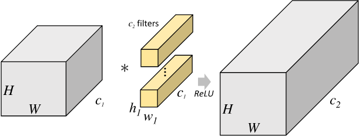

上图代表标准卷积， 输入特征图的尺寸为$H\times W\times c_1$ , 卷积核尺寸为 $c_1 \times \times h_1\times w_1$,  卷积核的个数为$c_2$, 假设步数为$stride=1$, 输出特征图的的尺寸为$H \times W \times c_2$

此时卷积层的参数量 为 $c_1 \times c_2\times h_1\times w_1$， 

计算量为$H\times W \times c_1 \times c_2\times h_1\times w_1 $

上图代表分组卷积， 将输入的特征图分为$g$ 组， 每组的特征图大小为 $H\times W\times \left(\frac{c_1}{g}\right)$,  每组特征图对应的卷积核尺寸变为$\frac{c_1}{g}\times h_1\times w_1$, 每组特征图对应的卷积核的个数为$\frac{c_2}{g} $, 得到的每组输出的特征图大小为$H \times W \times \frac{c_2}{g} $. 最后将$g$ 组输出的特征图进行拼接的到最终的输出特征图, 尺寸大小为$H \times W \times \frac{c_2}{g} \times g = H \times W \times c_2$

分组卷积总的参数量为$\frac{c_1}{g} \times \frac{c_2}{g}  \times h_1\times w_1 \times g = \frac{c_1 \times c_2\times h_1\times w_1 }{g}$, 

分组卷积总的计算量 $H\times W \times \frac{c_1}{g} \times \frac{c_2}{g}\times h_1\times w_1 \times g = \frac{H\times W \times c_1 \times c_2\times h_1\times w_1}{g} $

**分组卷积能够将卷积操作的参数量和计算量都降低为普通卷积的$\frac{1}{g}$**， 在AlexNet 和 resnext  模型中有使用。

* 深度可分离卷积

  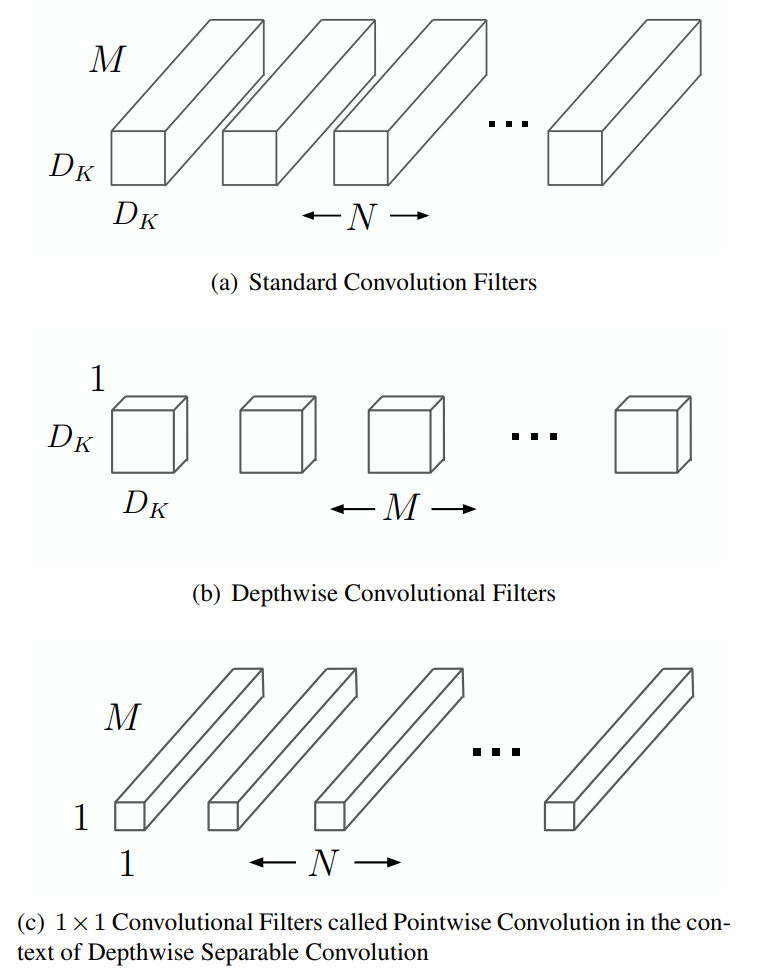

假设输入特征图的尺寸为 $D_F \times D_F \times M$

图(a) 对应的为标准卷积， 对应的卷积核大小为 $D_K \times D_K \times M$,  卷积核的个数为 $N$， 步数$stride=1$, 输出特征图的大小为 $D_F \times D_F \times N$。 标准卷积对应的参数量为$M \times N \times D_K \times D_K$,  总的计算量或计算损耗为$D_F \times D_F \times N \times D_K \times D_K \times M $

图(b) 代表深度卷积， 图（c）代表逐点卷积， 两者合起来就是深度可分离卷积。 深度卷积负责执行滤波操作， 逐点卷积负责通道转换。深度可分离卷积可以理解为将普通卷积操作分离为空间和通道两个方向分别进行卷积操作。

对于深度卷积， 对应的卷积核大小为$D_K \times D_K \times 1$, 卷积核的个数为$M$, 分别在输入特征图的每一个通道进行卷积操作， 输出的特征图大小为 $D_F \times D_F \times M$.  深度卷积对应的参数量为$M \times 1 \times D_K \times D_K = M  \times D_K \times D_K$,  计算量为$ D_F \times D_F \times M  \times D_K \times D_K$

对于逐渐卷积，输入的特征图大小为$D_F \times D_F \times M$, 对应的卷积核大小为$1 \times 1 \times M$, 卷积核的个数为$N$,， 输出的特征图大小为 $D_F \times D_F \times $. N 深度卷积对应的参数量为$N \times M \times 1\times 1 = N  \times M$,  计算量为$ D_F \times D_F \times M  \times N$

因此深度可分离卷积总的参数量为$M \times D_K \times D_K + N \times M $, 

总的计算量为$D_F \times D_F \times M  \times D_K \times D_K + D_F \times D_F \times M  \times N $

深度可分离卷积与标准隽嘉的的参数量之比为 $\frac{M \times D_K \times D_K + N \times M }{M \times N \times D_K \times D_K} = \frac{1}{N} + \frac{1}{D_K^2}$

深度可分离卷积与标准隽嘉的的计算量之比为$\frac{D_F \times D_F \times M  \times D_K \times D_K + D_F \times D_F \times M  \times N}{D_F \times D_F \times N \times D_K \times D_K \times M} = \frac{1}{N} + \frac{1}{D_K^2}$

**深度可分离能够将卷积操作的参数量和计算量都降低为普通卷积的$\frac{1}{N} + \frac{1}{D_K^2}$**， 在 mobileNet 模型中有使用。

### 空洞卷积/膨胀卷积 的作用

空洞卷积是为了解决语义分割问题而提出的， 在deeplab v2 中被使用。

传统的语义分割模型通常采用encoder-decoder的框架，一般需要先缩小特征图尺寸，做信息融合； 然后再复原到之前的尺寸， 最终返回与原始图像尺寸相同的分割图。 比如对于FCN 网络， 通过池化操作扩大特征图的感受野， 通过但是同时会降低特征图的分辨率， 会丢失一些的内部结构的丢失和空间信息的丢失， 导致后续的的上采样操作无法还原一些细节， 从而限制了最终的分割精度。此外池化和上采样操作是确定的（不可学习的）， 对于小物体信息甚至无法重建（假设有四个pooling layer 则 任何小于 $2^4=16$ pixel 大小的的物体信息将理论上无法重建。）

FCN 和 U-Net 通过 skip connection 将全局的语义信息传到 上采样的的操作中，缓解由于下采样造成的语义信息丢失问题。

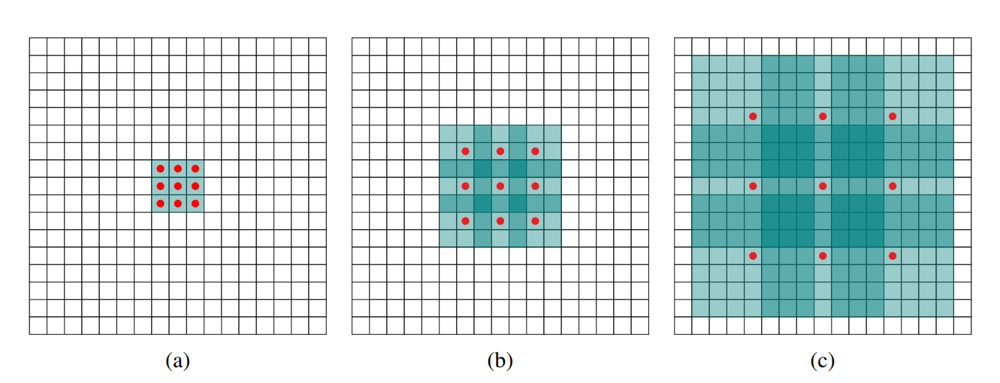

空洞卷积能够可以不改变图像输出特征图的尺寸的情况下， 扩大感受野。 这样可以保留内部数据结构， 避免池化操作的一些缺陷。

空洞卷积引入了扩张率（dilation rate）这个超参数来指定相邻采样点之间的间隔： 扩展率为$r$ 的空洞卷积， 卷积和相邻数据点之间有$r-1$个空洞。上图中红点为为有效采样点，其中图（a）为正常的的$3\times3$ 卷积（扩张率$r=1$）， 图（b）为扩展率$r=2$ 的空洞卷积, 扩张后卷积核的尺寸为5， 图（c）为扩展率$r=4$ 的空洞卷积, 扩张后卷积核的尺寸为9。第一层、第二层和第三层的感受野一次为$3\times3$, $7 \times 7$、 $15 \times15$。

**空洞卷积利用空洞结构扩大了卷积核的尺寸， 不经过下采样操作即可增大感受野， 同时还能保留输入数据的内部结构。**

###  转置卷积的主要思想 

转置卷积也称为反卷积（deconvolution）, 可以看作是普通卷积的“对称”操作

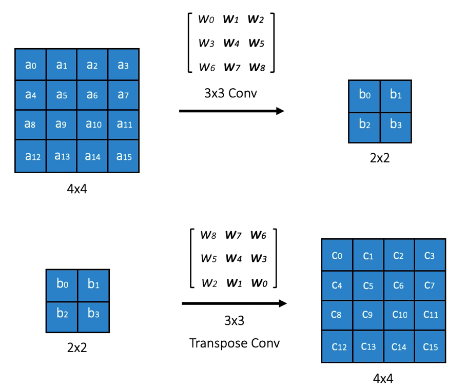

普通的卷积操作可以转化为一个矩阵乘法运算
$$
y = Ax
$$

转置卷积的运算如下
$$
\hat{y} = A^T \hat{x}
$$
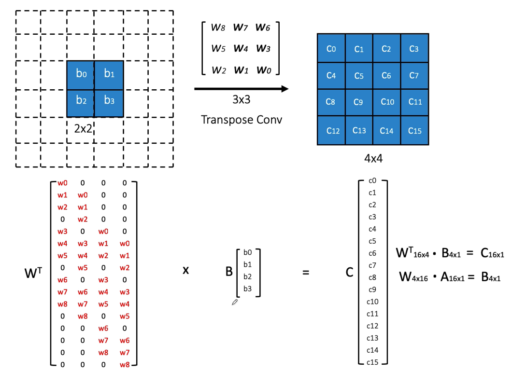

> 转置卷积将普通卷积中输入到输出的尺寸变换逆反过来；转置卷积的信息正向传播与普通卷积的误差反向传播所用的矩阵相同，反之亦然。

应用场景：

* 网络可视化（ZFNet）
* 在语义分割/实力分割任务中， 在decoder 阶段， 通过转置卷积将encoder 得到的具有较高语义信息的特征图到与原始图像大小一致的分割结果。
* 图像的自编码器和生成对抗网络中

### 动态卷积/可变形卷积

普通卷积（下图a）操作是在固定的、规则的网格点上进行数据采样，这束缚了网格的感受也形状， 限制了网络对几何形变的适应能力。 可变形卷积（Deformable Convolutional Networks， DCN）是在卷积核的每个采样点添加一个可学习的偏移量， 让采样点不再局限于规则的网格点。（下图 b c d）。 特别地，**空洞卷积可以看作是一种特殊的可变形卷积**

可变形卷积引入了一个平行分支来端到端学习卷积核采样点的位置偏移量， 如下图所示， 平行分支现根据输入特征图计算出采样点的偏移量， 然后再在输入特征图上采样对应的点进行卷积运算。**可变形卷积具有学习几何形变空间的能力**

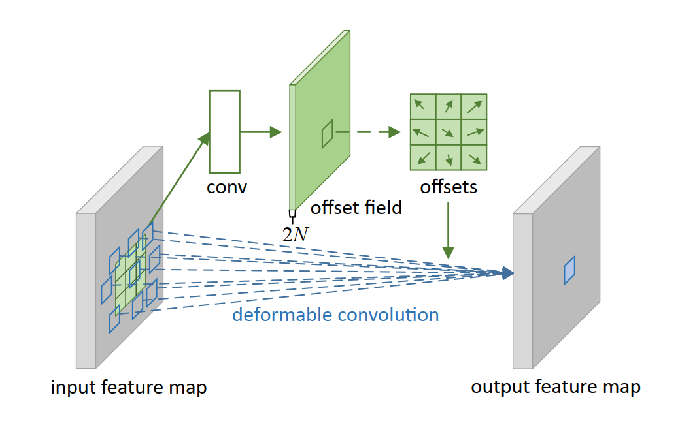

普通卷积的公式可以表示为
$$
y(p_0 ) = \sum_{P_n \in R}w(p_n) \cdot x(p_0 + p_n)
$$
其中 $R$ 定义了卷积核感受野的区域， $p_0$ 表示滑动窗口的中心点， $p_n$ 表示卷积核的采样点。

可变形卷积的公式表示为
$$
y(p_0 ) = \sum_{P_n \in R}w(p_n) \cdot x(p_0 + p_n + \Delta p_n)
$$
其中$\Delta p_n$ 是采样点的位置偏移量。

### 介绍一下 1x1 卷积的作用

* 调整特征图的深度 

  通过 $1\times 1$ 卷积可以对特征图进行升维和降维操作。下图是resnet 模型中的两个结构，右图中首先使用$1\times 1$ 的卷积对特征图进行降维， 经过$3\times 3 $ 卷积操作之后， 利用另一个$1 \times 1$ 卷积进行升维操作。

  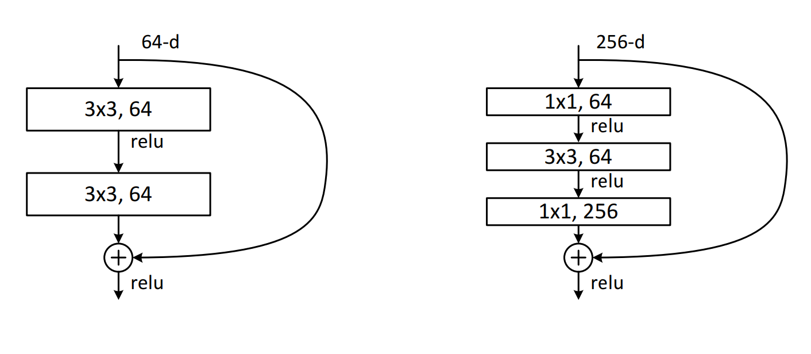

* 减少参数量

  上图中右图的结构称为**瓶颈结构**， 瓶颈结构设计的初衷是降低大卷积层的计算量。瓶颈结构可以用更小的计算代价达到于之前相似甚至更好的效果。 因为瓶颈结构会增加网路层数， 所以特征提取能力可能会有相应的提升。

* 跨通道信息交互

  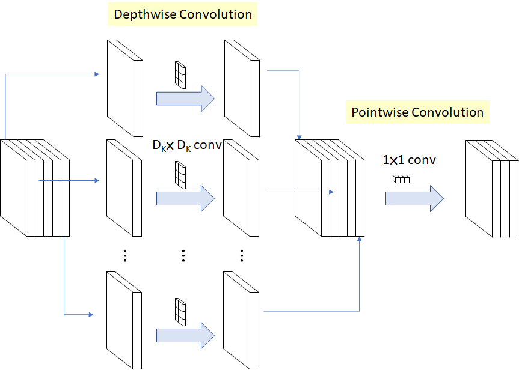

  使用$1 \times 1$卷积核，实现降维和升维的操作其实就是channel间信息的线性组合变化。上图为mobileNet 中的深度可分离卷积结构，与普通卷积相比， 深度可分离卷积在降低参数量和计算量的情况下， 能够达到或接近普通卷积的性能。 

  在普通卷积中， 使用一个卷积核， 因此所有通道的信息都是可交互的。深度可分离卷积分为两步，在深度卷积步骤(deepwise convolution) 步骤， 使用$g$ 个卷积核分别对特征图对应的部分进行卷积，然后进行拼接，此时各个通道间的信息是分离的。  通过使用$1 \times 1$ 的逐点卷积（pointwise convolution）对深度卷积输出的特征图进行特征融合。从而达到与普通卷积相同的性能。

*  使用$1\times1$ 的卷积可以在保持feature map尺度不变的（即不损失分辨率）的前提下大幅增加非线性特性（利用卷积层后的非线性激活函数）

### 解释 残差模块和它的作用

构建深度神经网络时会遇到两个主要问题：梯度爆炸/消散和网络退化问题。

- 梯度爆炸(explosion)/消散(vanishing)，是由于随着层数的增加，在网络反向传播过程中梯度会随着级乘运算变得特别大或特别小，即梯度变得不稳定。可以通过BatchNrom技术解决。
- 网络退化（degeneration），通常认为随着网络深度的增加，网络的性能会获得相应的提升。**但是，我们发现当网络增加到一定程度后继续增加，网络的性能会变得越來越差，直接体现为训练集上的准确率会下降。**

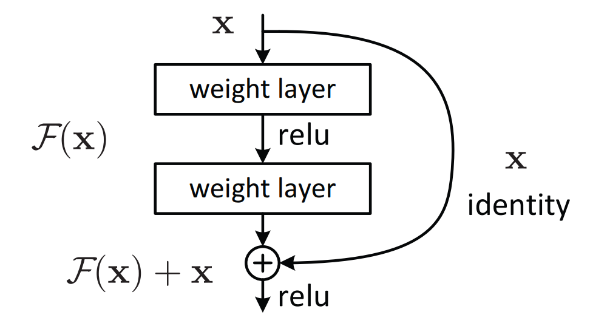

图中$F(X)$ 表示卷积层学习的变换， $X$ 表示残差模块的输入（浅层网络的输出）。

定义 $H(X)$ 表示期望的输出（深层网络的输出）
$$
H(X) = F(X) + X
$$
这时卷积层学习的映射函数可以表示为
$$
F(X) = H(X) - X
$$
**$F(X)$ 可以看作输出$H(X)$ 和输入$X$ 的残差， 这就时为什么称为残差模块的原因。**

特别地， 论文假设残差映射比优化原始的映射更容易。极端地说，如果一个恒等式映射是最优的，即$H(X) = X$或者$F(X) = H(X) - X =0$, 那么将残差推动到零比用一堆非线性层来拟合恒等式映射更容易。

Resnet 网络中提出使用残差（Residual ） 模块来解决网络退化的问题， 如下图所示残差模块引入了跳层连接（shortcut connection), 具有两点好处：

* 能够缩短误差反向传播到各层的路径， 有效抑制梯度消失的现象
* 由于有短路连接的存在， 当网络在层数加深发生性能退化时， 它可以通过控制网络中的短路通路$X$ 和卷积层变换$F(X)$ 的比例来回退到浅层时的状态（$F(X) = 0$）

### Batch Normalize 与 Layer Normalize 区别

在深层神经网络中，中间某一层的输入是其之前的神经层的输出。因此，其之前的神经层的参数变化会导致其输入的分布发生较大的差异。从机器学习角度来看，如果某个神经层的输入分布发生了改变，那么其参数需要重新学习，这种现象叫做内部协变量偏移（Internal Covariate Shift）。  

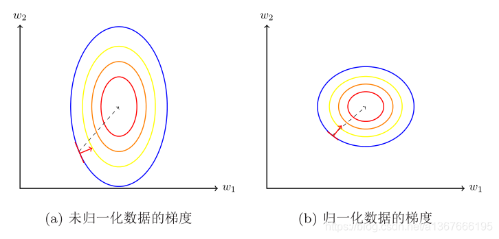

在机器学习中， 我们通常需要对输入的特征进行归一化。因为不同输入特征的取值范围差异比较大时，会影响到梯度下降法的效率。以二维特征为例，上图所示， 对于图(a)未归一化的数据， 特征取值不同会导致大多数位置的梯度方向并不是最优的搜索方向，当使用梯度下降法寻求最优解时，会导致需要很多次迭代才能收敛；而对于图(b)归一化的数据梯度方向会近似为最优的搜索方向。

机器学习中常用的归一化方法有**缩放归一化**和**标准归一化**两种。

为了解决深度模型训练过程中内部协变量转移需要使得每一个层的输入的分布保持一致，最简单有效的方法就是逐层归一化，但
是逐层归一化需要在中间层进行操作，要求效率比较高 。

* 批量归一化（Batch Normalization）是对神经层中**单个神经元**进行归一化。 

  对于第$l$层第的第$i$个神经元来看，其输入为$z_i^l=W_ia^{l-1}$，输出为$a^l$, 要避免协变量偏移，就得对进行归一$z_i^l$化。 **一般情况下批归一化在线性变换之后，激活函数之前。**

  因为目前主要的训练方法是基于小批量的随机梯度下降方法，所以准确地计算$z_i^l$的期望和方差是不可行的。因此，$z_i^l$的期望和方差通常用当前小批量样本集的均值和方差**近似估计**。

  以第$i$个神经元的批归一化进行说明， **其他神经元批归一化采用相同的步骤完成**。 假设输入的批次大小$batch\_size=N)$，**第$i$ 个神经元**对应的输入数据如下
  $$
  {z_i^l(1), z_i^l(N), \cdots, z_i^l(N)}
  $$
  计算第$i$维（第$i$ 个神经元）每个批次的均值和方差
  $$
  \begin{equation}
  u = \frac{1}{N}\sum_{n=1}^N z_i^l(n) \\
  \sigma^2 = \frac{1}{N}\sum_{n=1}^N \left(z_i^l(n)-u\right)^2
  \end{equation}
  $$
  其中 $N$ 为批次的大小

  根据得到的均值和方差对第$i$维输入进行归一化
  $$
  \hat{z}_i^l = \frac{z_i^l-u}{\sigma}
  $$
  对净输入的标准归一化会使得其取值集中的0附近，如果使用sigmoid型激活函数时，这个取值区间刚好是接近线性变换的区间，减弱了神经网络的非线性性质。 为了使得归一化不对网络的表示能力造成负面影响，我们可以通过一个附加的缩放和平移变换改变取值区间 。 批归一化完整公式定义为
  $$
  \hat{z}_i^l = \frac{z_i^l-u}{\sqrt{\sigma^2-\epsilon^2}}\gamma + \beta
  $$
  其中$\gamma$ 和 $\beta$ 分别代表缩放和平移因子。 $\gamma$ 和 $\beta$ 需要通过学习得到。

* 层归一化

  层归一化（Layer Normalization）是和批量归一化非常类似的方法。和批量归一化不同的是，层归一化是对**某一层的所有神经元**进行归一化。

  假设某一层有M个神经元，那么该层的输入$z^l$为
  $$
  {z_1^l, z_2^l, \cdots, z_M^l}
  $$
  其均值和方差为
  $$
  \begin{equation}
  u = \frac{1}{M}\sum_{m=1}^N z_m^l \\
  \sigma^2 = \frac{1}{M}\sum_{m=1}^N \left(z_m^l-u\right)^2
  \end{equation}
  $$
  层归一化的完成公式定义为
  $$
  \hat{z}_i^l = \frac{z_i^l-u}{\sqrt{\sigma^2-\epsilon^2}}\gamma + \beta
  $$

* 批归一化和层归一化的区别
  * 批量归一化是不同训练数据之间对**单个神经元**的归一化，层归一化是单个训练数据对某一层**所有神经元**之间的归一化。对于N个样本的一个小批量集合$Z(l)^{M \times N} = [z(1,l); \cdots; z(N,l)]$，层归一化是对矩阵 $Z(l)$ 对**每一列**进行归一化，而批量归一化是对$Z(l)$的**每一行**进行归一化。  
  * 一般而言，批量归一化是一种更好的选择。当小批量样本数量比较小时。 难以计算单个神经元的统计信息， 可以选择层归一化
  * 如果一个神经元的净输入的分布在神经网络中是动态变化的，比如循环神经网络，层归一化是更好的选择。

全连接层的归一化与卷积层的归一化操作有什么区别

* 对于全连接层，批量归一化层通常置于全连接层中的仿射变换和激活函数之间，**使用整个仿射变换的输出做批归一化**
* 对于卷积层， 批量归一化发生在卷积计算之后， 应用于激活函数之前。如果卷积计算输出多个通道，需要对这些通道的输出分别做批归一化，其每个通道都拥有独立的拉伸和偏移系数。
* 每一个最小批次都是按照该最小批次计算的均值和方差进行缩放的。由于在小部分数据数据上估计得出，计算均值和方差会引入噪声。因此批归一化具有轻微的正则化效果， 提高了网络的泛化能力， 避免过拟合。

### dropout 作用

dropout 操作是指网络训练阶段， 每次迭代时会重基础网络中随机丢弃一定比例的神经元， 来避免过拟合。设置一个固定概率$p$来， 对每一个神经元都以固定概率$p$ 来判定要不要保留。

**在训练时，激活神经元的平均数量为原来的$p$倍。而在测试时，所有的神经元都是可以激活的，这会造成训练和测试时网络的输出不一致。为了缓解这个问题，在测试时需要将每一个神经元的输出乘以$p$，也相当于把不同的神经网络做了平均 。**

* dropout 可以看作是集成了大量神经网络的Bagging 方法。 每做一次丢弃，相当于从原始的网络中采样得到一个子网络。每次迭代都相当于训练一个不同的子网络，这些**子网络都共享原始网络的参数 **， 最终的预测结果是这些模型进行投票或取平均值得到的。
* dropout 能够减少神经元之间复杂的共适性(co-adaptation)关系。 由于dropout每次丢弃的神经元是随机选择的， 训练过程中的网络每个神经元不会对特定的神经元的激活特别敏感， 这使得网络能偶学到更加泛化的特征。

### label-smoothing 的作用

label smoothing是一种正则化的方式，全称为Label Smoothing Regularization(LSR)，即标签平滑正则化，是在《Rethinking the inception architecture for computer vision》里面提出来的

在分类任务计算损失的过程中会将真实标签转换为one-hot 形式，然后计算交叉损失熵。**one-hot 可以看作是一种硬编码**， 分类标签的便编码是二值的（0或1)。one-hot 编码方式会导致网络往**正确标签和错误标签差值大的方向**学习，在训练数据不足以表征所以的样本特征的情况下，这就会导致网络**过拟合**， 容易造成过拟合， 无法保证网路的泛化能力

label smoothing 就是一种正则化的方法， **label-smoothing 可以看作是一种软编码**
$$
q_i=\begin{cases} 1-\epsilon &if\ i=y\\
\frac{\epsilon}{K-1} & otherwise\\
\end{cases}
$$
其中 $\epsilon$ 是一个超参数通常取0.1， $K$ 为分类的数目

label-smoothing 通**软化**传统的**one-hot**类型标签，避免监督样本过高的置信度， 使得在计算损失值时能够有效抑制过拟合现象。

label-smoothing 同时考虑了不同类别之间的相关性。

### warm-up 的作用

单循环学习率衰减比较有代表性的就是warm-up衰减策略，它可以分为两个阶段：第一个阶段，学习率从很小的学习率（warm-up learning rate）增加到基学习率（base learning rate），这一阶段也称为warm-up阶段。第二阶段，从基学习开始，执行学习率衰减。

warm-up 动机：

- 对于第一阶段，由于刚开始训练时,模型的权重(weights)是随机初始化的，这时模型对于数据的“分布”理解为零，在初始训练阶段， 每个输入数据对模型来说都是新的， 模型会根据数据对模型权重进行修正。此时若选择一个较大的学习率,如果这时候学习率就很大，极有可能导致模型对开始的数据“过拟合”，后面要通过多轮训练才能拉回来，浪费时间。当训练了一段（几个epoch）后，模型已经对数据集分布有一定了解，或者说对当前的batch而言有了一些正确的先验，较大的学习率就不那么容易会使模型跑偏，所以可以适当调大学习率。这个过程就可以看做是warm-up。对于第二阶段，当模型一定阶段（如十几个epoch）后,模型的分布就已经比较固定了，模型慢慢趋于稳定。这时再执行学习率衰减， 可以使得模型获得更快的收敛速度。warm-up 有助于减缓模型在初始阶段对mini-batch的提前过拟合现象，保持分布的平稳。
- 我们通常采用mini-batch作为输入数据喂入网络进行训练，小的mini-batch会导致样本方差较大。对于小的mini-batch,在训练的过程中，如果有mini-batch内的数据分布方差特别大，这就会导致模型学习剧烈波动，使其学得的权重很不稳定，这在训练初期最为明显，最后期较为缓解。warm-up策略有助于保持模型深层的稳定性。

### 目标检测、 语义分割、实例分割、全景分割区别

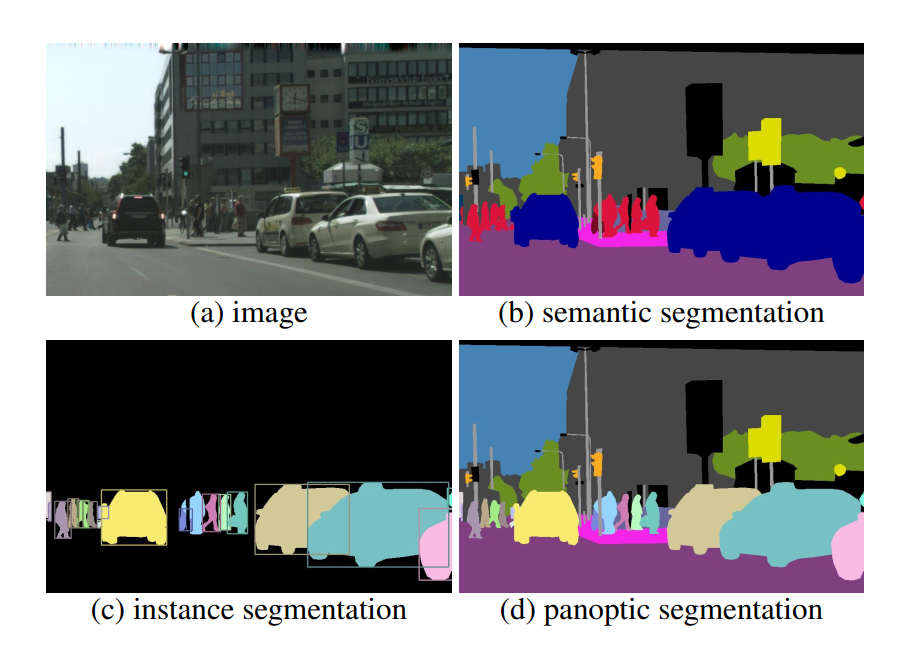

* 目标检测：检测图像中的目标的的边框+检测框进行分类
* 语义分割：给图片中中的每个像素进行分类
* 实例分割：给每个目标检测框里的目标分mask
* 全景分割：给背景的每个pixel 分类+检测框中的目标分mask

### IoU 与 GIoU 区别

* IoU

  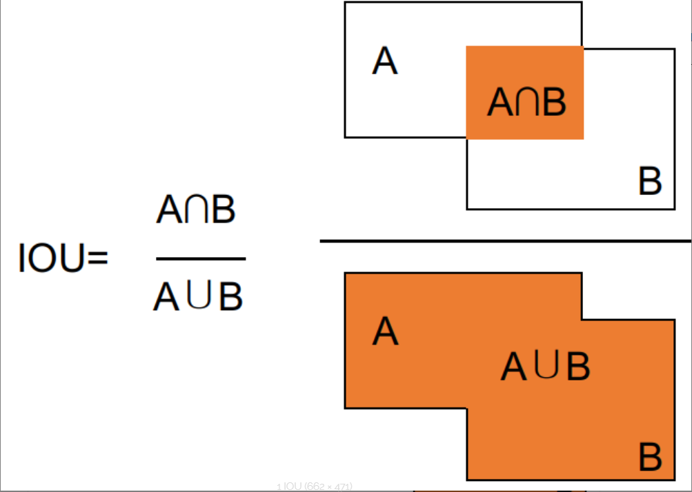

* GIoU

  GIoU(Generalized IoU )[5]  可以看作是 IoU 的一种泛化， 通过 将 IoU 的概念扩展到不重叠的情况下来解决IoU 的弱点。
  $$
  GIoU = IoU - \frac{|C - (A \cup B)|}{|C|}
  $$
  其中 C 为 包含bbox A 和 B 的最小外接矩形框。

  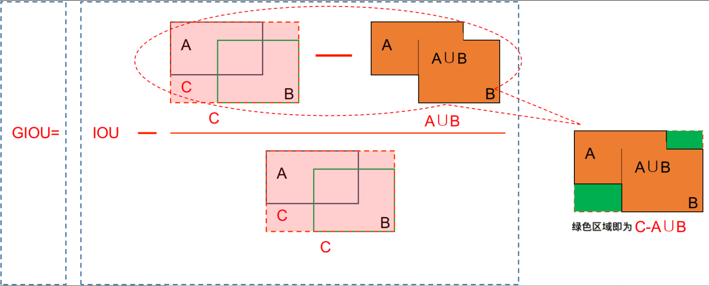

  对于IoU如果两个bbox A 和 B 不相交, 即 $|A \cap B|= 0$, 此时对应的 $IoU(A, B)=0$. $IoU$ 不能反映两个bbox是在彼此附近或者彼此离的很远。在这种情况下，对于不重叠的目标， 如果使用IoU作为损失， 梯度将会等于零而不能进行优化。

  **与 IoU 相比GIoU 同时关注两个 bbox 的重叠区域和非重叠区域，即两个bbox的相对位置，因此能够更好地反映两个bbox 的重合程度。**

* 此外还有对GIoU 的改进，如DIoU 和 CIoU等

### 目标检测中 one-stage 与 two-stage 区别

* one-stage 是指模型没有独立地、显示地提取候选区域（region proposal), 直接由输入图像得到物理的类别和位置信息。典型模型有YOLO(You Only Look Once)系列、 SSD(Single  Shot multibox-Detector)、 RetinaNet等
* two-stage 有独立地、显示地候选区域提取过程。第一阶段，先在输入图像上生成建议目标候选区域； 第二阶段， 对第一阶段的到的所有候选区域进行分类和位置修正。 典型的模型有 Fast RCNN、Faster RCNN、FPN、Cascade RCNN等

一般来说 one-stage 模型具有计算效率上的优势， two-stage 模型具有检测精度上的优势：

* 关于速度方面： one-stage 没有区域建议网络， 而是直接讲区域建议和分类定位集成到一个阶段进行处理。 这可以一定程度减少计算冗余， 减少计算损耗。其次， one stage 对图像中任何数量的对象都是鲁棒的，其计算负载仅取决于anchor 的数量； 而以Faster RCNN 为代表的tow stage 模型， 在第二步对候选区域进行分类和位置回归时，是针对每个候选区域独立进行的， 其计算负荷随着RPN 提出的区域数目的增加而增加。

* 关于精度方面： 

  one-stage 多数是利用预设的 anchor box 来捕捉可能存在于图像中的各个位置的物体， 因此 one-stage 模型会包含大量的锚框， 是一种稠密框预测方式。然而对一张图像而言， 含有目标的锚框的数量远远小于含有背景的锚框的数量，这就导致了严重的正负样本步平衡。 而tow-stage 第一步就可以筛选掉大量不含目标的区域（负样本）， 在第二步进行分类和边框回归时， 正负样本已经比较均衡。 在SSD 中 应用Hard negative mining 方法来缓解这一问题。 其次two-stage 模型在第一步生成候选区域的过程中会对候选框的位置和大小进行修正， 同时在第二步中会对候选框进行第二次修正， 通过两次边框修正带来了更高的定位精度。

### 目标检测中 anchor-based 和 anchor-free 区别

* anchor-based

  anchor based 将物体检测问题通常都被建模成对一些候选区域进行分类和回归的问题。anchor-based 算法通常会在输入图像中采样大量的区域，然后判断这些区域中是否包含我们感兴趣的目标，并调整区域边缘从而更准确地预测目标的真实边界框（gt box）。主要包括one-stage  和 two-stage 两种。 

  典型的方法有 SSD、YOLOv2, YOLOv3, RetinaNet 等

* anchor-free

  anchor free 通过另一种方法解决检测问题，目前anchor-free 算法分为基于关键点的（如CornerNet）和基于语义分割的（如FCOS)两种方法。 早期的方法有 DenseBox, YOLO, 基于关键点的方法有 CornerNet、FSAF、FCOS等。

* anchor based 存在的问题
  - Anchor的本质是目标的候选区域，由于目标形状、位置的多样性，Anchor的数量往往非常庞大，否则会出现漏检的情况：anchor-based anchor 数量很大（RetinaNet 的anchor 有100k）而anchor集合中仅有小部分分布在真值框附近，进而导致训练过程中正负样本不均衡问题。
  - Anchor的设定引入了许多超参数，包括每一层分配的anchor数量、尺度、宽高比等。

**ATSS论文指出anchor-based和anchor-free检测算法间的差异主要来自于正负样本的选择**

### 解释一下 Anchor 的意义

anchor  是指 anchor-based 目标检测方法中设定的参考框（reference box）, 即在输入图像上根据**先验知识**，预设好的具有不同**尺度（scale）** 和**长宽比（ratio ) **的参考框, 辅助模型进行训练。

* 对于人脸检测而言， 传统的检测算法为了获取人脸的位置， 通常是采用简单暴力的滑窗方法： 使用不同大小和长宽比的候选框在整张图片上进行穷尽式地滑窗， 然后提取窗口内的特征（haar 特征等），再送入分类器（SVM 等）进行二分类， 判断这个窗口是否包含人脸。这种方法简单，但是召回率和准确率都不高。
* 在深度学习时代， RCNN 和 Fast RCNN采用选择性搜索（Select Search）的滑窗方法， 这种方法优化了候选框生成策略， 但是仍然会产生大量的候选框， 因此网络运行很慢。
* 针对Fast RCNN 的缺陷， **Faster RCNN 提出了 RPN 网络， 直接预测出候选框的位置**，同时提高的网络的检测精度和速度。 RPN中最重要的一个概念就是**Anchor**,  启发了之后出现如 SSD、 YOLOv2, YOLOv3等anchor-based目标检测算法。

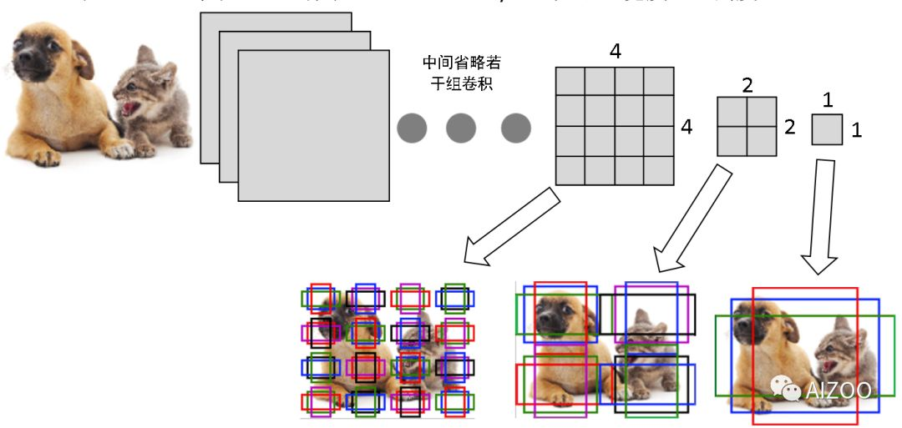

上图实例使用多尺度的特征图进行特征检测， 其中每个特征图分别对应1种scale 和 3 种ratio 的anchor。 如上图所示， 一共生成$4 \times 4 \times 3 + 2\times 2 \times 3 + 1 \times 1 \times 3 = 63$个anchor。以实际的SSD模型，在300x300的输入尺寸的情况下，其在$38 \times 38$、$19 \times 19$、$10 \times 10$、$5 \times 5$、$3 \times 3$、$1 \times1$为尺寸的6个特征图上分别生成对应的anchor。每张特征图分别设置4、6、6、6、6、4个不同尺寸和长宽比的anchor，所以一共有$38 \times 38 \times 4+ 19\times19\times6+ 10\times10\times6+ 5\times5\times6+ 3\times3\times4+ 1\times1\times4= 8732$个anchor。

利用神经网络强大的拟合能力，我们不再需要计算Haar、Hog等特征，而是直接让神经网络预测**每个anchor是否包含目标的概率，以及被检测到的目标相对当前anchor中心点的偏移以及长宽比例。**

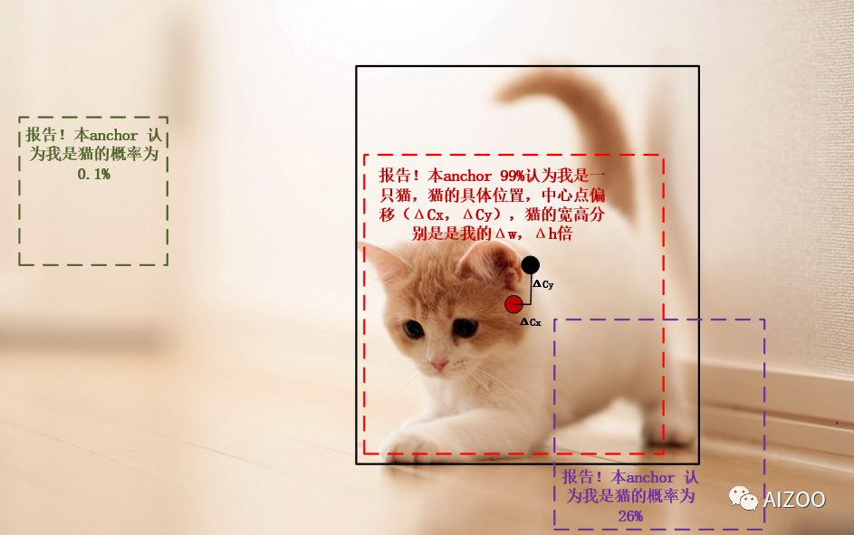

 目标检测网络的预测输出是指， **每个anchor是否含有目标的概率，目标比奥中心点与anchor自身的中心点位置的偏移量，以及目标尺寸相对于anchor的宽高比例**。因为anchor的位置都是固定的，因此很容易利用anchor和当前anchor预测的目标偏移量，解码出目标的真实坐标。以图中的小猫为例，红色的anchor就以99%的概率认为它是一只猫，并同时给出了猫的实际位置相对于该anchor的偏移量，这样，**我们将输出解码后就得到了实际猫的位置**。但是，绿色的anchor就认为它是猫的概率就很小，紫色的anchor虽然与猫有重叠，但是概率只有26%。 最后通过NMS 就可以顺利预测出猫的真实位置。

**anchor 在训练阶段和预测阶段都会使用**

* 在训练阶段：

  首先**对每张训练样本标记出所对应的anchor, 将每个anchor 视为一个训练样本**。 为了训练检测网络， 首先需要通过 anchor target layer 为每个锚框生成真实的标签：一是锚框所含目标的**类别（label）**；二是真实边界框相对锚框**偏移量（offset）**，**主要依据与锚框相似的真实边界框的位置和类别信息为锚框标注**。 然后通过目标检测网络**为每个锚框预测类别以及偏移量**，接着根据预测的偏移量调整锚框位置从而得到预测边界框，最后筛选需要输出的预测边界框。

* 在预测阶段

  **首先在图像中生成多个anchor box**， 然后根据训练好的模型参数**为所有的anchor box 预测对应的类别和偏移量**， 随后根据anchor及其对应的预测偏移量进行解码操作，得到预测边界框。 

  通常情况下需要对预测结果进行后处理：当锚框数量较多时，同一个目标上可能会输出较多相似的预测边界框， 通常采用非极大值抑制（Non-Maximum Suppression，NMS）对目标重复的边界框进行过滤，得到最终的预测结果

目前 anchor box 的选择主要由三种方式：

* 人工经验设定（Faster RCNN）
* 通过聚类得到（YOLOv2, YOLOv3）
* 作为超参数进行学习

### 简单介绍 tow-stage 模型 RCNN Fast RCNN  Faster RCNN  FPN 的发展过程

* RCNN 

  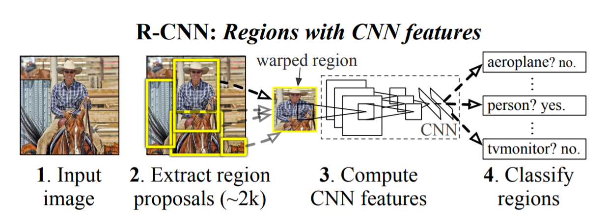

  首次将卷积网络应用于目标检测, 主要思路如下：

  * 生成候选区域：使用无监督的选择性搜索(Selective Search, SS) 将输入图像中具有相似颜色直方图特征的区域进行递归合并，提取约2000 个候选区域（region proposals)
  * 提取每个候选区域特征：从输入图像中截取候选区域所对应的图像， 并将其裁剪缩放至合适的尺寸（warped region）, 并将其送入CNN特征提取网络， 分别提取**每个候选区域的特征图**
  * 分类和回归：提取的特征被送入多个SVM 分类器进行分类， 以及一个线性回归器进行边框位置和大小的修正

* Fast RCNN

  **RCNN 需要对每个候选区域 进行特征提取**，且候选区域高度往往是互相有重叠的， 导致特征提取存在大量的冗余计算， 造成了RCNN 的速度瓶颈；**RCNN 由于使用多个SVM 分类器进行分类、 使用bbox回归器进行回归操作，因此无法进行端到端的训练**。

  Fast RCNN 主要针对上述两点进行改进 

  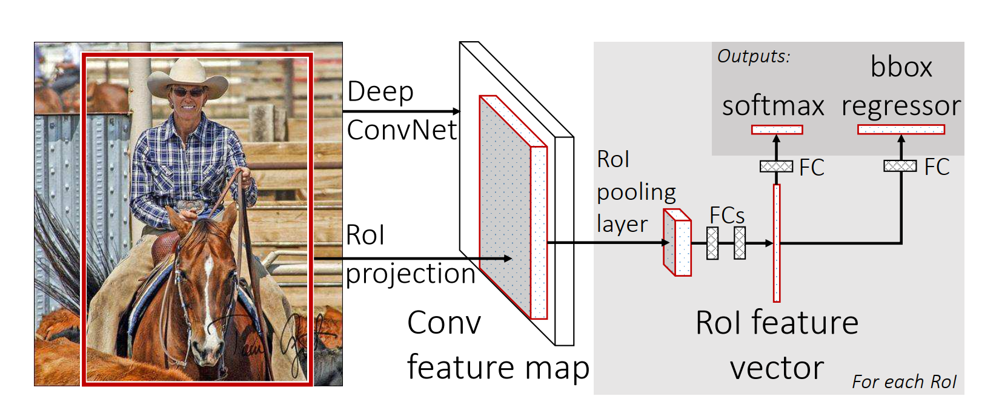

  * 提取整张图片的特征：将任意size的图像输入CNN 得到**整张图片的特征图 feature map**， 这里与RCNN 中相当于进行了多次卷积操作相比， 只需要进行一次特征提取操作， 减少了计算损耗
  * 生成候选区域：在原始图片上使用选择性搜索算法得到2000 个候选区域， **与RCNN 第一步相同**
  * RoIPooling：整张图像的特征图中， 直接截取每个候选区域所对应的特征图， 并执行**RoI Pooling**操作使得每个特征图具有相同的尺寸大小
  * 分类和回归： 使用全连接层代替了之前的SVM, 使用sftmax进行分类，回归器也使用全连接层实现。

* Faster RCNN

  Fast RCNN 最耗时的是使用选择性搜索进行候选区域提取的步骤，且这一步不可训练， 因此 Fast RCNN 虽然极大地简化了RCNN 但是仍然无法进行联合训练。  Faster RCNN 对此进行了改进。

  

  * 特征提取：将任意size的图像输入CNN 得到**整张图片的特征图 feature map**， 与 Fast RCNN 第一步相同

  * 使用RPN 生成候选区域：使用PRN(Region Proposal Network, RPN)替代选择性搜索， RPN 是一个全卷积网络，最后的两个同级分支分别执行分类和回归。将预设的anchor 和 feature map输入RPN 网络得到2000 个region propsal。

    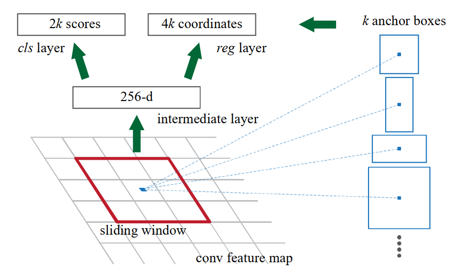

  * RoIPooling: 将得到feature map 和 2000 个region propsal 输入RoI Pooling layer， 获得固定尺寸大小的 roi

  * 分类和回归：将得到的特征图经过一系列全连接层， 同时通过两个分支进行分类和回归

* FPN

  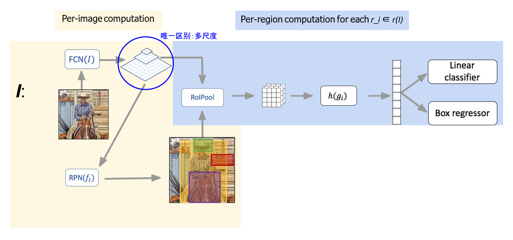
  
   FPN 是在Faster RCNN 的基础上增加特征金字塔结构， 利用横向连接和 top-down 策略来提取、利用多尺度的特征， 改进目标检测的效果。

​	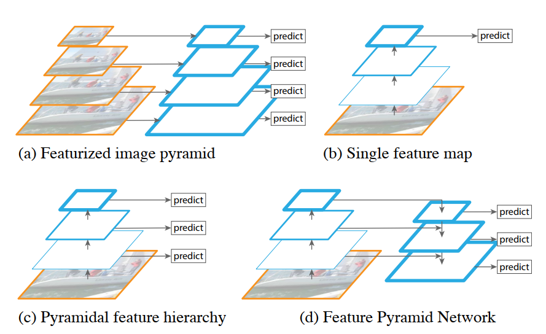

​	图中 d 为 FPN

### 简单介绍yolo yolov2 yolov3 yolov4 的发展过程 

* YOLOv1

  YOLOv1 将目标检测问题作为一个回归问题进行处理， 使用一个端到端的神经网络直接预测目标的类别和位置

  

  * 输入图像尺寸变换: 将输入图像的尺寸转换为$448 \times 448$ 的固定大小

  * 固定大小的图片出入卷积网路：YOLO 的backbone 参考 GoogLeNet， 由 24 个卷积层和2个全连接层组成。

    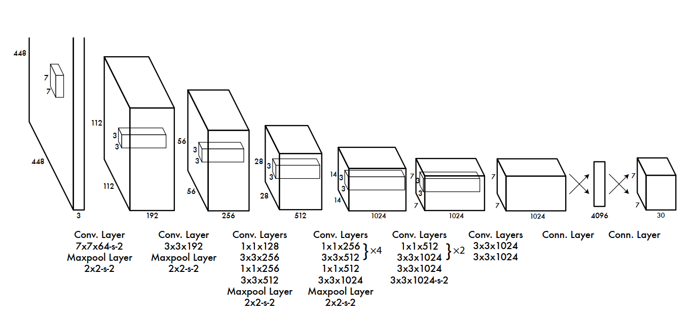 

    YOLO 的网络结构如图所示(对应pascal voc 数据集) 首先通过一系列的卷积层提取特征， 得到$1024 \times 7 \times 7$ 的特征。接着是两个全连接层，首先需要将将特征进行平铺，然后再通过两个全连接层， 第一个全连接的输输出大小为4096， 第二个全连接的输出大小为$7 \times 7 \times 30 = 1470$, 之后再将全连接层的输出 view 成$30 \times 7 \times7$ 的特征作为预测结果。

    

    如上图所示， YOLO 将输入图片划分成$S \times S$ 个网格， 每个网格负责预测中心点位于该网格内的目标。 具体实现中， 每个网络会预测**目标的类别**和**目标对应的B个边界框**， 其中每个边界框包括位置（x,y)表示**目标中心点的坐标与对应网格左上角的偏差**， 需要归一化为0-1；尺寸（w,h）是**物体相对于整张图片尺寸的大小**，也需要归一化为0-1; **置信度(conf)表示预测框和任意真实框之间的IOU**。 因此每个边界框的信息为<x, y, w, h, conf>。 假设目v标的类别大小为$C$, 预测可以编码为一个$S \times S \times (B* 5 + C)$的张量。以训练Pascal voc 2012 数据集为例，**$S=7$, 表示每张图片最多可以预测$7 \times 7 =49$个目标**,  边界框的数目$B=2$, 每个目标预测两个边界框，分类个数 $C=20$ , 最终预测的输出为$ 7 \times 7 \times(2*5 + 20) = 7 \times 7 \times 30$

  * 对输入结果进行NMS后处理，得到最终的预测结果。

  * 损失函数如下

    

    其中前两行代表坐标损失， 中间两行代表IOU损失, 最后一行代表分类损失。注意这里只计算包含真实目标的预测边框的坐标损失和分类损失。 

* YOLOv2

  YOLOv1 虽然速度很快， 但是有两个缺点：

  *  **低召回率**：很多目标找不到
  *  **低定位准确度**：准确度不高的特点提出了改进

  YOLOv2 主要针对YOLOv1 的缺点进行了改进， 主要改进如下：

  * 使用了 新的 backbone： Dacknet19
  * YOLOv2 把卷积特征图尺寸由$7 \times 7$变为$13 \times 13$, 且每个区域预测5 个anchor, 每个anchor 预测独立的类别（YOLOv1, 共享一个类别）， 因此预测结果的尺寸变为$S \times S \times (B \times(5 + C))$, 对应pascal voc 数据集为$S \times S \times (5  \times (5+20)) = (S \times S \times 125)$
  * 多尺度训练： 由于 YOLOv2 不再包含全连接层， 所以可以不限制图片输入的大小, 且卷积后的特征图的stride为32。 在训练期间每隔10 个 epoch从$\{320, 352, \cdots 608\}$ 中随机选择图片大小来训练模型， 提高了对小目标物体的检测精度。
  * 改变位置约束方法： YOLOv1 使用卷积作为特征提取器， 之后再加全连接层来预测边界框的中心位置、尺寸和置信度。 YOLOv2 借鉴 Faster RCNN 的思路， 直接再anchor 上预测偏移量和置信度，网络更容易训练。

* YOLOv3

  YOLOv3 是在YOLOv2 基础上进行了改进

  * 更换backbone: 使用更深的网络 DarkNet-53, 借鉴了残杀网络的 shorcut 结构
  * 使用多标签分类损失： softmax 函数假设每个bbox 的物体只存在一种类别。 YOLOv3使用二元交叉熵损失函数，而不是softmax 损失函数， 可以更好地支持多标签的检测
  * 多尺度预测： 利用FPN 的思想，在3个不同大小的特征图上进行训练， 在小物体上也能获得好的检测效果。

* YOLOv4

  YOLOv4 是在YOLOv3 的基础上， 使用各种新的算法思想对各个子结构进行了改进。**BoF(Bag of freebies)**是指能够提高检测器准确率， 只通过改变训练策略或只增加训练损耗，**而不增加推理损耗**的方法， 如 data augmentation、 focal loss 等。**BoS(Bag of special  ) **是指**只增加小的推理损耗**而获得大的检测准确度提升的插件模块或后处理方法。

  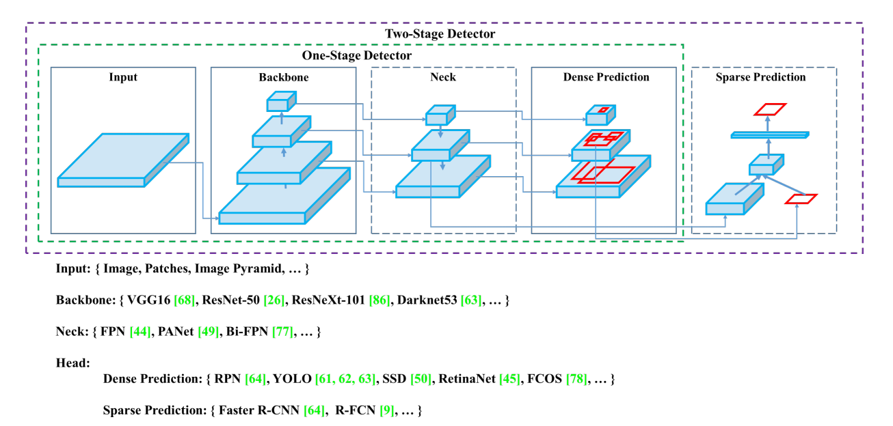

  * 新的 backbone: 使用 CSPDarkNet53 作为 backbone

  * Neck: 使用 SPP + PAN 代替 FPN

  * CmBN:  BN 是对当前时刻的的mini-batch 进行归一化； CBN 在计算当前时刻统计量时会考虑前K个时刻的统计量， 等价于扩大batch-size 操作。CmBN(Cross mini-Batch Normalization ) 可以看作时CBN 的改进版本，收集一个batch内多个mini-batch 内的统计数据

    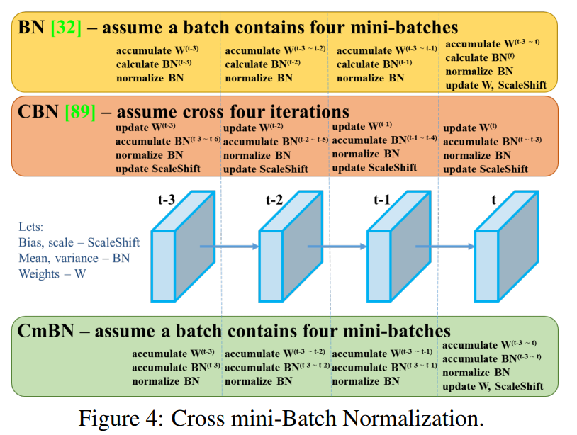

  * SPP

    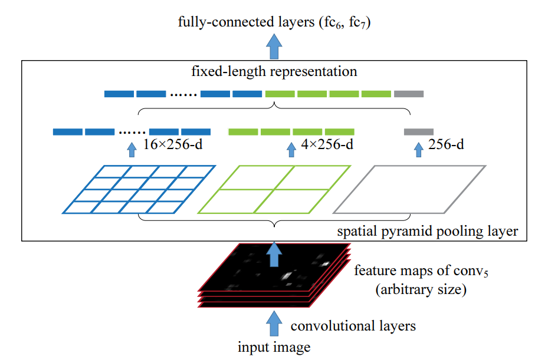

  * PAN

    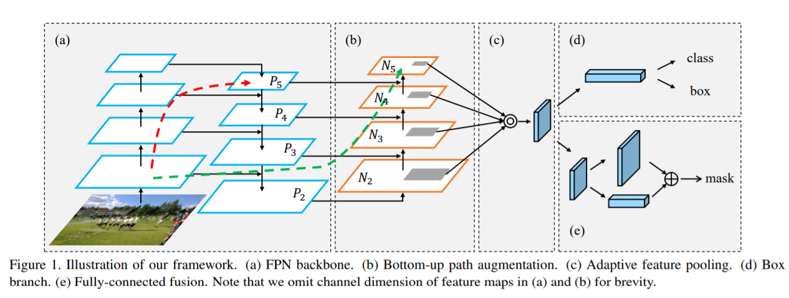

    

    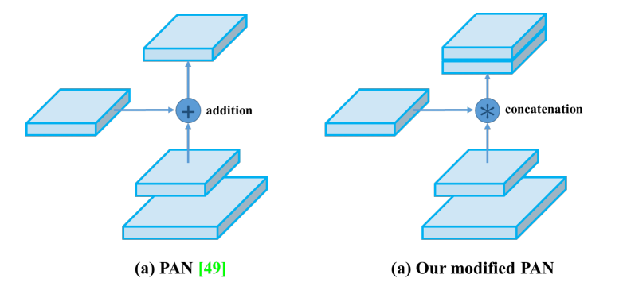

  * SAM

    

  * DIoU

    

* YOLOv5

###  YOLO 与 SSD 的区别

### MAP 的概念和计算过程

### 介绍一下 计算机视觉中的注意力机制 

* SENet

  SENet(Squeeze-Excitation) 是一种通道注意力机制。

  

  SENet 的通过引入一个个权重预测分支实现通道注意力机制， 分为Squeeze 和 Excitation 两步：将特征进行全局平均池化，得到代表代表全局信息的大小为$1 \times \ 1 \times c$的特征图， 这一步称为Squeeze； 将得到的特征图分别再经过两个$1 \times 1$卷积的网络， 最后通过非线性变换得到通道注意力权重。

  **通道注意力机制可以让模型跟过地关注信息量最大的通道特征， 而抑制那些不重要的通道特征**

* CBAM

  卷积注意力模块Convolutional Block Attention Module )**是一种空间和通道结合的注意力机制**。沿着通道和空间两个独立的维度依次推断出注意映射，然后将注意力映射相乘到输入特征映射中进行自适应特征细化。

  

  CBAM包括通道注意力模块和空间注意力模块两个模块， 如上图所示。通道注意模块的和空间注意力模块i的范式如下

  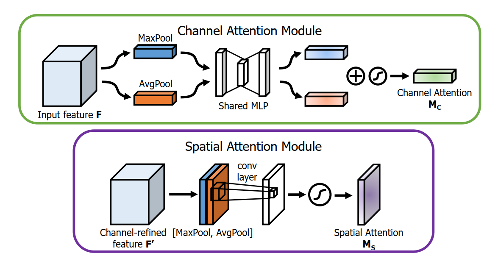

  对于通道注意力模块， 首先将特征图分别通过进行**全局平均池化**和**全局最大池化**， 通道数保持不变，得到空间大小为$1 \times1$ 的两个特征， 然后将两个特征分别进行两次$1 \times 1$ 的卷积进行通道融合， 将的两个特征相加得到通道注意力权重

  对于空间注意例模块，  首先将特征图在通道维度求对应通道的最大值和均值， 保持空间大小不变，得到通道维度为 1的两个特征；然后将得到的两个特征在通道维度进行拼接， 得到通道维度为2的特征；最后将得到的特征输入一个卷积，并进行非线性变换，得到空间注意力权重。

* Transformer

* DETR

### NMS 与 soft-NMS 的区别

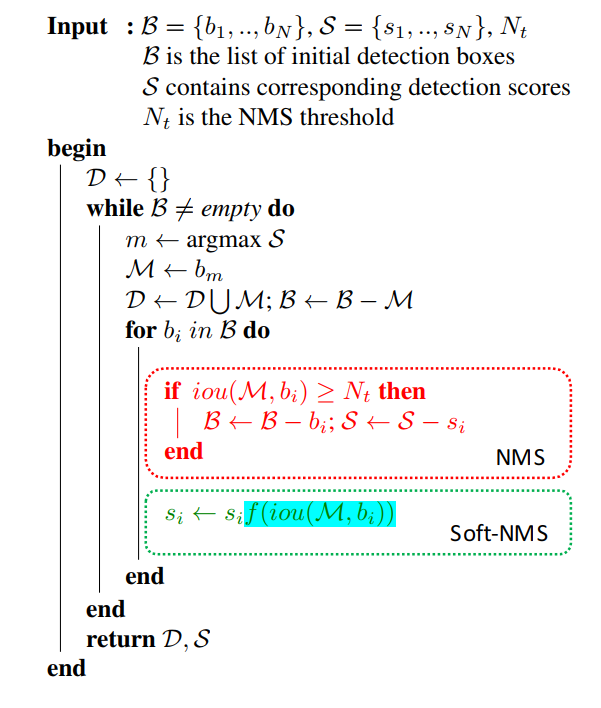

* NMS 

  NMS（Non-maximum suppression ） 是目标检测流程中一个重要的组成部分。 NMS 主要用于过滤预测的的假正 bbox。

  * 首先根据分数对预测的bbox 进行排序
  * 选择具有最大得分的检测框M，并且抑制与M具有显著重叠（使用预定义阈值）的所有其他检测框。
  * 迭代进行上述的过程

  NMS 中修剪bbox步骤中对应的公式如下
  $$
  s_i=\begin{cases}
  s_i \quad  & iou(M, b_i)<N_t\\
  0 & iou(M, b_i) \geq N_t\\
  \end{cases}
  $$
  ​	一般设置阈值为0.5

* soft-NMS

  NMS 主要的问题是它把邻近的检测框的分数设为0, 这样， 如果一个目标确实出现在超过覆盖度阈值的检测框， 它仍然会将会被丢弃， 从而导致 AP 分数的下降。

  NMS 设置了一个硬的阈值去决定M 的近邻bbox 如何去移除或保持, soft-NMS 中 对于高重叠的box 设置低的分类分数， 而不是完全压制它， 公式如下
  $$
  s_i=\begin{cases}
  s_i \quad  & iou(M, b_i)<N_t\\
  s_i(1-iou(M, b_i)) & iou(M, b_i) \geq N_t\\
  \end{cases}
  $$
  这样距离M较远的bbox不会受到影响，距离M较近的bbox将受到更大的惩罚。

* softer-NMS

### 目标检测中样本不平衡问题的的处理方法

样本不平衡问题可以分为正负样本不平衡和难易样本不平衡两个方面。

正负样本不平衡是指， 正样本是指图片中感兴趣的目标区域， 负样本是指背景区域。对于一张图片中负样本的数量会远远多于正样本， 造成正负样本的比例不平衡

* 一般在目标检测框架中保持正负样本的比例为1:3。

* ATSS

  论文指出one-stage anchor-based和center-based anchor-free检测算法间的差异主要来自于正负样本的选择， 论文提出ATSS（Adaptive Training Sample Selection）方法，它根据目标(GT)的统计数据自适应地选择正、负样本，几乎没有超参数, 不引入其它额外的开销的情况下，在MS COCO上达到SOTA。同时证明每个位置设定多个anchor是无用的操作

关于难易样本不均衡， 易分样本是指容易被正确分类的样本，易分样本包含易分正样本和易分负样本；难样本主要是指错分样本，难分样本包含难分正样本和难分负样本。易分样本在所有的样本中占大多数， 这就是难易样本不平衡。 易分样本（指置信度高的样本）单个样本的损失函数比较小， 对模型的提升效果比较小， 而错分样本的损失函数比较大， 对模型的提升更具有意义。 易分样本数量在总体样本中占有绝对优势，即使单个样本的损失函数较小，但是累积的损失函数会主导损失函数，而这部分样本本身就能被模型很好地分类，所以这部分引导的参数更新并不会改善模型的判断能力。难分样本在训练过程中单个样本的损失函数较高，具有多样性，但是该类占总体样本的比例较小。这会导致训练效率变得很低，甚至模型不能收敛。

* OHEM

  OHEM算法（online hard example miniing，发表于2016年的CVPR）主要是针对训练过程中的困难样本自动选择，其核心思想是根据输入样本的损失进行筛选，筛选出困难样本（即对分类和检测影响较大的样本），然后将筛选得到的这些样本应用在随机梯度下降中训练。在实际操作中是将原来的一个ROI Network扩充为两个ROI Network，这两个ROI Network共享参数。其中前面一个ROI Network只有前向操作，主要用于计算损失；后面一个ROI Network包括前向和后向操作，以hard example作为输入，计算损失并回传梯度。该算法在目标检测框架中被大量使用，如Fast RCNN．

* Focal Loss

  **易分样本（置信度高的样本）对模型的提升效果非常小，模型应该主要关注与那些难分样本**, 根据这个想法提出了Focal Loss, 思想就是把易分样本（高置信度样本）的损失分数降低，从而抑制易分样本的损失，可以看作一种软的重权重策略。Focal Loss 在标准交叉熵损失基础上修改得到的。这个损失函数可以通过减少易分类样本的权重，使得模型在训练时更专注于难分类的样本。

  以二分类任务为例进行说明，标准交叉损失熵损失函数如下
  $$
  CE=\begin{cases}
  -log(p) \quad  &if\ y=1\\
  -log(1-p) \quad  &if\ y=0\\
  \end{cases}
  $$
  为了解决正负样本的不平衡问题， 在交叉损失函数的前面加上参数$\alpha$, 公式如下
  $$
  CE=\begin{cases}
  - \alpha log(p) \quad  &if\ y=1\\
  -(1-\alpha)log(1-p) \quad  &if\ y=0\\
  \end{cases}
  $$
  为了解决难易样本的不平衡问题，Focal Loss 通过抑制高置信度样本对损失的贡献，去缓解难易样本不平衡。最终的完整公式如下
  $$
  CE=\begin{cases}
  - \alpha (1-p)^{\gamma}log(p) \quad  &if\ y=1\\
  -(1-\alpha)p^{\gamma}log(1-p) \quad  &if\ y=0\\
  \end{cases}
  $$
  论文中给出的参考值 $\alpha=0.25$, $\gamma=2$

* GHM

  对于一个样本，如果它能很容易地被正确分类，那么这个样本对模型来说就是一个简单样本，模型很难从这个样本中得到更多的信息，从梯度的角度来说，这个样本产生的梯度幅值相对较小。而对于一个分错的样本来说，它产生的梯度信息则会更丰富，它更能指导模型优化的方向。对于单阶段分类器来说，简单样本的数量非常大，他们产生的累计贡献在模型更新中占主导作用，而这部分样本本身就能被模型很好地分类，所以这部分的参数更新并不会改善模型的判断能力，这会导致整个训练变得低效。因此单阶段目标检测中样本不均衡性的本质是简单困难样本的不均衡性。

  而在这篇论文中，**研究者对样本不均衡的本质影响进行了进一步探讨**，找到了梯度分布这个更为深入的角度，并以此入手改进了单阶段检测器的训练过程。

  实际上，不同类别样本数不同并不是影响单阶段检测器的训练的本质问题，因为背景样本虽然大部分非常容易识别（well classified），但其中也会存在着比较像某类物体的难样本（hard negative），而前景类中也有许多网络很容易正确判断的样本（easy positive）。所以产生本质影响的问题是不同难度样本的分布不均衡。

  更进一步来看，每个样本对模型训练的实质作用是产生一个梯度用以更新模型的参数，不同样本对参数更新会产生不同的贡献。在单阶段检测器的训练中，简单样本的数量非常大，它们产生的累计贡献就在模型更新中就会有巨大的影响力甚至占据主导作用，而由于它们本身已经被模型很好的判别，所以这部分的参数更新并不会改善模型的判断能力，也就使整个训练变得低效。

  基于这一点，**研究者对样本梯度的分布进行了统计，并根据这个分布设计了一个梯度均衡机制（Gradient Harmonizing mechanism）**，使得模型训练更加高效与稳健，并可以收敛到更好的结果（实验中取得了好于 Focal Loss 的表现）

  

  

  首先对于原始交叉损失函数
  $$
  L_{CE}(p, p^*)\begin{cases}
  -log(p) \quad  &if\ p^*=1\\
  -log(1-p) \quad  &if\ p^*=0\\
  \end{cases}
  $$
  $p$ 和 $p^*$ 分别代表 预测概率和真实标签

  论文首先定义了梯度模长$g$公式，如下
  $$
  \frac{\partial L_{CE}}{x}=\begin{cases}
  p-1 \quad  &if\ p^*=1\\
  p \quad  &if\ p^*=0\\
  \end{cases} \\
  \frac{\partial L_{CE}}{x}= p-p^*
  $$
  其中 x 表示模型的输出，$p=sigmoid(x)$
  $$
  g = |p-p^*|=\begin{cases}
  1-p \quad  &if\ p^*=1\\
  p \quad  &if\ p^*=0\\
  \end{cases} \\
  $$
  **$g$正比于检测的难易程度，g越大则检测难度越大**

  左图表示梯度模长与样本数量的关系， 可以看出梯度模长接近于0的样本数量最多，随着梯度模长（困难程度增加）的增长，样本数量迅速减少，但是在随着梯度模长接近于1时，样本（困难样例）数量又变得很多。 这些非常困难的例子可以被视为异常值，因为它们的梯度方向往往与大量其他例子的梯度方向有很大的不同。也就是说，如果强迫模型去学习收敛如何更好地对这些异常值进行分类，则对大量其他样例的分类往往不太准确，导致模型的性能下降。

  Focal Loss 只是对易分样本进行了抑制， 而GHM 指出， **模型的确不应该过多关注于易分样本， 但是同时也不应该过多地关注于难分样本（离群点）**

  为了去同时抑制抑制易分样本和难分样本，首先需要定义一个变量去衡量一定梯度范围内训练样本的数量，论文引入了**梯度密度(Gradient density )函数**， 包含
  $$
  GD(g) = \frac{1}{l_{\epsilon}(g)} \sum_{k=1}^{N}\delta_\epsilon \left(g_k, g\right)
  $$
  其中$N$ 代表所有样本的数量

  ​		$\epsilon$ 表示梯度区间的长度

  ​		$\delta_\epsilon \left(g_k, g\right)$ 表示地 $k$ 个样本是否在地区 $g$ 对应的区间之内
  $$
  \delta_\epsilon(x, y)=\begin{cases}
  1 \quad  &if\ y-\frac{\epsilon}{2} \leq x \leq y+\frac{\epsilon}{2}\\
  0 \quad  &\ otherwise\\
  \end{cases}
  $$
  ​	   $l_{\epsilon}(g)$ 表示 $\left(g-\frac{\epsilon}{2},g+\frac{\epsilon}{2}\right)$对应的区间长度

  **梯度密度**的物理含义是：单位梯度模长$g$对应的区间内所包含样本的个数。

  进一步可以的到梯度密度函数的导数, 或者梯度密度协调参数$\beta_i$
  $$
  \beta_i = \frac{N}{GD(g_i)} =  \frac{1}{GD(g_i)/N}
  $$
  GHM 将**梯度密度的倒数**作为**损失函数的权重**分别引入到分类和回归损失函数得到，对应的分类损失函数(GHM-C)和边框损失函数(GHM-R)

  GHM-C 公式如下
  $$
  \begin{aligned}
  L_{GHM-C} &= \frac{1}{N} \sum_{i=1}^N \beta_i L_{CE}(p, p^*)\\
  &= \sum_{i=1}^N \frac{L_{CE}(p, p^*)} {GD(g_i)}
  \end{aligned}
  $$
  GHM-R 公式如下
  $$
  \begin{aligned}
  L_{GHM-R} &= \frac{1}{N} \sum_{i=1}^N \beta_i ALS_1(d_i))\\
  &= \sum_{i=1}^N \frac{ALS_1(d_i)} {GD(gr_i)}
  \end{aligned}
  $$
  式中$ALS_1(d_i)$表示**修正后的 sooth L1 loss**

* Focal Loss是从**置信度p**的角度入手衰减loss，而GHM是**一定范围置信度p的样本数量**的角度衰减loss。无论是Focal Loss，还是基于GHM的损失函数都可以嵌入到现有的目标检测框架中；Focal Loss只针对分类损失，而GHM对分类损失和边框损失都可以

### 目标检测中增强对小目标检测的方法

* 模型设计方面使用特征金字塔结构， 来增强网络对于多尺度尤其是小尺度特征的感知和处理能力； 尽可能地提升网络的感受野， 使得网络能够利用上下文信息来增强检测的效果； 同时减少网络总的下采样比例， 使最后用于检测的特征分辨率更高
* 在训练阶段， 可以提高小物体样本在总体样本中的比例； 也可以利用数据增强阶段， 将图像缩小易生成小物体样本
* 在测试阶段， 使用测试增强，使用更大的输入图像尺寸。

### 关于类别不平衡/长尾问题的处理方法

* 重采样
* 重加权
* BBN

## 参考资料

* <https://zhuanlan.zhihu.com/p/60612064>
* <https://zhuanlan.zhihu.com/p/60698060>
* <https://github.com/ZFTurbo/Weighted-Boxes-Fusion/blob/master/ensemble_boxes/ensemble_boxes_nms.py>
* <https://zhuanlan.zhihu.com/p/65377955>
* <https://www.zhihu.com/question/54149221/answer/323880412>
* Multi-Scale Context Aggregation by Dilated Convolutions
* Deformable Convolutional Networks  
* Panoptic Segmentation
* <https://zhuanlan.zhihu.com/p/62372897>
* <https://zhuanlan.zhihu.com/p/94924987>
* <https://zhuanlan.zhihu.com/p/62103812>
* <https://zhuanlan.zhihu.com/p/112574936>

* <http://zh.gluon.ai/chapter_computer-vision/anchor.html>
* CBAM: Convolutional Block Attention Module  

