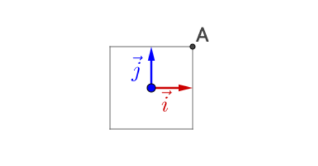
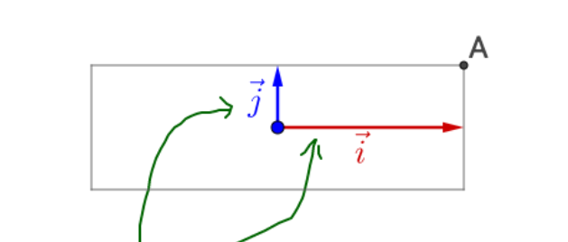
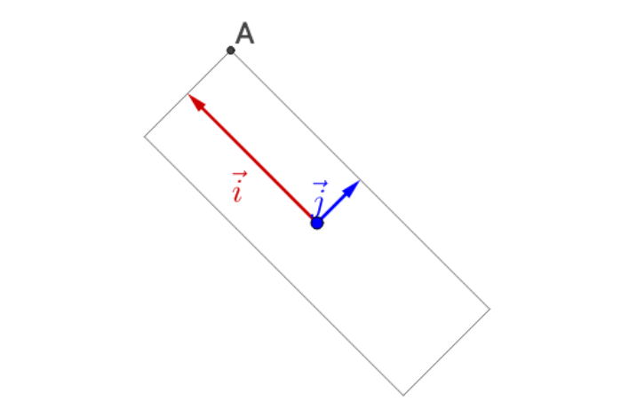

# 矩阵和行列式的本质

最近在学习闫令琪大佬的[计算机图形学入门](https://www.bilibili.com/video/BV1X7411F744)， 同时也在做设计传统图像特征提取的工作， 对涉及的很多关于线性代数的模糊不清的概念有了进一步的认识， 所以就总结一下。

## 基本概念

* 矩阵
* 行列式

## 矩阵

### 矩阵特征值和特征向量

> * 定义1： 设 $A$ 是 n 阶矩阵， 如果数$\lambda$ 和非零列向量$\alpha$使关系式$A\alpha = \lambda\alpha$成立， 则称这样的数$\lambda$为方阵A的特征值， 非零向量 $ \alpha$ 称为$A$对应于特征值 $\lambda$的特征向量
>
> * 定义2： 设 $A$为n阶矩阵， 称$\lambda I - A$为$A$的特征矩阵， 其行列式$\begin{vmatrix} \lambda I - A \end{vmatrix}$为$\lambda$的 n 次多项式，$\begin{vmatrix} \lambda I - A \end{vmatrix} = 0$ 称为A 的特征方程。

矩阵本质上可以看作是运动的状态，对于运动而言， 最重要的就是速度和方向，这就是特征值和特征向量所代表的含义：

> * 矩阵特征值就是运动的速度
>
> * 矩阵特征向量就是运动的方向
> * 是对称矩阵的特征向量一定是正交的

因此特征值和特征向量也可以称为运动（即矩阵的特征）

> 矩阵乘法对应了一个变换， 是把任意的一个向量变成另一个方向或长度大多不同的新向量。在这个变换中， 原向量主要发生旋转和伸缩的变换。**如果矩阵对某一个向量或某些向量只发生伸缩变换， 不对这些向量产生旋转的效果， 那么这些向量就称为是这个矩阵的特征向量， 伸缩的比例就是特征值**

### 空间基

**在研究线性变换时最重要的是确定空间所对应的基**  

> 定义1: 设 $V$ 为向量空间， 如果 $r$ 个特征向量$\alpha_1,\alpha_2, \cdots,\alpha_r \in V$, 且满足
>
> * $\alpha_1,\alpha_2, \cdots,\alpha_r$ 线性无关；
> * $V$ 中的任意一个向量都可以由$\alpha_1,\alpha_2, \cdots,\alpha_r$ 线性表示
>
> 那么， 向量组$\alpha_1,\alpha_2, \cdots,\alpha_r$ 就称为向量空间中的一组基， $r$ 就称为向量空间V 的维数，并称$V$为$r$维向量空间

> 定义2：如果在向量空间$V$中取定一个基$\alpha_1,\alpha_2, \cdots,\alpha_r$, 那么$V$ 中的任一向量$x$可以唯一地表示为
>
> $$x = \lambda_1 \alpha_1 + \lambda_2 \alpha_2 + \cdots + \lambda_r \alpha_r $$
>
> 数组$\lambda_1, \lambda_2, \cdots, \lambda_r$ 称为向量$x$ 在 基$\alpha_1,\alpha_2, \cdots,\alpha_r$ 中的坐标
>
> 特别地，在 n 维向量空间$\mathbb{R}^n$(欧式空间)中取**（线性无关）单位坐标向量组**$e_1,e_2, \cdots,e_n$ 为基，则以$x_1, x_2, \cdots, x_n$为分量的向量$x$，可以表示为
>
> $$x = x_1 e_1 + x_2 e_2 + \cdots + x_n e_n $$
>
> 可见向量在基$e_1,e_2, \cdots,e_n$ 中的坐标就是该向量的分量， 因此$e_1,e_2, \cdots,e_n$ 叫做 $\mathbb{R}^n$中的自然基。

注意：定义2 意味着**同一向量空间存在的基是不唯一的， 且同一向量在空间的不同基下的坐标值是不同的**， 以二维空间为例， 任意两个不平行的向量都可以作为空间的基。

**自然基**是指由某一维为1，其余维都0的向量组成的一组基，基里的向量均线性无关。以二维空间为例， 二维空间的两个自然基为
$$
\vec{i} = \begin{pmatrix} 1 \\0 \end{pmatrix}  \qquad  \vec{j} = \begin{pmatrix} 0 \\1 \end{pmatrix}
$$
**默认的向量空间基为自然基， 但是很多情况下向量的表示并不是自然基。**

> 定义3：设 $n$ 维向量 $e_1,e_2, \cdots,e_r$r是向量空间 $V(V \subset \mathbb{R}^n)$的一个基， 如果$e_1,e_2, \cdots,e_n$两两正交（两个向量的点积为0），且都是单位向量(每个向量的长度为1)， 则称$e_1,e_2, \cdots,e_r$ 是 $V$的一个规范正交基或标准正交基

容易验证，每一组自然基都是标准正交基。

###  矩阵变换

矩阵变换以 向量  $v=\begin{pmatrix} 1 \\ 0 \end{pmatrix}$ 以自然基为空间基进行变换为例 进行说明

* 尺度变换（Scale）

  令尺度变换矩阵 $m_1$为 $m_1=\begin{pmatrix} 2 & 0\\ 0 & 2 \end{pmatrix}$
  $$
  v_1= m_1 v = \begin{pmatrix} 2 & 0\\ 0 & 2 \end{pmatrix}\begin{pmatrix} 1 \\ 0 \end{pmatrix} = \begin{pmatrix} 2 \\ 0 \end{pmatrix}
  $$
  

  尺度变换是沿着自然基的方向做尺度变换， 这里向量的长度由1变成了2。

* 旋转变换 (Rotation )

  对于以自然基为空间基的情况下，以逆时针方向为正的旋转方程可以表示为 
  $$
  m =\begin{pmatrix} cos(\theta) & -sin(\theta)\\ sin(\theta) & cos(\theta) \end{pmatrix}
  $$
  假设旋转角度$\theta=45^o$, 旋转矩阵$m_2$为$m_1=\begin{pmatrix}\frac{\sqrt{2}}{2} & -\frac{\sqrt{2}}{2}\\ \frac{\sqrt{2}}{2} & \frac{\sqrt{2}}{2} \end{pmatrix}$， 对$v_1$做旋转变换
  $$
  v_2= m_1 v = \begin{pmatrix}\frac{\sqrt{2}}{2} & -\frac{\sqrt{2}}{2}\\ \frac{\sqrt{2}}{2} & \frac{\sqrt{2}}{2} \end{pmatrix}\begin{pmatrix} 2 \\ 0 \end{pmatrix} = \begin{pmatrix} \sqrt{2} \\ \sqrt{2} \end{pmatrix}
  $$
  旋转变换就是向量尺度保持不变的情况下， 对以原点为中心进行旋转变换，这里向量的长度为保持不变为2，向量与基的夹角由$0^o$变为$45^o$

* 组合变换

  根据矩阵的性质，可以组合多个变换完成复杂的变换，这里可以上面的组合尺度变换和旋转变换
  $$
  \begin{equation}
  	\begin{aligned}
  v_3 =&\begin{pmatrix}\frac{\sqrt{2}}{2} & -\frac{\sqrt{2}}{2}\\ \frac{\sqrt{2}}{2} & \frac{\sqrt{2}}{2} \end{pmatrix}\begin{pmatrix} 2 & 0\\ 0 & 2 \end{pmatrix}\begin{pmatrix} 1 \\ 0 \end{pmatrix} \\
    =& \begin{pmatrix}\ \sqrt{2} & -\sqrt{2}\\ \sqrt{2} & \sqrt{2} \end{pmatrix}\begin{pmatrix} 1 \\ 0 \end{pmatrix} \\
    =& \begin{pmatrix} \sqrt{2} \\ \sqrt{2} \end{pmatrix}
  \end{aligned}
  \end{equation}
  $$

### 特征值和特征向量的性质

* 数学定义

  对于矩阵$V$， 如果存在数$\lambda$ 和非零向量 $\vec{v} $, 使得关系式$A\vec{v} = \lambda\vec{v}$成立,  如下图所示， 换句话说 向量$\vec{v} $ 经过矩阵变换后的新的向量$A\vec{v} $,  $A\vec{v} $与$\vec{v} $仍然在同一条直线上（方向相同）, 只是向量的长度发生了变化。则称这样的数$\lambda$为方阵A的**特征值（eigenvalues）**， 非零向量$\vec{v} $称为$A$对应于特征值 $\lambda$的**特征向量（eigenvector）**。特征向量所在的直线包含了所有的特征向量，我们称为**特征空间**

  

* 几何意义

  > 同一个线性变换， 不同基下的矩阵，称为**相似矩阵**

  对于实对称矩阵$A$， 根据对称矩阵的性质，我们可以通过相似矩阵进行特征值分解：
  $$
  A = P \Lambda P^{-1}
  $$
  这里$\Lambda$为对角阵， 对角线元素为矩阵的特征值， $P$ 的列向量是单位化的特征向量。

  假设对称矩阵A为$A = \begin{bmatrix} 2 & -1\\ -1 & 2 \end{bmatrix}$进行特征值分解得到
  $$
  A = \begin{bmatrix} 2 & -1\\ -1 & 2 \end{bmatrix} =\begin{bmatrix}-\frac{\sqrt{2}}{2} & \frac{\sqrt{2}}{2}\\ \frac{\sqrt{2}}{2} & \frac{\sqrt{2}}{2} \end{bmatrix}\begin{bmatrix}3 & 0\\ 0 & 1 \end{bmatrix}\begin{bmatrix}-\frac{\sqrt{2}}{2} & \frac{\sqrt{2}}{2}\\ \frac{\sqrt{2}}{2} & \frac{\sqrt{2}}{2} \end{bmatrix}
  $$
  其中特征值3和1分别对应的特征向量为$\begin{bmatrix}-\frac{\sqrt{2}}{2} \\ \frac{\sqrt{2}}{2}  \end{bmatrix}$和$\begin{bmatrix}\frac{\sqrt{2}}{2} \\ \frac{\sqrt{2}}{2}  \end{bmatrix}$，且两个特征向量是正交向量。

  **接下来验证矩阵$A$与其对应特征向量相乘，得到的新的向量方向与特征向量相同**， 通过矩阵$A$的特征值分解矩阵的相乘， 可以验证**特征值和特征向量对于矩阵乘法运算的作用机理**

  图中$\vec{i}$和$\vec{j}$分别为使用矩阵A的单位特征向量的一组基所对应的基向量。其中 $\vec{i} = \begin{bmatrix}-\frac{\sqrt{2}}{2} \\ \frac{\sqrt{2}}{2}  \end{bmatrix}$, $\vec{j}=\begin{bmatrix}\frac{\sqrt{2}}{2} \\ \frac{\sqrt{2}}{2}  \end{bmatrix}$， 图中正方形也是以中$\vec{i}$和$\vec{j}$为基的区域。 观察矩阵相乘过程中正方形区域的变化。接下来以$\vec{i} = \begin{bmatrix} \vec{i} & \vec{j} \end{bmatrix}= \begin{bmatrix}-\frac{\sqrt{2}}{2} & \frac{\sqrt{2}}{2}\\ \frac{\sqrt{2}}{2} & \frac{\sqrt{2}}{2} \end{bmatrix}$为例进行说明。

* 第一步：首先左乘以$P^{-1}=\begin{bmatrix}-\frac{\sqrt{2}}{2} & \frac{\sqrt{2}}{2}\\ \frac{\sqrt{2}}{2} & \frac{\sqrt{2}}{2} \end{bmatrix}$
  $$
  A_0 =\begin{bmatrix}-\frac{\sqrt{2}}{2} & \frac{\sqrt{2}}{2}\\ \frac{\sqrt{2}}{2} & \frac{\sqrt{2}}{2} \end{bmatrix}\begin{bmatrix}-\frac{\sqrt{2}}{2} & \frac{\sqrt{2}}{2}\\ \frac{\sqrt{2}}{2} & \frac{\sqrt{2}}{2} \end{bmatrix} =\begin{bmatrix} 1 & 0 \\ 0 & 1\end{bmatrix}
  $$
  转换结果如下图所示， 容易得到，与单位特征向量构成的矩阵相乘，只是发生了一次旋转变换。

  

* 第二步，继续左乘$\Lambda=\begin{bmatrix}3 & 0\\ 0 & 1 \end{bmatrix}$
  $$
  A_1 =\begin{bmatrix}3 & 0\\ 0 & 1 \end{bmatrix}A_0 =\begin{bmatrix}3 & 0\\ 0 & 1 \end{bmatrix}\begin{bmatrix} 1 & 0 \\ 0 & 1\end{bmatrix} = \begin{bmatrix}3 & 0\\ 0 & 1 \end{bmatrix}
  $$
  转换结果如下图所示， 对角阵对向量进行了拉伸。

  

  **通过第一步的旋转变换， 将向量变化为新的基向量表示， 第二步，在新的基向量的情况下完成尺度变换。**

* 第三步， 最后左乘$P=\begin{bmatrix}-\frac{\sqrt{2}}{2} & \frac{\sqrt{2}}{2}\\ \frac{\sqrt{2}}{2} & \frac{\sqrt{2}}{2} \end{bmatrix}$
  $$
  A_2 =PA_1=P=\begin{bmatrix}-\frac{\sqrt{2}}{2} & \frac{\sqrt{2}}{2}\\ \frac{\sqrt{2}}{2} & \frac{\sqrt{2}}{2} \end{bmatrix}\begin{bmatrix}3 & 0\\ 0 & 1 \end{bmatrix} = \begin{bmatrix}-\frac{3\sqrt{2}}{2} & \frac{\sqrt{2}}{2}\\ \frac{3\sqrt{2}}{2} & \frac{\sqrt{2}}{2} \end{bmatrix}
  $$
  结果如下图所示， 尺度变换后向量通过第二次旋转变换回到了之前的方向。

  

通过观察可以发现如下理解：

* **向量的尺度变化只与特征值有关系， 与特征向量无关**
* **特征向量指明了尺度变换（拉伸）所发生的方向**
* **最大特征值对应的特征向量指明了运动速度的最大方向**

### 矩阵特征值的其他性质

假设n阶矩阵$A_{n\times n}$
$$
\begin{equation}
	\begin{aligned}
		A  =& 
		\begin{vmatrix}
		a_{01} & a_{12} &  \cdots & a_{1n} \\
        a_{21} & a_{22} &  \cdots & a_{2n} \\
         \vdots & \vdots &  \ddots & \vdots \\
		 a_{n1} & a_{n2} &  \cdots & a_{nn}
		\end{vmatrix} \\
		
	\end{aligned}
\end{equation}
$$
求矩阵的特征值公式如下
$$
\begin{equation}
	\begin{aligned}
		\begin{vmatrix}\lambda E - A \end{vmatrix} =& 
		\begin{vmatrix}
		\lambda - a_{01} & a_{12} &  \cdots & a_{1n} \\
        a_{21} & \lambda -a_{22} &  \cdots & a_{2n} \\
         \vdots & \vdots &  \ddots & \vdots \\
		a_{n1} & a_{n2} &  \cdots & \lambda - a_{nn}
		\end{vmatrix} \\
		=&(\lambda - \lambda_1)(\lambda - \lambda_2)\cdots(\lambda - \lambda_n)
	\end{aligned}
\end{equation}
$$
进一步可得
$$
\begin{equation}
	\begin{aligned}
		&\lambda^n - (a_{11} + a{22} + \cdots + a_{nn})\lambda^{n-1}+ \cdots + (-1)^n\begin{vmatrix} \mathbf {A}\end{vmatrix} \\
		=& \lambda^n - (\lambda_1 + \lambda_2 + \cdots + \lambda_n)\lambda^{n-1}+ \cdots + (-1)^n\lambda_1 \lambda_2\cdots\lambda_n
 \end{aligned}
\end{equation}
$$
比较同次幂系数可得
$$
\begin{equation}
	\begin{aligned}
		(a_{11} + a{22} + \cdots + a_{nn}) =& (\lambda_1 + \lambda_2 + \cdots + \lambda_n) \\
		\lambda_1 \lambda_2\cdots\lambda_n =& \begin{vmatrix} \mathbf {A}\end{vmatrix}
 \end{aligned}
\end{equation}
$$

## 行列式

> * 定义1： 行列式（determinant）在线性代数（algebra）是将**方阵**映射到实数的函数。定义域为det 的矩阵（方阵）A所对应的行列式， **取值为一个标量**， 写作$det(A)$ 或$\begin{vmatrix}A \end{vmatrix}$。行列式等于矩阵特征值的乘积
> * **行列式本质上是对矩阵所描述的线性变换的某些性质进行编码**。 
> * **行列式的代数意是一种反对称多重线性函数**
> * **行列式的物理意义是线性变换的有向体积**
> * **n阶行列式是n个n维线性空间的笛卡尔积上唯一一个把一组标准基映射到1的反堆成线性函数**=

### 行列式的作用

> **行列式就是线性变换的伸缩因子**

 **行列式的绝对值**用来衡量矩阵参数矩阵乘法后空间扩大或缩小了多少：

* 矩阵行列式的绝对值**大于1**，转换使得**空间体积扩大**
* 矩阵行列式的绝对值**等于1**， 空间体积保持不变**
* 矩阵行列式的绝对值**大于0小于1**，**空间体积缩小**
* 矩阵行列的绝对值**等于0**， 意味着空间至少沿着某一维完全收缩了， 使其失去了所有的体积。 特别指出，这种情况下 **变换是不可逆的**（维度某一维度变为0， 意味着转换会丢失对应维度的信息）

### 克拉默法则

## 参考资料  

* <https://zhuanlan.zhihu.com/p/67770305>
* <https://www.zhihu.com/question/21874816/answer/181864044>