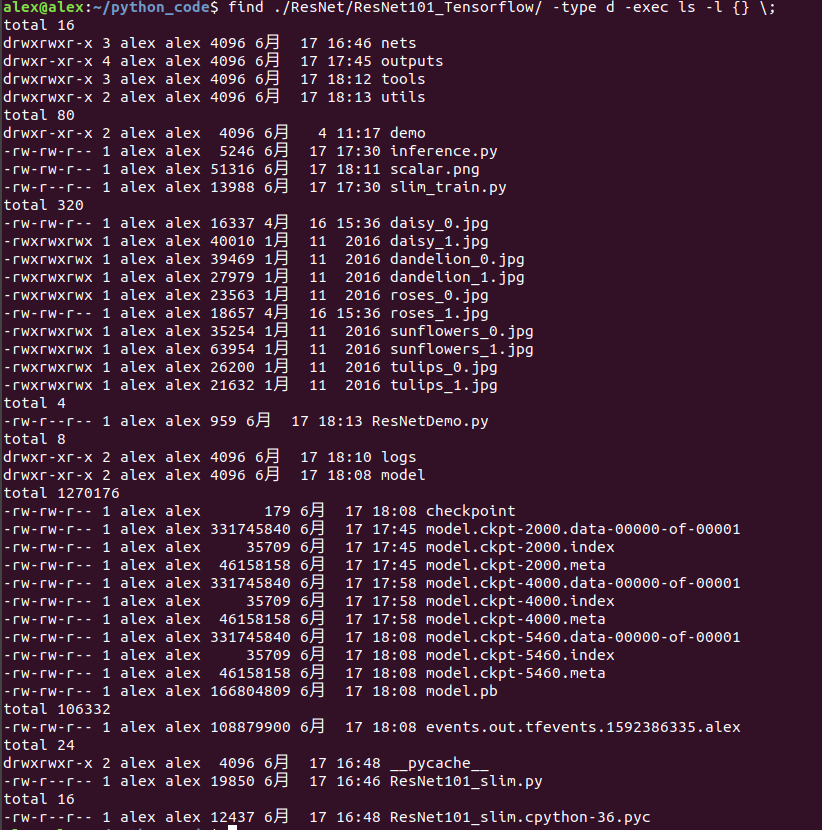
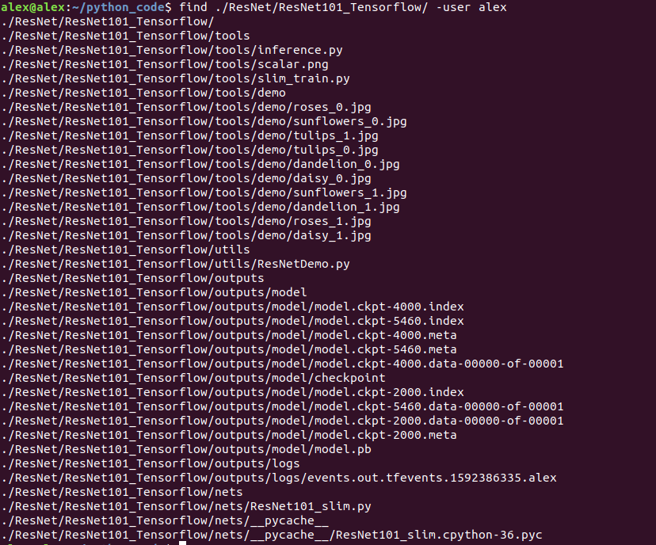

# 查找命令

## locate

​	locate命令用以快速查找文件和文件夹

### 命令

```shell
locate [finename]
```


### 为什么查找速度快

locate 命令查找文件或目录时，并不是直接去读取文件系统，**它实际上是指向一个数据库（由updatedb准备）来查找用户需要查找的内容，并返回查找结果**。

locate命令需要预先建立数据库，数据库默认每天更新一次。很容易想到，这会导致一个问题，当我们在系统上创建了新的文件或目录后，需要更新该工具的数据库才能使其正常工作。否则，该命令将无法找到上次数据库更新后创建的文件或目录。

### 查看当前的数据库的状态

```
locate S
```


### 手动更新数据库

```
sudo updatadb
```


## find

 	find 命令用以高级查找文件和文件夹

### 命令

```shell
find [location][-options] [filename]
```

-options:

* name 文件名称

  ```
  find . -name ResNet
  ```

  

* perm (permmision) 权限

  ```shell
  find / -perm 777
  ```

* type 文件类型

  查看制定路径下的类型为文件的目录

  ```shell
  find ./ResNet/ResNet101_Tensorflow/ -type d
  ```

  

* exec 匹配项执行

  ```shell
  find ./ResNet/ResNet101_Tensorflow/ -type d -exec ls -l {} \;
  ```

  

* user 用户对应文件

  ```shell
  find ./ResNet/ResNet101_Tensorflow/ -user alex
  ```

  

* group 分组

  ```
  sudo find / -group ssh
  ```

  

* size 大小

* atime访问时间|mtime内容更改时间|ctime 状态改动时间

* ...

## 参考资料

* [参考资料一](https://www.howtoforge.com/linux-locate-command/ "howtoforge")

* [参考资料二](https://www.geeksforgeeks.org/find-command-in-linux-with-examples/ "geekforgeeks")