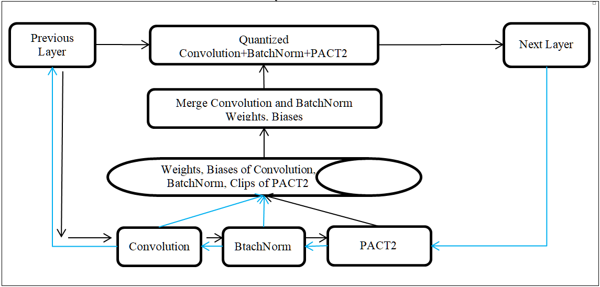

# 基于 TIDL 模型量化

## TIDL 量化过程

TIDL 库支持两种量化方法后训练量化（Post Training Quantization, PTQ）和量化感知训练(Quantization Aware, QAT ) 量化两种方式。

TIDL 提供了 一个封装模块`QuantTrainModule` ，可以去自动化QAT所有的任务。用户只需要使用`QuantTrainModule`封装模型并进行训练。

### QuantTrainModule 处理流程

1. 用PACT2 替换模型中的所有RELU、RELU6 层：具体实现中，使用 pytorch 中 nn.Modules 的前向 hook 机制去回调额外的激活函数。这样能够不干扰现有预训练权重的情况下添加这些额外的激活。
2. 权重范围裁剪：如果权重的范围太高，就裁剪权重的值到合适的范围
3. 卷积层与批归一化层合并：在量化训练的前向过程中，将融合卷积层与其相邻的BN 层动态地合并，可以提高缩放因子$S$ 和零点预估准确性，提升量化感知训练的精度。
4. 在量化训练的过程中同时量化权重和激活。

### PACT2 激活模块

PACT2 激活模块用于将激活限制为2的幂次方值，PACT2 用于替代常用的激活函数如ReLU、ReLU6 等。TIDL 的QAT 训练时会在在必要时自动插入PACT2激活模块，以限制激活值范围。在PACT2中使用统计范围（而不是最大最小值）进行限幅来提高量化精度。

### QAT 训练过程

1. 每次迭代，使用原始的权重和偏差执行前向浮点运算。**这个过程中，PACT2 层会使用直方图和移动平均收集输入的范围，使用统计范围进行裁剪来提高量化精度（与最大-最小范围裁剪相比）**
2. 执行卷积和BN 的合并，并量化合并后得到的权重。这些量化和反量化的权重被用与前向推理。PACT2 收集的范围用于激活量化和量化输出。
3. 使用**STE(Straight-Through Estimation)**反向传播更新参数，去降低量化损失。
4. 使用小的学习率，训练少量 epoch，获得合理的量化精度。

### 关于QAT 部署的推荐和限制规则

* **同一模块不应在模块内重复使用**，以保证特征图范围估计的准确性。这里比如在ResNet 的 BasicBlock 和 BottleneckBlock 中的同一个ReLU在不同层重复使用多次。在执行感知量化前需要对对应模块进行重写，为每一个卷积层分配不同的ReLU激活层。*这里与pytorch 官方QAT量化训练的要求一致*
* **使用`Modules` (继承自nn.Module的类)替换 `funtionals` 或 `operations`**。比如使用 `torch.nn.ReLU` 替换 `torch.nn.functional.relu()`，使用`torch.nn.AdaptiveAvgPool2d()` 替换 `torch.nn.functional.adaptive_avg_pool2d()`， 使用 `torch.nn.Flatten()`替换` torch.nn.functional.flatten()`等。这样做的目的是为了方便量化感知训练过程中的范围收集、卷积层与BN 层的合并等操作。*这里与pytorch 官方QAT量化训练的要求一致*
* **TIDL 量化库自定义的模块**：`xnn.layers.AddBlock`执行元素级加法，`xnn.layers.CatBlock`执行张量拼接。这里是**与第二条规则对应的**，使用自定义的模块去解决，pytorch 官方库中只有`funtionals`，而没有对应`Modules`类的问题。当然，这些**自定义模块也遵循第一条规则**。
* **关于模型导出为onnx**：`Interpolation`/`Upsample`/`Resize`这些操作在pytorch 导出onnx 的过程中有一定的棘手性，必须使用正确的选项才能获得干净的onnx图。TIDL 库提供了这些运算符的`funtionals`形式`xnn.layer.resize_with`和`Modules`形式`xnn.layers.ResizeWith`导出干净的onnx 图。
* **关于训练**：在QAT训练期间的几个 epoch 之后，**冻结BN 和 量化范围对获得更高的量化准确性有益**，实用的函数 `xnn.utils.freeze_bn(model) `和` xnn.layers.freeze_quant_range(model) `可以被用在这里。 
* 其他：如果一个函数不改变特征图的范围，那么是否以`Modules`形式使用它并不重要。比如`torch.nn.functional.interpolate`

## edgeai-torchvision 量化库使用

### PTQ

PTQ(Post-Train-Quantization) 对应的模块为`QuantCalibrateModule`(edgeailite/xnn/quantize/quant_calib_module.py)

### QAT

QAT(Quantization Aware Training) 对应的模块为`QuantTrainModule`(edgeailite/xnn/quantize/quant_calib_module.py)

QAT 的默认的量化方式为**对称（symmetric）**、**二次幂（power-of-two）量化**。

**QAT 量化训练的流程**如下：

1. 第一步，插入伪量化节点 `model_surgery_quantize`(edgeailite/xnn/quantize/quant_train_module.py): 将计算图中所有的模块替换为伪量化模块。*这里会对激活函数做特殊处理，如果激活函数为ReLU 或者 ReLU6，调整符号标签`sign=False`，即使用**无符号量化**。*
2. 第二步，设置模块属性控制模块的行为`apply_setattr`(edgeailite/xnn/quantize/quant_base_module.py)：配置模块属性，使设置生效
3. 第三步，执行量化训练。 量化训练过程中，会通过`merge_quantize_weights`(edgeailite/xnn/quantize/quant_train_module.py)会执行 conv 与 bn 层的合并，以优化量化精度。
4. 第四步，保存量化训练

**获取权重、激活函数和偏差的尺度因子**的代码分别为 `get_clips_scale_w`，`get_clips_scale_w` 和 `get_clips_scale_bias` (edgeailite/xnn/quantize/quant_base_module.py)

1. 第一步，统计浮点数的的进行对称处理和二次幂向上取整（$\hat{x} = pow(2, ceil(log(x)))$）裁剪之后的最小值 clip_min和最大值clip_max。
2. 第二步，计算对应量化 tensor （weight，bias，activation）对应量化位数取值范围的最小值width_min和最大值width_max。
3. 第三步，计算尺度系数scale，$scale= \frac{width_{max} } {clip_{max}}$

**伪量化节点**的代码为`quantize_dequantize_func`(edgeailite/xnn/layers/functional.py)

1. 第一步，对尺度系数s进行二次幂向下取整，$\tilde{s} = pow(2, floor(log(s)))$
2. 第二步，使用**量化**公式，浮点数的值乘以尺度系数得到**伪量化后的值**（训练时还是浮点数） $x_{scale} = x \cdot \tilde{s}$
3. 第三步，计算尺度系数的倒数 $\tilde{s}_{inv}=\frac{1}{\tilde{s}}$
4. 第四步，对量化后的值执行范围裁剪（clamp）， $x_{clamp}=clamp(x_{scale};width_{min}, width_{max})$
5. 第五步，对量化后的值进行**反量化**，得到**浮点数值**，$\hat{x}=x_{clamp}\cdot \tilde{s}_{inv}$
6. 第六步，返回**引入量化误差**后的浮点数值

## 参考资料

* <https://github.com/TexasInstruments/edgeai-torchvision/blob/master/docs/pixel2pixel/Quantization.md>
* https://software-dl.ti.com/jacinto7/esd/processor-sdk-rtos-jacinto7/08_04_00_06/exports/docs/tidl_j721e_08_04_00_16/ti_dl/docs/user_guide_html/md_tidl_fsg_quantization.html>

* <https://github.com/TexasInstruments/edgeai-torchvision>