# 知识蒸馏调研

## 概述

在考虑引入新的数据的情况下，大模型的过参数化可以提高模型的泛化能力。但是由于计算容量和内存的限制，大模型在部署到移动端时回有巨大的挑战。模型压缩技术，通过参数去冗余化解决这个问题，主要包括模型剪枝，知识蒸馏，网络搜索等。

 **知识蒸馏是通过将大模型的信息迁移到小模型，或者说从达模型学习一个小模型，达到参数去冗余的和模型加速目的。*

知识蒸馏的**动机**是学生模型模仿教师模型去获得具有竞争力或者更优越的表现

知识蒸馏的**关键问题** 是如果迁移知识从一个教师模型到一个学生模型。

知识蒸馏主要由三个关键组件组成：

* 知识
* 蒸馏算法
* 教师学生架构

通过知识蒸馏达到模型压缩压缩的方式与人类的学习方式很相似。知识蒸馏方法已经扩展到教师-学生学习、互学习（mutual-leaning）、辅助教学（assistant-teaching）、终身学习（lifelong-learning）、自学习（self-learning）

## 蒸馏知识

蒸馏知识在算法结构的位置可以将蒸馏知识分为基于响应（response）的知识、基于特征（feature）的知识、基于关系（relation）的知识。

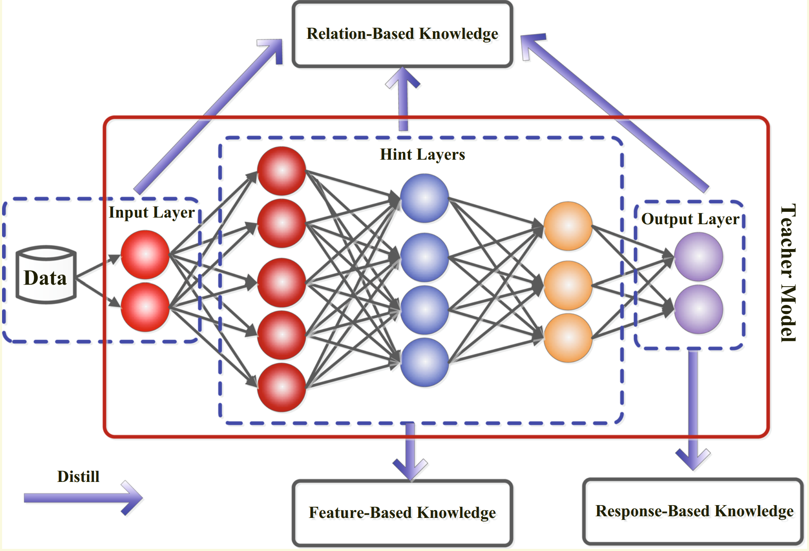

### 基于响应的知识

基于响应的知识表示教师模型最后输出层的响应。主要的观点是学生模型直接去模仿教师模型的最终预测结果。这里的输出指的是没有经过sftmax 的logits，非目标类别对应的输出值没有被抑制。

基于知识的响应通常会使用**温度系数T**, 分别对教师模型和学生模型的logits 进行软化. 

软标签信息相比于 one-hot 形式的真实标签具有更高的熵值，提供了更高的信息量，并提升了**各非目标类间**的关系信息。软标签起到了类似于标签平滑（label-smoothing）的作用，从而提高了模型的泛化性。

基于响应的损失函数表示为
$$
L_{res}(p(z_t, T), p(z_s,T))=L_R(p(z_t, T), p(z_s,T))
$$
其中 $p(z_i, T)=\frac{exp(z_i/T)}{\sum_jexp(z_j/T)}表示目标软化公式；T一般为大于1的温度尺度因子，去控制每个软化后目标的权重；$$L_R$经常采用 KL 散度损失。

* 优点

  简单直接、容易理解，尤其对于上下文为黑盒的知识。

* 缺点

  基于响应的知识依赖最后一层的输出，为解决教师模型中间层的监督的问题。而中间层的监督基于深度神经网络的表示学习非常重要；软的 logits 实际上表示了类的概率分布，这也限制了监督学习。

### 基于特征的知识

基于特征的知识可以看作是基于响应的知识的扩展，引入了教师网络**中间层的知识**作为监督去训练学生模型。

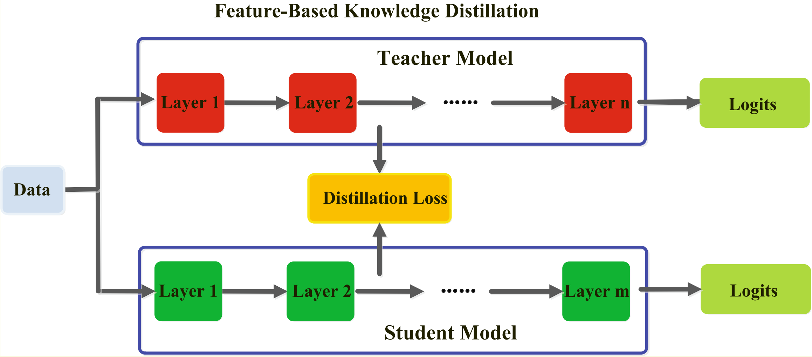

**通常情况下，教师特征图的通道数大于学生的通道数，二者无法直接对齐。**一般需要在教师特征图或者学生特征图之后加处理层去进行通道对齐，从而实现特征点的对应。实现**特征图对齐的功能模块**是基于特征蒸馏知识的核心模块，也是很多算法研究的重点。

基于特征的损失函数表示如下
$$
L_{feat}(f_t(x),f_s(x))=L_f(\phi_t(f_t(x),\phi_s(f_s(x)))
$$
其中$f_t(x)$和$f_s(x)$分别表示教师和学生模型中间层的特征图；$\phi_t(f_t(x)$和$\phi_s(f_s(x))$分别表示教师模型和学生模型去应用于通道对齐的转换函数；$L_F(.)$表示相似度函数

* 优点

  基于特征的知识引入了深度学习中抽象度不断提高的多层特征表示，为学生模型的学习提供了更优的信息。

* 缺点

  从教师模型中选择提示层（hint-layer）和从学生模型中选择指导层（guideed-layer）去匹配特征表示需要进一步探索。

### 基于关系的知识

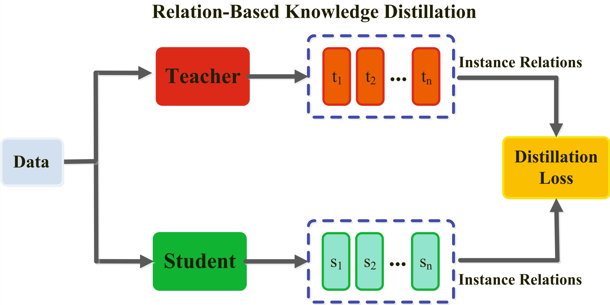

基于关系扩展了基于响应的知识和基于特征的知识，去探索不同层特征图或不同数据样本之间的关系。基于特征的知识只是计算特征点之间一对一的差异，而基于关系的知识是考虑**特征关系**的差异。

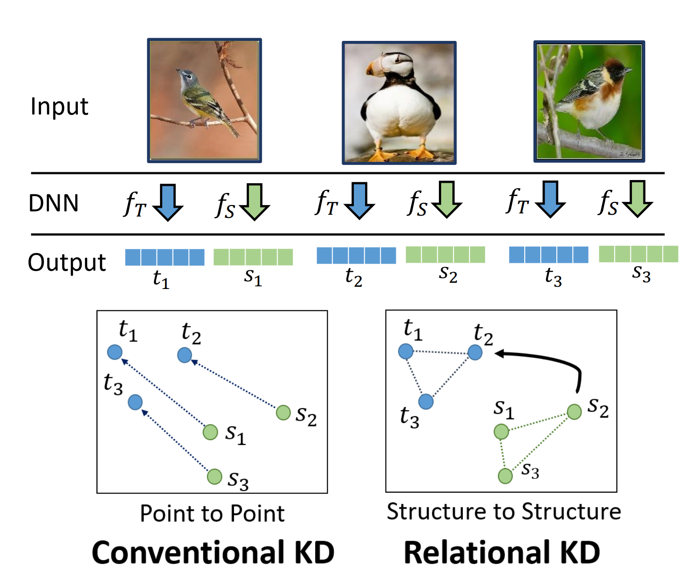

* 基于特征图关系的关系知识

  基于特征图关系的关系蒸馏损失如下
  $$
  L_{rel}(f_t，f_s) = L_R(\psi_t(\hat{f_t}, \check{f_t}),\psi_s(\hat{f_s}, \check{f_s}))
  $$
  其中$\hat{f_t}$和$\check{f_t}$表示教师模型的一对特征，$\hat{f_s}$和$\check{f_s}$表示学生模型的一对特征（（注意：这里的特征指的是一个样本在网络不同层对应的特征）；$\psi_t(.)$和$\psi_s(.)$表示相似度函数；$L_R(.)$表示教师和学生特征图之间的相关函数。

* 基于实例关系的关系知识

  传统的知识迁移只涉及个体的知识蒸馏，教师的个体软目标直接蒸馏到学生。**蒸馏的知识不止包含特征信息，还包括数据样本之间的互相关性**。基于实例关系的关系蒸馏损失如下
  $$
  L_{rel}(F_t，F_s) = L_R(\psi_t(t_i, t_j),\psi_s(s_i, s_j))
  $$
  其中 $(t_i, t_j) \in F_t$, $(s_i, s_j) \in F_s$, $F_t$和$F_s$分别表示教师和学生的不同样本特征的表示集合；$\psi_t(.)$和$\psi_s(.)$表示相似度函数;$L_R(.)$表示教师和学生特征表示之间的相关函数

## 蒸馏学习方案

根据教师模型是否与学生模型同时更新，知识蒸馏的学习方法可以为分为**离线蒸馏**、**在线蒸馏**和**自蒸馏**。

### 离线蒸馏

将预训练教师模型的知识迁移到学生模型。

整个训练过程分为两个阶段：第一阶段，在蒸馏之前训练一个大的教师模型；第二阶段，在蒸馏阶段，教师模型的特征知识被提取去指导学生模型的训练。

* 优点

  简单且容易实现；学生模型在预训练教师模型的指导下的训练更有效率。

* 缺点

  不可避免需要大量的时间去训练一个复杂的高容量教师模型；教师模型和学生模型之间的 gap 会始终存在；学生模型的性能过度依赖于教师模型

### 在线蒸馏

在线蒸馏是为了克服离线蒸馏的的限制和在大容量的高性能教师模型不能得到的情况下，去进一步提升学生模型的表现。

在线蒸馏过程中，学生模型和教师模型被同时更新，且整个知识蒸馏架构是端到端可训练的。

* 优点

  在线蒸馏是一种一阶段端到端训练方案；有高的并行计算效率

* 缺点

  现有的在线方案，通常无法解决在线环境中的高容量教师问题。需要进一步探索在线环境中，教师模型和学生模型的关系。

### 自蒸馏

在自蒸馏中，教师模型和学生模型使用相同的网络。自蒸馏可以被看作是一种特殊的在线蒸馏。

## 蒸馏架构

从教师模型到学生模型之间知识获取的和蒸馏的质量取决于如何去设计教师和学生网络。**我们希望学生能够找到正确的老师，去更好地获取和蒸馏知识**，因此如何选择合适的老师和学生架构是很重要的

> 大模型（教师模型）和小模型（学生模型）之间的容量 gap 会损害知识迁移

为了有效地将知识转移到学生网络，目前已经提出了多种方法来控制降低模型复杂性。

## 蒸馏算法

### 对抗蒸馏

### 多教师蒸馏

### 跨模态蒸馏

### 基于图的蒸馏

## 知识蒸馏相关论文

### Knowledge Distillation: A Survey(IJCV 2021)

* 类型：综述
* 摘要：
* 贡献：
* 方向：略

### Knowledge Distillation and Student-Teacher Learning for Visual Intelligence(TPAMI 2021)

* 类型：视觉综述
* 摘要
* 贡献
* 方向：略

### Revisiting Knowledge Distillation for Object Detection(2021)

* 类型：目标检测综述
* 摘要
* 贡献
* 方向：略

### Distilling the Knowledge in a Neural Network(KD, NIPS 2015)

* 类型：应用，基于响应的知识

* 摘要：论文指出使用复杂的集成模型进行预测，太笨重、计算成本高，难以部署给大量用户。本文提出将集成模型的知识蒸馏到单个模型。**将复杂模型的泛化能力迁移到小模型的方法是使用复杂模型产生的类概率作为“软目标去训练小模型”**

* 关键点

  * 引入温度 T 软化目标
    $$
     q_i(z_i, T)=\frac{exp(z_i/T)}{\sum_jexp(z_j/T)}
    $$
    其中$z_i$ 表示目标 logits

  * 温度 T 的作用

    复杂模型总是对正确类产生很高的置信度，而关于目标数的很多信息存在于小的概率中，这些信息是数据上定义相似度结构的有价值信息。这些信息在转换阶段直接通过 softmax 损失函数，概率值会接近于0，所以对交叉熵损失函数只有很小的影响。

    论文引入温度 T 去产生一个类的软的概率分布，使得目标函数中非目标类的信息（相似度结构信息）的影响得到增强，**T 取大于 1 的值**。

  * 目标函数
    $$
    L = L_0+\frac{1}{T^2}L_1
    $$
    其中$L_0$表示教师模型与学生模型之间软目标的交叉熵损失，$L_1$表示学生模型与真实标签（硬标签）的交叉熵损失。这里第二项乘以$\frac{1}{T^2}$的原因是，**由软目标产生的梯度大小的尺度为$\frac{1}{T^2}$，** 之后的很多论文也会用到这个性质。

* 贡献: 知识蒸馏的开篇之作
* 方向：分类，语音识别

### FitNets: Hints for Thin Deep Nets(FitNets, ICLR 2015)

* 类型：应用，基于特征的知识

* 摘要：KD 的知识蒸馏方法是小的模型去模仿大的教师模型或者集成模型的软输出。论文中扩展了这个观点，**不仅使用输出，而且使用教师模型学到的中间层表示作为提示（hint）**，去训练一个比教师模型更瘦且更深的学生模型，以提升模型的训练过程和最终学生模型的表现。由于学生模型中间隐藏层一般会比教师的中间层小，**需要引入额外的参数去将学生的隐藏层映射到教师的隐藏层**。这允许训练一个更深的学生模型，并由选择的学生模型的能力来权衡模型泛化能力更好或运行更快。

* 关键点：

  * 为什么使用中间层特征

    从教师的隐藏层引入中间层提示（hint）去指导学生模型的训练过程。注意，**提示是正则化的一种形式**，因此我们必须成对地选择提示（hint）/引导（guided）层，以使得学生网络不会被过度正则化。将引导层设置的越深，
    
    网络的灵活性就越小，引导层越容易受到过度正则化的影响。因此我们选择提示作为教师网络的中间层，引导作为学生网络的中间层。

  * 提示层与指导层对齐

    

    由于提示层和引导层的输出特征尺寸通常不一致，作者提出使用一个回归（regression）层（b 种的 $W_r$）,来对齐特征的形状。回归层在之后的论文中通常称为自适应层（Adaptation Layer）,这也是很多工作的重要的改进点。

    **为了降低回归层的参数和计算量，使用卷积回归器替换全连接（线性）回归器。**

  * 损失函数
    $$
    L_{HT}(W_{Guided, W_r}) = \frac{1}{2}||u_h(x;W_{Hint})-r(v_g(x;W_{Guided});W_r)||
    $$
    其中$u_h$ 和 $v_g$ 分别是教师和学生网络是提升层和引导层映射函数，对应的参数分别为$W_{Hint}$和$W_{Guided}$;$r$ 是引导层的回归（regression）的函数，对应的参数为 $W_r$。

  * 训练过程
    * 第一阶段（如图b），使用训练好的教师模型的提示层，预训练学生模型对应的引导层和回归层。
    * 第二阶段（如图c）, 与传统的KD训练策略一样训练整个网络

* 贡献：基于特征知识蒸馏的开篇之作

* 方向：分类

### A Gift from Knowledge Distillation(FSP, CVPR 2017)

* 类型：应用，基于关系的知识
* 摘要：
* 贡献
* 方向：分类

### A Comprehensive Overhaul of Feature Distillation(OFD, ICCV 2019)

* 类型：应用，基于特征的知识

* 摘要：本文探索了特征蒸馏方法的设计方面，提出了新的特征蒸馏方法。新方法的损失函数可以使得教师网络转化 、学生转换、特征蒸馏位置和距离函数等各个方面协同作用。具体来说，蒸馏函数包括了一个新设计的边缘ReLU的特征变换，一个新的蒸馏特征位置和一个partial-L2距离函数，去跳过对学生压缩产生不利影响的冗余信息。

* 关键点：

  * 动机

    最近的方法（AB 和 FT）表现了**通过增加迁移信息的数量可以获得更好的蒸馏表现**。但是这些算法只是通过变换教师的特征值提升蒸馏的特征迁移x表现（FitNets 则是变换学生的特征值去对齐教师的特征），这为进一步的改进性能留下了空间。

  *  模型架构

    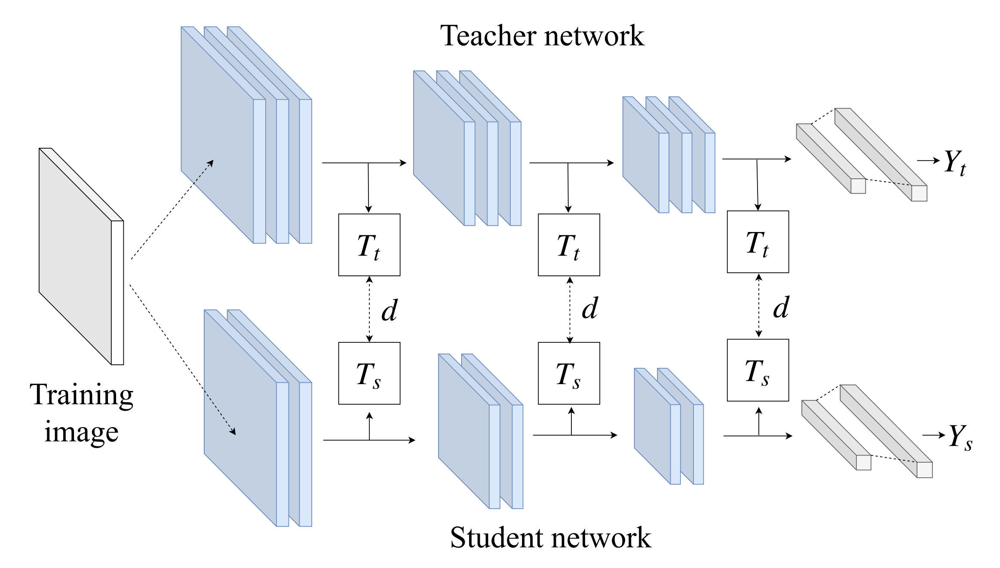

    图中$T_t$ 和$T_s$分别表示教师和学生的转换函数；$d$ 表示距离相似度函数

  * 教师转换和学生转换

    

    对于教师转换来说，当前的教师转换方法会造成教师特征信息的丢失，我们提出Margin ReLU, 正（有益）的信息没有任何转换地被使用，而负（不利）的信息被压制。

    对于学生转换，使用$1\times1$ 的卷积，增加特征的通道，这样没有信息会丢失。使用不对称的格式进行学生特征转换。

  * 特征蒸馏位置(Pre-ReLU)

    当前方法的蒸馏点都位于**每个层组的的最后**，这些都缺乏关于教师模型 ReLU激活值的考虑。

    > ReLU 允许有益（正）的信息通过并滤掉不利（负）的信息

    知识蒸馏必须在了解这种信息分布的情况下设计。

    **论文设计的蒸馏损失，将特征带到ReLU 函数之前，称为Pre-ReLU。**正值和负值都在 Pre-ReLU 的位置被保存，这使得学生能够在通过ReLU之前接触到教师保存的信息，更利于蒸馏。

  * Margin ReLU

    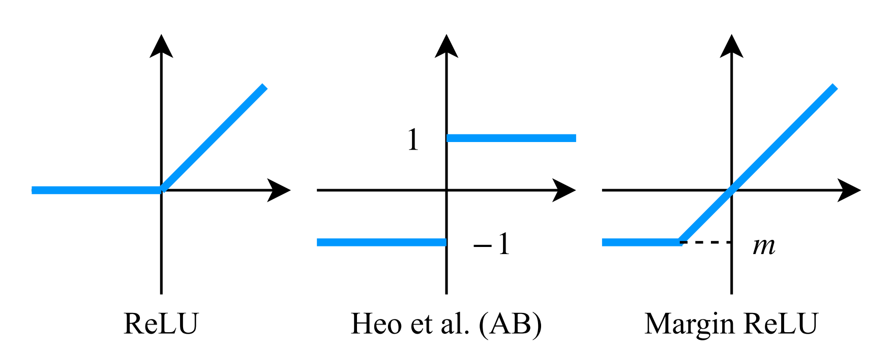
    $$
    \sigma_m(x)=max(x,m)
    $$
    Margin ReLU 旨在给定一个比教师负值更容易遵循的负界。式中的m 定义为负响应逐通道的期望值.

  * Partial $L_2$

    针对的特征表示在ReLU 之前，对于正响应该迁移它们的真实值，**但是对于负响应，如果一个学生的响应比目标值，它却不需要增加。由于无论为何止，ReLU 都会同等地阻止**。 partial $L_2$定义如下
  $$
  d_p(T,S)=\sum\begin{cases}
    0 \quad  & if\ S_i\leq T_i \leq 0\\
    (T_i-S_i)^2 & othrewise\\
    \end{cases}
  $$
    其中$T$ 和 $S$ 分别表示特征和学生的特征表示
  
  * 损失函数
  $$
  L = L_{task} + \alpha L_{distill}
  $$
  
  $$
    L_{distill} = d_p(\sigma_m(F_T)，r(F_s))
  $$
    其中 $L_{task}$表示网络特定任务的损失函数
  
    **论文提出的方法的使用蒸馏函数$L_{distill}$ 进行连续蒸馏**

* 贡献：论文提出的基于特征的蒸馏在图像分类、目标检测和语义分割等任务取得显著的表现提高。

* 方向：分类、目标检测、语义分割

### Relational Knowledge Distillation(RKD, CVPR 2019)

* 类型：应用，基于关系的知识

* 摘要：之前的方法可以表示为训练学生去模拟由由教师表示的**独立数据样本的的输出激活**的格式。关系知识蒸馏，则是去迁移数据样本的交互关系。为了实现RKD，本文提出了**实例级**和**角度级**的蒸馏损失，去惩罚关系中的结构差异。

  

* 贡献: 
* 方向：分类，少样本学习

### Knowledge Distillation Meets Self-Supervision(SSKD, ECCV 2020)

* 类型：应用，**自监督**
* 摘要：
* 贡献
* 方向：分类

### Contrastive Representation Distillation(CRD, ICLR 2020)

* 类型：应用，**自监督**
* 摘要：（对比学习在知识蒸馏领域的应用）
* 贡献
* 方向：分类

### Channel-wise Knowledge Distillation for Dense Prediction(CWD, ICCV 2021)

* 类型：应用，基于特征的知识，[开源](https://github.com/irfanICMLL/TorchDistiller/tree/main/SemSeg-distill)，

* 摘要：用于**稠密预测任务**的 KD 方法在空间域上对齐学生网络和教师网络的激活图。与之前的方法不同，本文提出了归一化每个通道的激活图去获得一个软的概率图。通过最小化两个网络通道级概率图之间的 KL 散度，蒸馏过程能够分配更多的注意力去每个通道最突出的区域，这对于绸密预测任务是有利的。

* 关键点

  * 动机

    之前研究发现，直接将 KD 中的方法用到语义分割中会产生不太令人满意的结果。最近的研究注意去加强不同空间位置（spatial location）的相关性, 每个空间位置的激活值被归一化。然后，通过聚集不同空间位置的子集来进行特定关系的任务。**但是每个空间位置的激活在迁移的时候贡献相同的知识，这会从教师网络带来冗余的信息**

    

    通过可视化容易发现，对于一个训练语义分割模型的**每个通道的激活特征趋近于去编码每个场景的显著性。** 因此可以考虑进行通道级的知识蒸馏。

    为了稠密预测任务，本文提出了**通过归一化每个通道的的激活图**的新的通道级知识蒸馏方法，然后**最小化归一化通道激活图的非对称 KL散度**。通过这种方法传输教师和学生之间每个通道的分布。学生网络的每个通道被引导用更多的注意力去模仿显著激活值的区域，导致了稠密预测任务任务中更准确的定位。

  * 通道级的蒸馏

    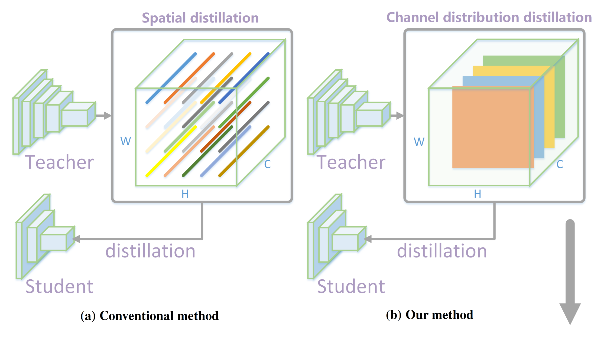

    首先转换一个通道的激活的**概率分布**，这样我们可以使用概率距离尺度**KL散度来度量概率分布的差异**。

  * 通道级蒸馏损失
    $$
    \varphi(\phi(y^T), \phi(y^S)) = \varphi(\phi(y_c^T), \phi(y_c^S))
    $$
    其中$y^T$ 和$y^S$ 分别对饮教师和学生的激活图，

    $\phi(\cdot)$用来将特征激活转换为概率图
    $$
    \phi(y_c)= \frac{exp(\frac{y_{c,i}}{\tau})}{\sum_{i=1}^{W.H}exp(\frac{y_{c,i}}{\tau})}
    $$
    其中$c$ 为通道所以，$i$ 一个通道空间位置的索引。**此外，一个$1\times1$的卷积层去上采样学生网络的输出去对齐教师网络**。

    $\varphi(\cdot)$用来评估教师网络和学生网络的差异，本文使用KL散度。
    $$
    \varphi(\phi(y^T), \phi(y^S)) = \frac{\tau^2}{C}\sum_{c=1}^C\sum_{i=1}^{W\cdot H}\phi(y_{c,i}^T)\cdot log{[\frac{\phi(y_{c,i}^T}{\phi(y_{c,i}^S}]}
    $$
    
    **KL 散度是一个非对称的尺度**，如果$\phi(y_{c,i}^T)$的值很大时，$\phi(y_{c,i}^S)$应该变得与$\phi(y_{c,i}^T)$一样大去最小化KL 散度。反之，如果$\phi(y_{c,i}^T)$的值很小时，KL 散度最小化与$\phi(y_{c,i}^S)$的关系很小。（乘积的第一项起主要作用）。
    
    **这样教师网络趋近于在前景的显著性中产生相似的激活分布，同时教师网络背景区域对应的激活项对于学习只有很小影响**。这种非对称性有利于稠密预测任务。
    
  * 损失函数
    $$
    L = L(y, y^S) + \alpha\varphi(\phi(y^T), \phi(y^S)) 
    $$
    其中第一项为特定任务的损失，$y$表示真实标签；第二项为蒸馏损失，$\alpha$为平衡损失项的超参数。

  

* 贡献：提出了通道级的蒸馏范围为稠密预测任务；在语义分割和目标检测任务显著高于当前 SOTA 方法

* 方向：分类、目标检测、语义分割

### Rethinking Soft Labels for Knowledge Distillation(WSLD, ICLR 2021)

* 类型：应用，基于特征的知识，离线蒸馏
* 摘要：最近的研究表明，使用软标签训练可以更高地规范化学生网络，但是训练过程中偏差和方差如何变化不清晰。本文探索的使用软标签进行蒸馏带来的偏差-方差的权衡。我们观察到在训练期间偏差与方差的权衡样本级地改变。进一步，在相同蒸馏温度设定的情况下，**蒸馏的表现与一些特殊样本的数量负相关**，而这些样本被命名为**正则化样本（regularization samples）**，由于这些样本会导致偏差的增加和方差的降低。然而，我们经验的发现，完全过滤正则化样本也会损害蒸馏的表现。这些发现启发我们去提出新的重权重软标签去帮助网络自适应地处理样本级的偏差-方差权衡。
* 贡献
* 方向：分类

### Distilling Knowledge via Knowledge Review(ReviewKD, CVPR 2021)

* 类型：应用，基于特征的知识，[开源](https://github.com/dvlab-research/ReviewKD)

* 摘要：之前的方法侧重于提出统一级别特征的特征转换和损失函数。本文研究了教师和学生网络之间连接路径的跨层次因素，并揭示它的重要性。学生的单层通过教师的多层特征同时引导学习，这种引导学习的方式比起之前的方法更加完全，教师的浅层可以认为是比较简单的知识，深层是比较抽象的知识，学生训练早期会更加关注教师浅层简单知识的学习，随着训练的进行，会越来越关注teacher深层抽象知识的学习。

* 关键点：
  * 动机
  
    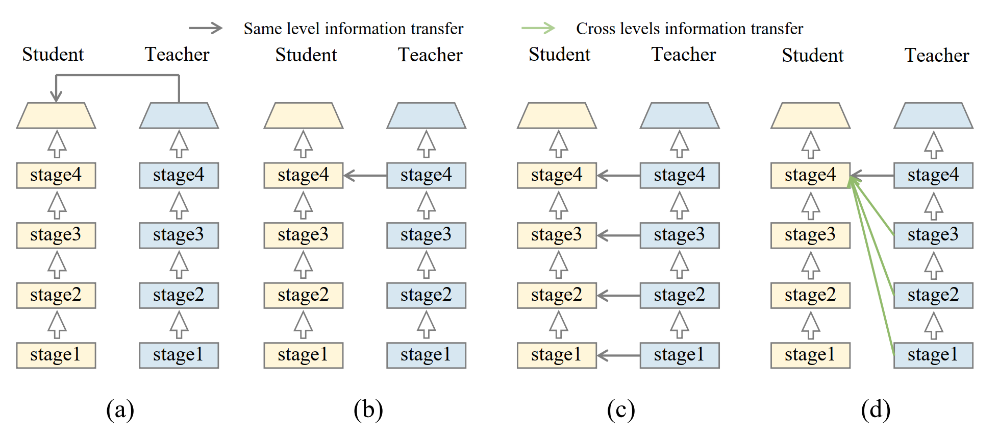
  
    所有之前的方法只使用教师相同层的信息去指导学生，但是我们发现这是一个知识迁移架构的瓶颈。我们提出了新的架构，**使用教师的多层信息去指导学生的单层学习，其关键的改变是使用教师网络底层的特征去监督学生网络的深层特征。**
  
  * knowledge review
  
    review 机制是使用教师**浅层的特征**去引导学生**深层特征**的学习。这意味着一个学生总是在学生新知识前更细对旧知识的理解和上下文。（相反地，使用教师的深层特征去监督学生浅层特征只会带来很小的收益并浪费很多资源，这可能与深层特征对于早期阶段的学习过于复杂）
  
  * ABL 和 HCL
  
    
  
    ABF(Attention Based Function)能够根据数据的特征生成不同的特征图，这样来自网络不同阶段的特征图可以被动态地集成。
  
    HCL(Hierachical Context Loss)，采用空间金字塔去分离不同层级上下文信息的知识迁移，这样信息能够在不同抽象层地被蒸馏。
  
  * 残差学习架构
  
    
  
    如果直接使用多阶段级的特征去进行多层蒸馏，由于不同阶段的特征的信息有很大不同，因此策略不是最优的，计算过程也很复杂。
  
    **残差架构是一种更优雅和更利于训练过程蒸馏架构。帮助训练过程更加稳定和容易优化**。在训练过程中，学生的深层特征与学生浅层特征（这里指前一阶段特征）想结合去模仿教师的浅层特征，这样学生深层特征就能够学习学生浅层特征与教师浅层特征的残差信息。
  
  * 损失函数
  
    $L = L_{CE}+\lambda L_{MKD\_R}$
  
    其中$L_{CE}$ 表示主损失；$L_{MKD\_R}$表示 review 机制的多层蒸馏损失。
  
    在训练过程中 review 机制的损失相当于一个正则化项，在学生网络推理时没有额外的时间损耗。
  
* 贡献： 首次在知识蒸馏种提出了跨阶段（cross stage）路径；提出了残差学习架构去更好地实现review 机制的学习过程；提出了ABF 模块和HCL 函数去进一步提升表现；

* 方向：分类、目标检测、实例分割

### Distilling Object Detectors via Decoupled Features(DeFeat, CVPR 2021)

* 类型：应用，基于特征的知识，[开源](https://github.com/ggjy/DeFeat.pytorch)
* 摘要：
* 关键点：

* 贡献：
* 方向：目标检测

### Decoupled Knowledge Distillation(DKD, CVPR 2022)

* 类型：应用，基于响应的知识，[开源](https://github.com/megvii-research/mdistiller)

* 摘要：重新思考了基于响应（logit)知识的蒸馏方案，提出将经典的 KD 损失分解为两部分：目标类知识蒸馏（TCKD）和 非目标知识蒸馏（NCKD）两部分。其中 TCKD 传递了训练样本难度相关的知识，而 NCKD 才是知识蒸馏起作用的原因。论文进一步揭示了经典的KD是一个耦合损失，它抑制了NCKD 的有效性和限制了两部分平衡的灵活性。本文使用解耦的知识蒸馏可以使得TCKD 和 NCKD 能够更有效、更灵活地发挥作用。

* 关键点：

  * 动机

    与基于logit的损失相比，基于特征的损失在各个任务上都有优势，但是会引入额外的计算和存储。

    由于logits 有更高的语义层级，理论基于 logit 的蒸馏应该与基于特征的蒸馏取得相当的表现，但是表现却更差。我们假设 logits 的潜力被某种原因限制了。

    我们将legit 蒸馏分为两部分，一个目标分类知识蒸馏（Target Classification Knowledge Distillation， TCKD) 和非目标分类（Non-target Classification Knowledge Distillation，NCKD)。其中TCKD表示了“难度知识”，而NCKD表示了对知识蒸馏起作用至关重要的知识，成为“暗知识”。

  * TCKD

    **TCKD 传递训练样本中困难的知识**，数据越困难，TCKD的益处就越大。为了验证这个假设，论文中采用数据增强、噪声数据和有挑战数据集等三种策略的困难数据做对比实验，使用TCKD 都取得更优的表现。说明当提取关于更具挑战性的训练数据的知识时，关于训练样本的“难度”的知识可能更有用。

  * NCKD

    NCKD是蒸馏起作用的重要知识，也是logit蒸馏中被抑制的知识。**论文中实验表明只使用NCKD蒸馏取得了与logit 蒸馏相当甚至更优的结果，同时只使用TCKD 蒸馏则产生了与logit蒸馏相比更差的结果 **。这表明了非目标 logit 在知识蒸馏中是起突出作用的“暗知识”。

  * 知识解耦

    上述表明，TCKD 和 NCKD 两者对于知识蒸馏都相当重要。但是在原始的logit 公式中，NCKD会被抑制。距离公式推理如下：

    假设分类的概率为$p=[p_1, p_2,\dots,p_t,\dots, p_C]，其中$$p_i$表示第$i$ 类的概率；$C$为类的数量
    $$
    p_i = \frac{exp(z_i)}{\sum_{j=1}^C{exp(z_j)}}
    $$
    其中$z_i$表示第$i$类的logit值。

    进一步目标类的概率表示为$b=[p_t, 1-p_t]$
    $$
    p_t = \frac{exp(z_t)}{\sum_{j=1}^C{exp(z_t)}}
    $$
    非目标类的独立概率为$\hat{p}=[\hat{p}_1,\cdots,\hat{p}_{t-1}, \cdots,\hat{p}_{t+1}, \hat{p}_C]$，其中$\hat{p}_i$表示如下
    $$
    \hat{p}_i = \frac{exp(z_i)}{\sum_{j=1,j\neq t}^C{exp(z_j)}}
    $$
    基于logit 的KD蒸馏损失如下
    $$
    L_{KD}=KL(P^T || P^S)
    $$
    通过公式变换（具体参考原文）可以表示为
    $$
    \begin{align*}
    L_{KD} &= KL(b^T||b^S) + (1-p_t^T)KL(\hat{p}^T||\hat{b}^S) \\
    &=TCKD + (1-p_t^T)NCKD
    \end{align*}
    $$
    其中$T$ 和$S$表示教师和学生；**$p_t^T$表示教师logit 中目标类别的置信度**；$KL(\cdot)$表示度量教师和学生特征相似度的KL散度损失,
    
    **公式表明，NCKD明显与目标类别的概率$(1-p_t^T)$耦合**。

  * 损失函数

      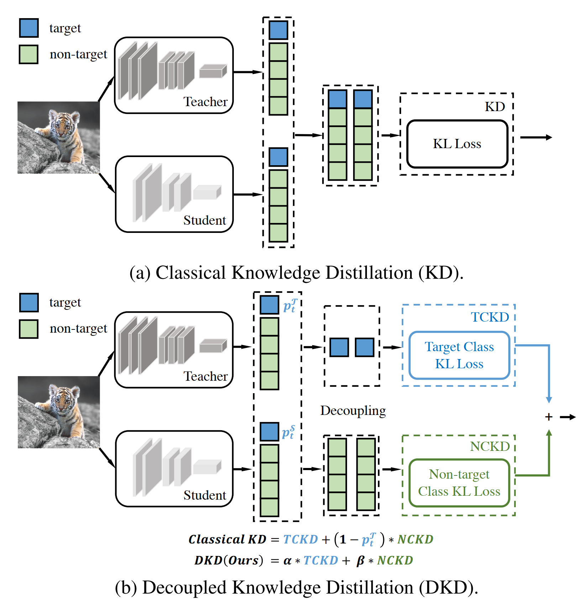

     由于NCKD损失与$(1-p_t^T)$ 耦合，意味着NCKD与目标类别的置信度呈**负相关**。一般认为教师中训练样本的置信度越高，将会提高更可靠和更有价值的知识。**但是，NCKD损失权重被目标类预测置信度的很大地抑制了，这抑制了NCKD 在良好预测样本的迁移效果**。

  
    为了改变TCKD和NCKD的权重去平衡重要性，论文引入了两个超参数$\alpha$ 和$\beta$ 分别作为TCKD 和 NCKD 的权重。DKD 的损失函数如下
  $$
    L_{KD} = \alpha TCKD + \beta NCKD
  $$
  
* 总结： 可以被认为是一种比经典KD论文中引入T去软化输出概率分布更激进/直接的方式，实现目标和非目标概率分布的完全解耦。

* 贡献：提供了新的视角研究了logit 的知识分布；揭示了经典KD损失的限制是由于它高的耦合形式；提出了新的解耦损失函数 

* 方向：分类、目标检测

### Localization Distillation for Dense Object Detection(LD, CVPR 2022)

* 类型：应用，基于响应的蒸馏，[开源](https://github.com/HikariTJU/LD)

* 摘要：目前目标检测的蒸馏方案主要聚焦于在模仿区域模仿深度学习特征，相比去模仿分类的logit，对于蒸馏信息更有效且有轻微提升。本文重新制定了定位的蒸馏过程，我们展示了新的定位蒸馏（Location Distillation,LD）能够有效地迁移知识从教师到学生。此外，我们启发式地介绍了有价值定位区域（valuable locolization region）的概念，它能够辅助选择一个确定区域蒸馏的**语义（semantic）**和**定位（localization）**知识。我们展示了**logits 模仿可以超过特征模仿的性能**，同时对于目标检测蒸馏问题来说，定位知识蒸馏比语义蒸馏更重要和有效。

* 关键点

  * 动机

    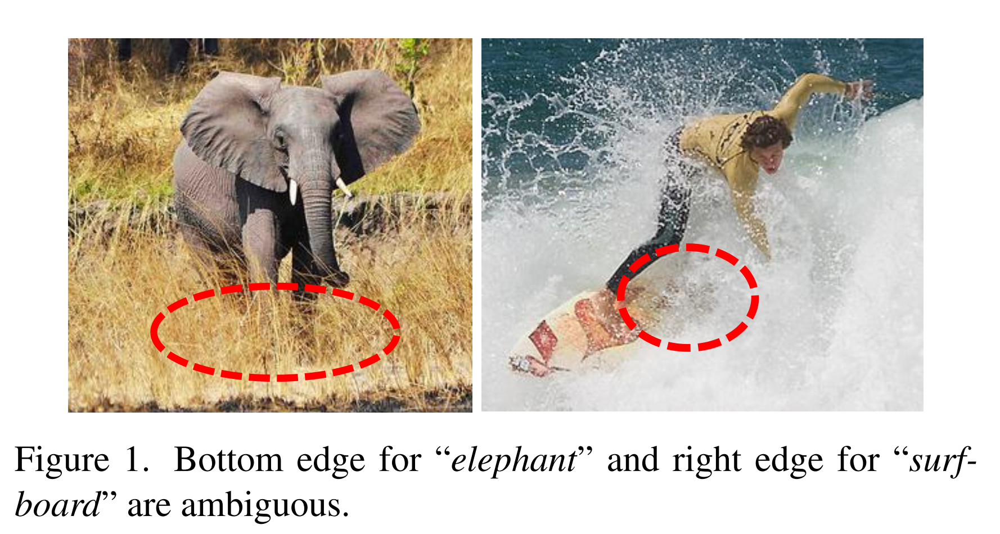
    
    定位模糊，无法通过边缘可靠地定位目标，仍然是目标检测的一个常见问题，尤其在小模型中更为明显，本文通过KD去缓解这个问题。
    
    现有目标检测的蒸馏方案强迫教师生和学生特征对的一致性，**但是由于语义知识和定位知识混合在特征图中，很难区分每个位置传递的混合信息是否有利于性能，以及哪些区域有利于某种知识的传递。**论文替代了简单地蒸馏特征图中混合知识，**我们提出了分而治之的策略，分别迁移语义和定位知识**。

  * 边框回归

    最近的边框表示已经从 **dirac delta 分布**演变为**高斯分布**， 并经一步变为**概率分布**。

    传统的bbox 表示方式有两种形式， $\{x,y,w,h\}$和$\{t,b,l,r\}$都输入dirac delta 分布， 它们只聚焦于真实的定位，而不能建模bbox 的模糊性。bbox 的概率分布更全面地描述了bbox的不确定性，并被证明是迄今为止最先进的bbox表示。让$e\in B$作为 bbox 的边界，它的值可以具体表示如下
    $$
    \hat{e} = \int_{e_{min}}^{e_{max}}xPr(x)dx, \quad e\in B
    $$
    其中 $x$ 是回归的坐标，$Px(x)$是对应的概率。

    传统的dirac delta 分布是概率分布的一种特殊情形。通过使用SoftMax函数，可以将给定边界框的每个边缘表示为概率分布

  * 定位蒸馏

    定位蒸馏（Location Distillation,LD）是由bbox 概率分布表示的视角得到的，概率分布可以携带更多的定位信息。

    首先将bbox 的四元表示如$\{t,b,l,r\}$转换为概率分布。假设$z$表示通过定位头预测的所有可能边缘$e$位置的logit, 对应的$z_T$ 和 $z_S$分别表示教师和学生的logit。教师和学生的概率$P_T$和$P_S$的相似度度量共识如下
    $$
    \begin{align*}
    L_{LD}^e &= L_{KL}(P_S,P_T) \\
    &=L_{KL}(S(z_S,\tau),S(z_T,\tau))
    \end{align*}
    $$
    其中$S(\cdot,\tau)$表示泛化的softmax 函数$S(\cdot,\tau)=softmax(\cdot/\tau)$；$L_{KL}$表示KL散度损失。

  * 有价值定位区域

    为了提高蒸馏的效率，本文提出了有价值定位区域（Valuable Location Region） 能够帮助判断不同区域中哪种类型的知识有利于迁移。

    之前的工作已经指出，分类和定位的知识分布模式是不同的。蒸馏区域被分为两部分主蒸馏区域和有价值蒸馏定位区域。**主(main)蒸馏区域**是有标签分配主观确定的，即检测头的正位置。

    有价值蒸馏区域的获取：

    * 首先，对于第$l$ FPN 层，计算计算所有 anchor 框与 gt 狂之间的 DIOU 矩阵$X_l$
    * 然后，设置 DIOU 的下界为$\alpha_{vl}=\gamma\alpha_{pos}$, 其中$\alpha_{pos}$是标签分配的正IOU阈值。
    * VLR 定义为 $V_l={\alpha_{vl}\leq X_l \leq \alpha_{pos}}$的区域

    **实际上可以将VLR视为主蒸馏区的向外延伸。**

  * 架构

    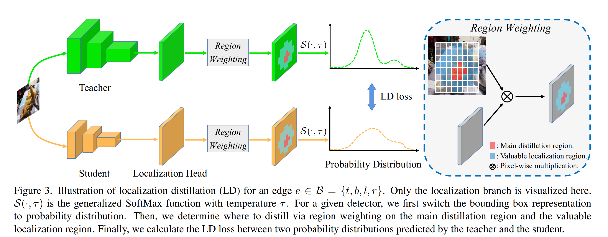

  * 损失

    论文中在分类头上采用原始的分类（logit）KD，同时对于定位知识，提出了更有效的定位蒸馏。**这两个操作都在独立头的logit 上而不是中间特征**。

* 贡献：

* 方向：目标检测

### Focal and Global Knowledge Distillation for Detectors(FGD, CVPR 2022)

* 类型：应用， 基于特征知识，[开源](https://github.com/yzd-v/FGD)

* 摘要: 论文指出**教师和学生的特征在不同的区域差异非常大**，尤其在前景和背景区域。**如果我们相同的蒸馏它们，特征间不均匀的差异会对蒸馏产生负面影响**。因此，本文提出了**Focal and Global Distillation(FGD)**。**Focal 蒸馏分离了前景和背景，强迫学生去专注于教师重要的像素和通道。Global 蒸馏重建了不同像素之间的关系，并从将它从教师迁移到学生，以补偿在Focal 蒸馏中消失的全局信息**。

* 关键点：

  * 动机

    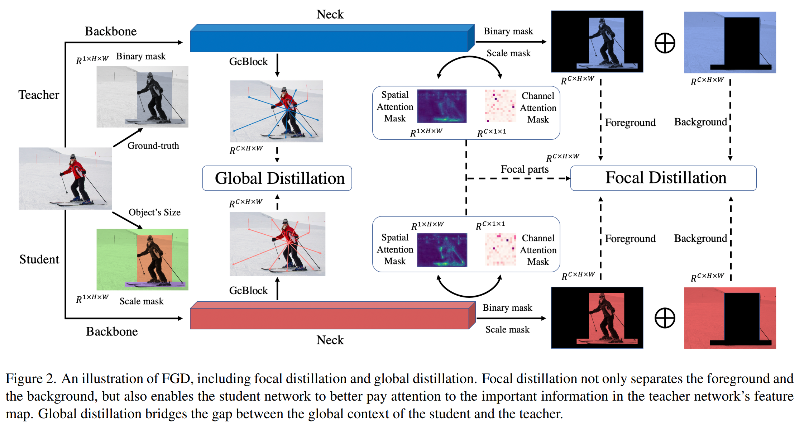

    众所周知，极端的前景和背景不平衡是目标检测的关键点，这种不平衡比率也会损害用于目标检测的蒸馏。很多的目标检测蒸馏方法，尝试去优化这个问题。但是，哪些是蒸馏的关键区域仍然不清晰。

    论文通过空间和通道注意力可视化发现，**学生的注意力和教师的注意力在前景中的差异非常显著，而在背景中的差异相对较小**。这可能导致学习前景和背景的困难程度不同。

    论文设计了前景和背景解耦的蒸馏实验，发现**一起使用前景和背景蒸馏的表现很差，甚至比单独使用前景和背景更差**。

    **选择有价值的区域进行蒸馏对检测蒸馏是一个很重要的问题**。之前的蒸馏方法**同等地对待所有的像素或通道，且大多数方法缺乏对像素之间上下文信息的蒸馏。本文提出了FGD去克服以上问题。

  * Focal 蒸馏

    Focal 蒸馏用于分离图像并引导学生专注于关键的像素和通道。

    首先定义一个二值的掩膜$M$去分离前景和背景
    $$
    M_{i,j}=\begin{cases}
      1 \quad  & if \ (i,j)\in r\\
      0 & othrewise\\
      \end{cases}
    $$
    其中 $r$ 表示 gt 区域了$i$和$j$分别表示水平和竖直坐标。

    容易发现，大尺寸目标由于更多的像素会占据更多的损失，对应的小尺寸的目标的影响会很小。并且，前景区域和背景区域的的比率在不同图像也会有各种变化。为了平等地对待不同尺寸的目标和平衡前景和背景的损失，我们设定了一个尺度掩膜$S$
    $$
    S_{i,j}=\begin{cases}
      \frac{1}{H_rW_r} \quad  & if \ (i,j)\in r\\
      \frac{1}{N_{bg}} & othrewise\\
      \end{cases}
    $$
    其中 $N_{bg}=\sum_{i=1}^{H}\sum_{j=1}^W(1-M_{i,j})$表示所有背景像素的数量。$H_r$和$W_r$分别表示gt 框的高和宽

    为了选择聚焦的像素和通道，参考CBAM论文分别计算空间注意力$G^S(F)$ 和通道注意力$G^C(F)$。

    然后注意力掩膜可以被公式化为
    $$
    A^S(F)=H\cdot W\cdot softmax(G^S(F)/T)
    $$

    $$
    A^C(F)=C\cdot softmax(G^C(F)/T)
    $$

    其中$T$表示温度超参数去调整分布。

    特征损失如下
    $$
    L_{fea}= \alpha\sum_{k=1}^C\sum_{i=1}^H\sum_{j=1}^WM_{i,j}S_{i,j}A_{i,j}^SA_{i,j}^C(F_{K,i,j}^T-f(F_{K,i,j}^S)) + \\beta\sum_{k=1}^C\sum_{i=1}^H\sum_{j=1}^W(1-M_{i,j})S_{i,j}A_{i,j}^SA_{i,j}^C(F_{K,i,j}^T-f(F_{K,i,j}^S))
    $$
    其中$F^T$和$F^S$分别表示教师和学生对应的特征图。$\alpha$和$\beta$为超参数去平衡前景和背景的损失

    论文使用注意力损失$L_{at}$ 损失去强迫学生去模仿教师的空间和通道注意力掩膜，公式化为
    $$
    L_{at}=\gamma\cdot(l(A_T^S,A_S^S)+l(A_T^C,A_S^C))
    $$
    其中$l(\cdot)$表示L1损失，$\gamma$是一个超参数去平衡损失。

    最终的Focal 损失$L_{focal}$为特征损失和注意力损失之和，公式如下
    $$
    L_{focal}= L_{fea} + L_{at}
    $$
     

  * Global 蒸馏

    不同像素之间的关系具有有价值的知识，用来提高检测任务的表现。但是Focal 损失切断了前景区域和背景区域之间的关系。Global 蒸馏旨在提取特征图不同像素之间的全局关系，并从教师蒸馏到学生。

    论文中采用**GcBlock**去捕获全局关系信息，**并强迫学生去从教师网络学习这种关系**。

    $L_{global}$公式如下
    $$
    L_{global}= \lambda\cdot \sum(R(F^T)-R(F^S))^2
    $$
    其中R 表示 GcBlock 全局关系模块的映射函数(具体参考论文)。

  * 损失函数
    $$
    L = L_{original} + L_{focal} + L_{global}
    $$
    其中$L_{original}$表示检测器的原始损失

    蒸馏损失仅在特征图上进行计算。

* 贡献：我们展示了教师和学生的像素和通道的注意力不同，如果不判别饿进行蒸馏，提升会很微小；论文提出了Focal 和 Global 蒸馏，使得学生不止聚焦于教师重要的像素和通道，而且也去学习像素之间的关系。

* 方向：目标检测

### Masked Generative Distillation(MGD ECCV 2022)

* 类型：应用，基于特征的知识，[开源](https://github.com/yzd-v/MGD)

* 摘要：教师可以通过引导学生的特征恢复来提高学生的表征能力。从这个角度来看，论文提出了掩蔽生成蒸馏（MGD）。我们掩蔽学生特征的随机像素，并通过一个简单的块强制生成教师的全部特征。（MAE 论文在知识蒸馏的扩展）

* 关键点：

  * 动机

    之前基于特征的蒸馏方法通常使得学生去模仿尽可能的接近教师的输出特征，由于教师特征有很强的表示能力。但是，论文认**没必要直接去模仿教师去提升学生特征的表示能力**。**用于蒸馏的特征通常是通过深度网络的高阶语义信息，这些特征像素已经一定程度上包含了邻近像素的信息。**

    因此，如果我们可以**使用部分像素通过一个简单的块来恢复教师的全部特征**，那么这些被使用像素的表现力也可以提高。从这个视角出发，论文提出了MGD(Masked Generative Distillation)，这是一个简单且有效的基于特征的蒸馏方法。

  * 算法流程

    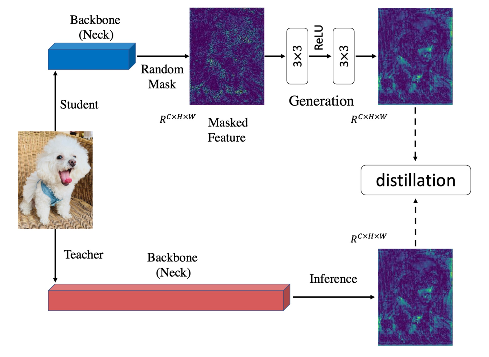

    * 首先，随机掩膜学生的特征
    * 然后，使用投影层使得学生使用其具有屏蔽的特征，去生成完整的教师特征

    **由于每次迭代都是用随机像素，这样所有的像素在训练中贯穿地被使用。这意味着学生的特征将会更鲁棒，同时表现能力也会提高**。

    在论文的方法中，教师模型知识服务于知道学生去恢复特征，而不是直接模仿教师的特征。

  * 掩膜特征

    **深层特征图的像素在一定程度上包含了邻近像素的信息，这样我们可以使用部分像素去恢复完整的特征图。**旨在使用学生的被屏蔽的特征去生成教师特征，从而帮助提高学生取得更好的表现。

    首先设定第 $l$层的掩模$M$去覆盖学生第$l$层的特征。
    $$
    M_{i,j}^l=\begin{cases}
      0 \quad  & if \ R_{i,j}^l<\lambda\\
      1 & othrewise\\
      \end{cases}
    $$
    其中$R_{i,j}$是一个$(0,1)$中的随机数，$i$和$j$是对应特征图的水平和垂直坐标；$\lambda$是一个表示掩模比率的超参数

    使用对应的mask去覆盖学生特征图，并使用得到的特征图去生成教师特征图，公式如下
    $$
    g(f_{align}(S^l)\cdot M^l) \rightarrow T^l
    $$
    其中$g(F)=W_{l2}(RELU(W_{l1}(F)))$表示映射层;$f_{align}$表示自适应层去对齐教师特征。

    MGD 的蒸馏损失$L_{dit}$的公式如下
    $$
    L_{dist}(S,T)=\sum_{l=1}^L\sum_{k=1}^C\sum_{i=1}^H\sum_{j=1}^W(T_{k,i,j}^l-g(f_{align}(S_{{k,i,j}}^l)\cdot M_{{i,j}}^l) )
    $$
    其中$L$ 表示用于蒸馏的层之和；$C$、$H$、$W$表示特征图的形状；$S$和$T$表示学生和教师对应的特征。

  * 损失函数
    $$
    L = L_{originnal} + \alpha \cdot L_{dis}
    $$
    其中$L_{originnal}$表示所有任务对应的原始损失；$\alpha$ 是一个超参数去平衡损失

* 贡献：新的特征蒸馏方法，使得学生用其掩盖的特征来生成教师的特征，而不是直接模仿它；只使用两个超参数，更容易被使用。

* 总结： MGD 可以看作是 MAE在知识蒸馏领域的应用。

* 方向：分类、目标检测、语义分割

### Knowledge Distillation from A Stronger Teacher(DIST, NIPS 2022)

* 类型：应用，基于关系的知识, [开源](https://github.com/hunto/DIST_KD)
* 摘要：从经验上发现学生和强教师之间的预测差异会相当严重。KL 散度预测的精确匹配会干扰训练，是的表现不佳。本文证明了简单地保持教师和学生预测之间的关系就足够了，并相应地提出了一种基于相关性的损失来现实地捕捉教师内在的类间关系，并将这种关系扩展到类内级别。
* 贡献：
* 方向：分类、目标检测、语义分割

### General Distillation Framework for Object Detectors via Pearson Correlation Coefficient(PKD,NIPS 2022)

* 类型：应用，基于特征的知识，[待开源](https://github.com/open-mmlab/mmrazor)
* 摘要：
* 贡献：
* 方向：目标检测

### 目标检测蒸馏相关论文

| 名称     | 知识类型 | 开源 |
| -------- | -------- | ---- |
| CWD      | 基于特征 | 是   |
| ReviewKD | 基于特征 | 是   |
| DKD      | 基于响应 | 是   |
| LD       | 基于响应 | 是   |
| FGD      | 基于特征 | 是   |
| MGD      | 基于特征 | 是   |
|          |          |      |

## 目标检测蒸馏复现计划

| 名称     | teacher   | map  | student  | map  | epoch | 耗时 |
| -------- | --------- | ---- | -------- | ---- | ----- | ---- |
| CWD      | gfl-rx101 |      | gfl-18   |      |       | 2天  |
| ReviewKD | fpn-rx101 |      | fpn-rx18 |      |       | 2天  |
| DKD      | fpn-rx101 |      | fpn-rx18 |      |       | 1天  |
| LD       | gfl-rx101 |      | gfl-rx18 |      |       | 2天  |
| FGD      | fpn-rx101 |      | fpn-rx18 |      |       | 2天  |
| MGD      | fpn-rx101 |      | fpn-rx18 |      |       | 1天  |

## 开源库

* [mmrazor](https://github.com/open-mmlab/mmrazor)
* [mdistiller](https://github.com/megvii-research/mdistiller)
* [RepDistiller](https://github.com/HobbitLong/RepDistiller)
* https://github.com/yzd-v/cls_KD

## 参考资料

* Knowledge Distillation: A Survey
* Knowledge Distillation and Student-Teacher Learning for Visual Intelligence：A Review and New Outlooks
* Relational Knowledge Distillation
* https://zhuanlan.zhihu.com/p/586364069
* https://zhuanlan.zhihu.com/p/505213269
* https://zhuanlan.zhihu.com/p/363994781
* https://zhuanlan.zhihu.com/p/346686467

