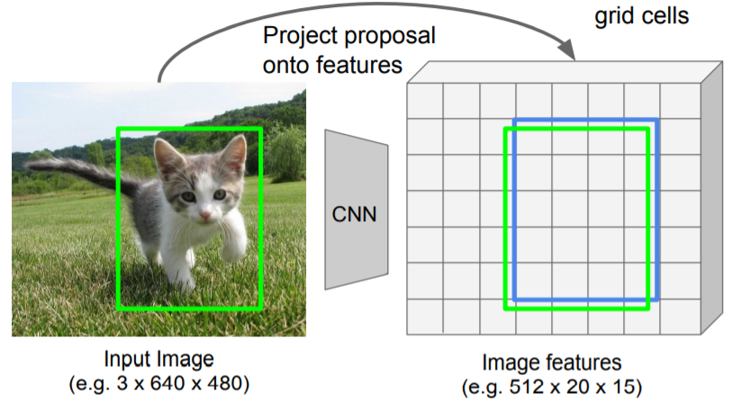
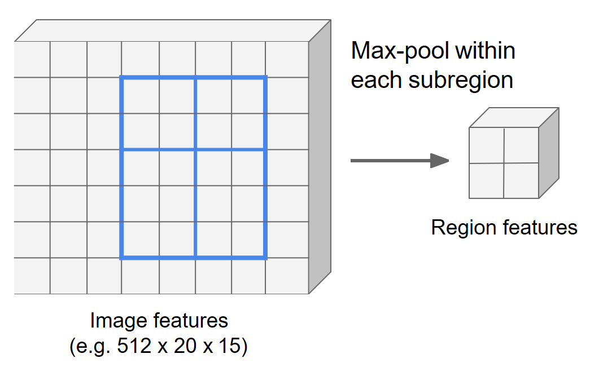
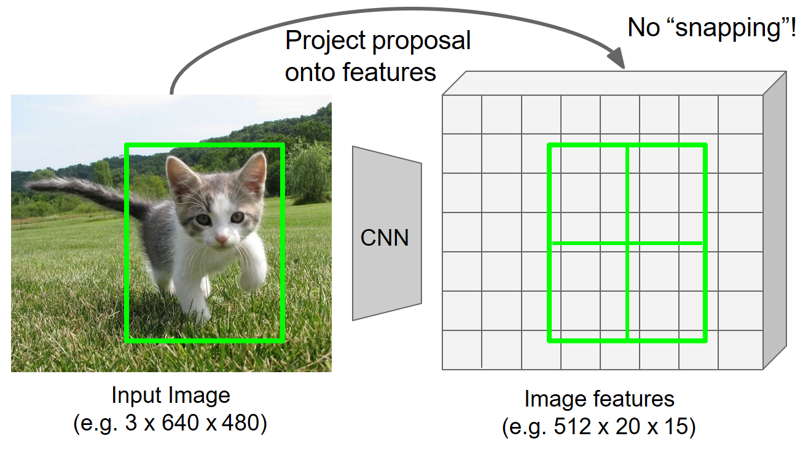
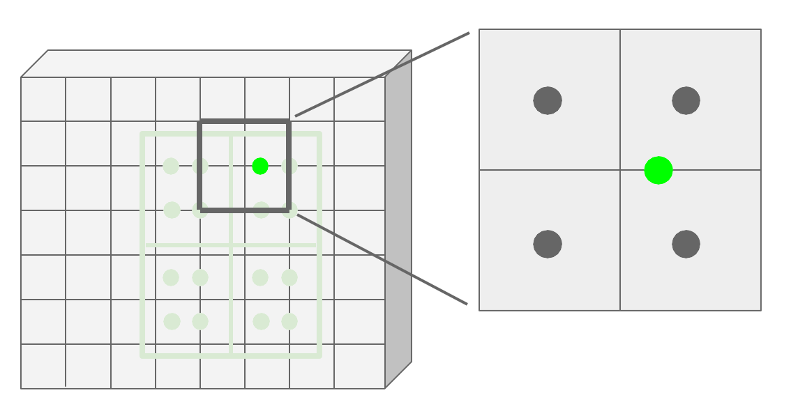
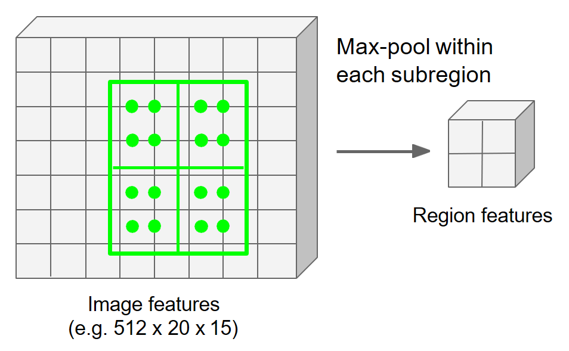
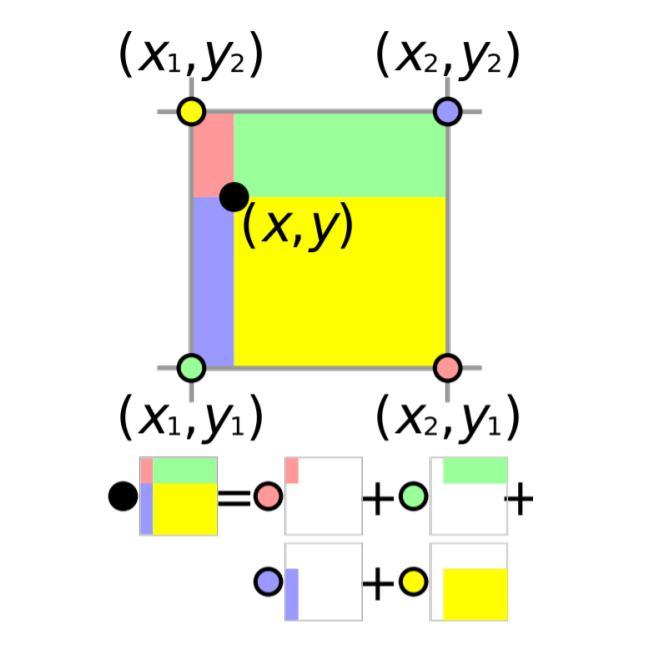

# R0I Pooling 与 R0I Align 区别

## 基本概念

### RoI

RoI(Region of Interest)是通过不同区域选择方法，从**原始图像(original image)**得到的候选区域(proposal region)。

需要注意的一点是**RoI并不等价于bounding box**, 它们可能看起来像，但是RoI只是为了进一步处理而产生的候选区域。

## bounding box

boundding box 指的是检测目标的边界矩形框。

## 量化

> 量化(quatization)是指将输入从连续值（或大量可能的离散取值）采样为有限多个离散值的过程。也可以理解为，将输入数据集（如实数）约束到离散集（如整数）的过程。

## R0I Pooling 和 R0I Align的作用

RoI Pooling 对于任意大小的图像输入，总能产生固定大小的输出。

> Region features always the same size even if input regions have different sizes!

## R0I Pooling 原理

**RoI Pooling在Faste RCNN 中被首次提出。**

RoIPooling，直接从feature map 里截取各个兴趣区域(Region of Interest, RoI)的feature, 并换为为相同大小的feature输出。

**RoI Pooling =  crop feature +  resize feature**

通过上图的容易得到，RoI Pooling的作用本质上是为了将不同尺寸的RoI特征转换为相同的特征图输出，保证特征图展开（flatten）后具有相同的大小尺寸，能够与下层的全连接层连接，分别执行线性分类(linear classifier)和边框回归(bounding box regressor)。

### 执行步骤

* 前置条件

  对于输入图片，通过候选区域方法发网得固定大小数量(Faster RCNN中为256)的候选区域坐标，。

  将整个输入图片喂入基网络（如vgg, resnet等）提取图片的特征（Fast RCNN 中为vgg网络的conv5层特征）。

  **下面以输出目标特征图尺寸大小为$2\times2\times512$进行说明**

* 对齐到网格单元（snap to grid cell）

  首先将一个浮点数RoI量化为特征映射的离散粒度。表现为RoI对应的特征图的与原始特征图的网格单元对齐。**这里为第一次量化操作**

  如下图中绿色框为RoI对应的实际区域（**由于经过特征尺度变换，导致RoI的坐标会可能会落到特征图的单元（cell）之间**）， 蓝色框为量化后的RoI所对应的特征图。（得到到量化特征图尺寸为$5\times5\times512$）

  

* 划分网格为子区域（bin）

  粗略地将网格分为$H\times W$（Fast RCNN 中设为$7\times7$）个子网格区域。将上一步得到的量化RoI 特征进一步细分为量化的空间单元(bin)。**这里进行了第二次量化操作。**

  **如果无法通过直接均分得到量化的子区域，通过分别采取向上取整（ceil）和向下取整（floor）的到对应的单元尺寸大小**。以*当前 $4\times5$尺寸的特征图为例，对于宽度方向 $4\div2=2$ ，但是对于高度方向由于$5\div2=2.5$， 通过向上和向下取整整，确定高度方向特征子区域的大小分别为2和3。

  

* 最大池化操作

  在每一个子区域执行聚合操作得到单元的特征值（一般是最大池化）。对上一步得到的$2\times2$个子区域分别做最大池化操作，得到$2\times2\times512$的目标特征图。

  

### 执行结果

通过RoI Pooling, 对于具有不同特征大小的的输入区域, 都可以得到相同大小输出特征。

### 缺点

每一次量化操作都会对应着轻微的区域特征错位（misaligned），xiang 这些量化在RoI和提取到的特征之间引入了偏差。这些量化可能不会影响对分类任务，但它对预测像素精度掩模有很大的负面影响。

## R0I Align 原理

**RoI Align 在 Mask RCNN 中被首次提出。**

针对RoI Pooling在语义分割等精细度任务中精确度的问题提出的改进方案。

### 执行步骤

​	**下面以输出目标特征图尺寸大小为$2\times2\times512$进行说明**

* 遍历候选每个候选区域，保持浮点数边界不做量化（不对齐网格单元）；同时平均分网格分为$H\times W$（这里为$2\times2$）个子网格区域，每个单元的边界也不做量化。

  

* 对于每个区域选择4个规则采样点（分别对应将区域进一步平均分为四个区域，取每个子区域的中点）

  

* 利用双线性插值计算得到四个采用点的像素值大小。下图为一个规则采样点所对应的邻近区域示意图。
* 

* 利用最大池化（max pooling）或平均池化(average pooling)分别对每个子区域执行聚合操作，得到最终的特征图。

  

### 执行结果

通过RoI Align, 对于具有不同特征大小的的输入区域, 都可以得到相同大小输出特征。

## 补充

### 双线性插值

* 概念

双线性插值(bilinear interpolation)，又称为双线性内插。在数学上，双线性插值是有两个变量的插值函数的[线性插值](https://baike.baidu.com/item/线性插值/19113392)扩展，其核心思想是在两个方向分别进行一次线性插值。在数字图像和音频处理领域都有应用。

在图像处理中，双线性插值法**考虑围绕未知像素的计算位置的$2\times2$最近邻域的已知像素**。然后对这4个像素进行加权平均，以得出其最终的内插值。

* 公式推导

如图，已知求位置像素P的像素值， 已知相邻$2\times2$像素区域对应位置和像素值，其中坐下角像素区域标号为11，左上角像素区域标号为12，右下角像素区域标号为21，右上角像素区域标号为22。

注意这里的$Q_{11}=(x_1, y_1)$,$Q_{12}=(x_1, y_2)$,$Q_{21}=(x_2, y_1)$,$Q_{22}=(x_2, y_2)$,分别对应**像素单元（区域）的中心点**。

已知直线上两点$y_1=\phi(x_1, y_1)$， $y_2=\phi(x_2, y_2)$, 求直线上任意一点$(x,y)$的值$\phi(x,y)$。
$$
\phi（x,y） = \frac{x-x_1}{x_2-x_1}y_2 +\frac{x-x_2}{x_1-x_2}y_1 \tag{1}
$$

第一步，利用公式$1$执行两次线性插值操作：使用$Q_{11}$和$Q_{21}$计算$R_1=（x,y_1）$点的像素值大小；使用$Q_{12}$和$Q_{22}$计算$R_2=(x, y_2)$点像素值大小。
$$
\begin{align}
\phi(x,y_1) =& \frac{x-x_1}{x_2-x_1}\phi(x_2, y_1) +\frac{x-x_2}{x_1-x_2}\phi(x_1, y_1) \tag{2}\\
\end{align}
$$
$$
\begin{align}
\phi(x,y_2)=& \frac{x-x_1}{x_2-x_1}\phi(x_2, y_2) +\frac{x-x_2}{x_1-x_2}\phi(x_1, y_2) \tag{3}\\  
\end{align}
$$

第二步， 利用公式$2$和公式$3$的到的结果，再次执行一次线性插值，得到目标位置$P$的像素值。
$$
\begin{align}
\phi(x,y) =& \frac{y-y_1}{y_2-y_1}\phi(x, y_2) +\frac{y-y_2}{y_1-y_2}\phi(x, y_1) \\
=&\frac{y-y_1}{y_2-y_1}(\frac{x-x_1}{x_2-x_1}\phi(x_2, y_2) +\frac{x-x_2}{x_1-x_2}\phi(x_1, y_2) ) +\frac{y-y_2}{y_1-y_2}(\frac{x-x_1}{x_2-x_1}\phi(x_2, y_1) +\frac{x-x_2}{x_1-x_2}\phi(x_1, y_1)) \\
=& \frac{1}{(y_2-y_1)(x_2, x_1)}((x-x_1)(y-y_1)\phi(x_2, y_2) +(x-x_2)(y-y_1)\phi(x_1, y_2) +(x-x_1)(y-y_2)\phi(x_2, y_1) + (x-x_1)(y-y_1)\phi(x_2, y_2))\\
\tag{4}
\end{align}
$$
由于$Q_{11}$,$Q_{12}$,$Q_{21}$,$Q_{22}$分别为相邻像素的中间位置坐标，如下图所示。

容易得到$y_2 - y_1=1$，$x_2-x_1=1$，因此双线性插值公式$4$可以进一步简化为
$$
\phi(x,y) =(x-x_1)(y-y_1)\phi(x_2, y_2) +(x-x_2)(y-y_1)\phi(x_1, y_2) +(x-x_1)(y-y_2)\phi(x_2, y_1) + (x-x_1)(y-y_1)\phi(x_2, y_2) \tag{5}
$$
同时可以得到
$$
(x-x_1)(y-y_1) +(x-x_2)(y-y_1) +(x-x_1)(y-y_2)+ (x-x_1)(y-y_1) = 1 \tag{6}
$$
公式$5$也可以进一步表示为
$$
\phi(x,y) = \sum_{i,y=1}^2{\phi(x_i, y_j)max(0, 1-|x-x_i|)max(0, 1-|y-x_i|)}   \tag{7}
$$

* 公式物理意义

通过公式$5$可以看出， 双线性插值本质上是目标像素值相邻四个像素的像素值加权和值。

对于第一项$(x-x_1)(y-y_1)\phi(x_2, y_2) $表示右上角像素$(x_2, y_2)$的像素值加权后的结果，其对应的权重公式为$(x-x_1)(y-y_1)$，可以看出第一项权重本质上是目标像素与$(x_2,y_2)$对应的对角像素$(x_1, y_1)$所构成的矩形区域的面积大小，如上图紫色区域。同理其它三项也满足同样的规律。**当目标元素与某个相邻元素的距离越近，目标元素元素与该相邻像素的对角像素组成的矩形框面积大小就越大，该相邻像素对应的权重值就越大**

综上可以得到， **双线性插值本质上是目标像素所相邻的四个像素， 分别以像素对应的对角像素与目标像素的构成的矩形区域面积为权重，像素值的加权和**。

## 参考资料

* <http://cs231n.stanford.edu/slides/2020/lecture_12.pdf>
* <https://towardsdatascience.com/understanding-region-of-interest-part-2-roi-align-and-roi-warp-f795196fc193>
* <https://tjmachinelearning.com/lectures/1718/instance/instance.pdf>
* <https://en.wikipedia.org/wiki/Bilinear_interpolation>

