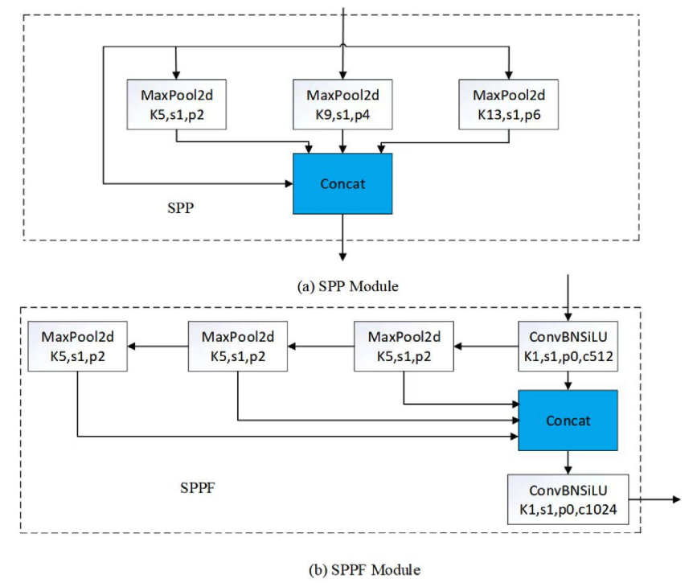
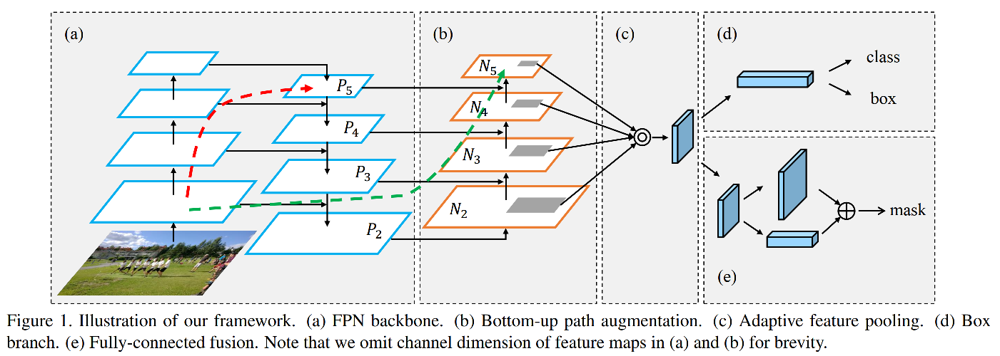
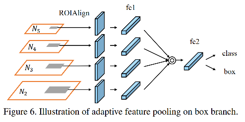

# YOLOv5 网络解读

## 网络框架


DarkNet  + PAFPN

* 对于 P5 而言，BaseBackbone 为包含 1 个 stem 层 + 4 个 stage 层的类似 ResNet 的基础结构.
* 对于 P6 而言，BaseBackbone 为包含 1 个 stem 层 + 5 个 stage 层的结构。

## backbone

### CSPNet


CSPNet(Cross Stage Parial Network) 从网络结构的角度去缓解网络推理过程中需要大量计算的问题。论文中认为网络推理成本过高**归因于网络优化中的梯度信息重复导致的**。论文提出通过将梯度的变化从头到尾集成到特征图中，从而在减少计算量的同时保持模型精度。

论文指出， DenseNet 大量的梯度信息被重复用于更新不同密集层的权重，这导致不同稠密层重复学习复制的梯度信息。

一个 CSPNet 阶段由**局部稠密块（partial dense block）**和 **局部过渡层（partial  transition layer）**组成。

* 局部稠密块的目的

  * 通过并归策略增加梯度路径

  * 平衡每一层的计算量

  * 减少内存占用。

* 局部过渡层的目的
  * 最大化梯度组合的差异。局部过渡层是一种层次化的特征融合机制，它使用**截断梯度流**（truncation the f）的策略来防止不同的层学习重复的梯度信息。

**CSPNet 保持了DenseNet 重用特征特性的优势，同时通过截断梯度流阻止了过多的重复梯度信息。**CSPNet 也可以应用到ResNet 和 ResNeXt 等其他架构。

* 实现代码

  ```python
  class BottleneckCSP(nn.Module):
      # CSP Bottleneck https://github.com/WongKinYiu/CrossStagePartialNetworks
      def __init__(self, c1, c2, n=1, shortcut=True, g=1, e=0.5):  # ch_in, ch_out, number, shortcut, groups, expansion
          super().__init__()
          c_ = int(c2 * e)  # hidden channels
          self.cv1 = Conv(c1, c_, 1, 1)
          self.cv2 = nn.Conv2d(c1, c_, 1, 1, bias=False)
          self.cv3 = nn.Conv2d(c_, c_, 1, 1, bias=False)
          self.cv4 = Conv(2 * c_, c2, 1, 1)
          self.bn = nn.BatchNorm2d(2 * c_)  # applied to cat(cv2, cv3)
          self.act = nn.SiLU()
          self.m = nn.Sequential(*(Bottleneck(c_, c_, shortcut, g, e=1.0) for _ in range(n)))
  
      def forward(self, x):
          y1 = self.cv3(self.m(self.cv1(x)))
          y2 = self.cv2(x)
          return self.cv4(self.act(self.bn(torch.cat((y1, y2), 1))))
  ```


## neck

### SPP


​		流行的CNN 要求输入固定尺寸的图像，这同时限制了输入图像的比率和尺度。当前的方法通过crop或者warp 去使得输入图像符合固定尺寸大小。但是 crop 区域可能不包含整个目标，而 warp 内容可能会导致不想要的集合形变。

​		CNN 主要包含卷积层和全连接层两部分。其中卷积层没有固定图像尺寸的限制，并可以生成任意尺寸的特征图。而全连接层需要输入预定义的固定大小的输入。**因此，固定大小的限制只来自于全连接层，这些层在网络的更深层阶段。**

​		论文中提出了**空间金字塔池化(Spatial Pyramid Pooling, SPP) **层去移除网络固定输入尺寸的限制。论文中在**最后一个卷积层的顶部**引入了SPP 层。通过SPP层 池化特征，生成固定大小的输入，然后把它们喂入全连接层。通过在网络层级更深阶段执行信息“聚合”，避免了开始阶段的 crop 和 warp。

​		*YOLOv3 中改进了 SPP 模块堆叠使用$k \times k$大小的卷积核进行最大池化的输出，其中$k={1, 5, 9,13}$, $stride=1$。SPP模块显著地增加了backbone 特征的感受野，分离出了重要的上下文特征，并不会降低网络的运行速度。*

* SPP

  在每个空间中，我们池化每个滤波器的响应（论文使用最大池化）。输出的空间金字塔是一个具有$M$个bin的$kM$ 维向量，其中$k$是最后一个卷积层的卷积核数量。这个固定维度的向量作为全连接层的输入。


* 实现代码

  ```python
  class SPP(nn.Module):
      # Spatial Pyramid Pooling (SPP) layer https://arxiv.org/abs/1406.4729
      def __init__(self, c1, c2, k=(5, 9, 13)):
          super().__init__()
          c_ = c1 // 2  # hidden channels
          self.cv1 = Conv(c1, c_, 1, 1)
          self.cv2 = Conv(c_ * (len(k) + 1), c2, 1, 1)
          self.m = nn.ModuleList([nn.MaxPool2d(kernel_size=x, stride=1, padding=x // 2) for x in k])
  
      def forward(self, x):
          x = self.cv1(x)
          return self.cv2(torch.cat([x] + [m(x) for m in self.m], 1))
  ```

### SPPF



​		YOLOv5 中使用了SPP 的改进版 SPPF(Spatial Pyramid Pooling - Fast)， 从名字容易看出SPPF与SPP的主要改进是速度提升。与 SPP 的并行结构相比，SPPF使用了串行的结构，其中最大池化的卷积核大小只有$5 \times 5$ 一种。SPPF 与 SPP 模块的效果相同，但是速度更快。

​		YOLOv5 中 SPPF 模块加在了最后一个 stage 的层之后。

* 实现代码

  ```python
  class SPPF(nn.Module):
      # Spatial Pyramid Pooling - Fast (SPPF) layer for YOLOv5 by Glenn Jocher
      def __init__(self, c1, c2, k=5):  # equivalent to SPP(k=(5, 9, 13))
          super().__init__()
          c_ = c1 // 2  # hidden channels
          self.cv1 = Conv(c1, c_, 1, 1)
          self.cv2 = Conv(c_ * 4, c2, 1, 1)
          self.m = nn.MaxPool2d(kernel_size=k, stride=1, padding=k // 2)
  
      def forward(self, x):
          x = self.cv1(x)
          y1 = self.m(x)
          y2 = self.m(y1)
          return self.cv2(torch.cat((x, y1, y2, self.m(y2)), 1))
  ```

  

### PAN



特征聚合网络(Path Aggregation Network，PAN) 的目的是提升基于区域候选实例分割框架的信息流。论文通过**自底向上（Bottom-Up）**的增强方式，使用底层中精确的定位信号来增强整个特征层次，它缩短了底层和最顶层特征之间的信息路径。

FPN(Feature Pyramid Network) 被提出去提取网络内的层级特征，其中具有横向连接（lateral connection）的**自顶向下（Top-Down）**的路径被增强去传播具有更强语义特征。

论文发现，低层的特征有利于大型实例的定位。但是从底层结构到高层特征有很长的路径，这增加了困难去获取准确的定位信息。进一步来说，每个建议的预测，是基于一个来自启发式分配的特征层的特征网格。这个过程可以被更新，由于其他层被忽略的信息可能有助于最后。最后，在单视角上预测mask , 失去了机会去集成更多多样性的信息。

为了**缩短信息信息路径**并**使用低层中准确的定位的信息去增强特征金字塔**，自底向上的路径增强被创建，通过传播底层的特征去增强整个特征层级。

* 自底向上的增强架构

  增强路径从最底层的$P_2$ 开始逐渐接近$P_5$，使用$\{N_2,N_3,N_4,N_5\}$表示新生成的特征，分别对应$\{P_2,P_3,P_4,P_5\}$，其中$P_2$只是$N_2$，没有任何处理。

  每一个构建块采用高分辨率的特征图$N_i$，首先通过一个卷积核大小为$3\times3$，stride 为2的卷积去降低空间大小。然后，每个特征图$P_{i+1}$与降采样后的特征图通过横向连接相加。最后，融合后的特征通过另一个$3\times3$的矩阵处理生成$N_{i+1}$，为了接下来的子网络。这个过程迭代进行，直到处理完$P_5$ 为止。每个建议的特征从新的特征池化得到。

* 自适应特征池化

  

  在 FPN 中，建议(proposal)会根据它的尺寸被分配到不同的特征层。这尽管简单有效，但仍然可能生成非最优的结果。相差几个像素的建议可能被分到不同的层，而这两个建议可能非常相似。进一步，特征的重要性可能与其所属的级别没有强烈的相关性。

  论文对于每个建议池化来自所有层的特征并融合它们，为了后续的预测。这称为**自适应特征池化(adaptive feature pooling)**

  对于每一个建议，首先映射它们到不同的特征层；然后，ROIAlign 被用来去池化来自不同层的特征网格；最后一个融合操作（像素级最大/和）被应用去融合来自不同层的特征网格。

### PAFPN

* 代码

  ```python
  class YOLOPAFPN(nn.Module):
      """
      YOLOv3 model. Darknet 53 is the default backbone of this model.
      """
  
      def __init__(
          self,
          depth=1.0,
          width=1.0,
          in_features=("dark3", "dark4", "dark5"),
          in_channels=[256, 512, 1024],
          depthwise=False,
          act="silu",
      ):
          super().__init__()
          self.backbone = CSPDarknet(depth, width, depthwise=depthwise, act=act)
          self.in_features = in_features
          self.in_channels = in_channels
          Conv = DWConv if depthwise else BaseConv
  
          self.upsample = nn.Upsample(scale_factor=2, mode="nearest")
          self.lateral_conv0 = BaseConv(
              int(in_channels[2] * width), int(in_channels[1] * width), 1, 1, act=act
          )
          self.C3_p4 = CSPLayer(
              int(2 * in_channels[1] * width),
              int(in_channels[1] * width),
              round(3 * depth),
              False,
              depthwise=depthwise,
              act=act,
          )  # cat
  
          self.reduce_conv1 = BaseConv(
              int(in_channels[1] * width), int(in_channels[0] * width), 1, 1, act=act
          )
          self.C3_p3 = CSPLayer(
              int(2 * in_channels[0] * width),
              int(in_channels[0] * width),
              round(3 * depth),
              False,
              depthwise=depthwise,
              act=act,
          )
  
          # bottom-up conv
          self.bu_conv2 = Conv(
              int(in_channels[0] * width), int(in_channels[0] * width), 3, 2, act=act
          )
          self.C3_n3 = CSPLayer(
              int(2 * in_channels[0] * width),
              int(in_channels[1] * width),
              round(3 * depth),
              False,
              depthwise=depthwise,
              act=act,
          )
  
          # bottom-up conv
          self.bu_conv1 = Conv(
              int(in_channels[1] * width), int(in_channels[1] * width), 3, 2, act=act
          )
          self.C3_n4 = CSPLayer(
              int(2 * in_channels[1] * width),
              int(in_channels[2] * width),
              round(3 * depth),
              False,
              depthwise=depthwise,
              act=act,
          )
  
      def forward(self, input):
          """
          Args:
              inputs: input images.
          Returns:
              Tuple[Tensor]: FPN feature.
          """
  
          #  backbone
          out_features = self.backbone(input)
          features = [out_features[f] for f in self.in_features]
          [x2, x1, x0] = features
  
          fpn_out0 = self.lateral_conv0(x0)  # 1024->512/32
          f_out0 = self.upsample(fpn_out0)  # 512/16
          f_out0 = torch.cat([f_out0, x1], 1)  # 512->1024/16
          f_out0 = self.C3_p4(f_out0)  # 1024->512/16
  
          fpn_out1 = self.reduce_conv1(f_out0)  # 512->256/16
          f_out1 = self.upsample(fpn_out1)  # 256/8
          f_out1 = torch.cat([f_out1, x2], 1)  # 256->512/8
          pan_out2 = self.C3_p3(f_out1)  # 512->256/8
  
          p_out1 = self.bu_conv2(pan_out2)  # 256->256/16
          p_out1 = torch.cat([p_out1, fpn_out1], 1)  # 256->512/16
          pan_out1 = self.C3_n3(p_out1)  # 512->512/16
  
          p_out0 = self.bu_conv1(pan_out1)  # 512->512/32
          p_out0 = torch.cat([p_out0, fpn_out0], 1)  # 512->1024/32
          pan_out0 = self.C3_n4(p_out0)  # 1024->1024/32
  
          outputs = (pan_out2, pan_out1, pan_out0)
          return output
  ```

  

## head

YOLOv5 的 head 结构与YOLOv3 完全一致，为非解耦head。head 模块只包含3个不共享权重的卷积，用于对输入特征图进行变换。

## 参考资料

* <https://mmyolo.readthedocs.io/zh_CN/latest/>
* https://github.com/ShuLiu1993/PANet/blob/master/lib/modeling/FPN.py
* <https://github.com/ultralytics/ultralytics/blob/main/ultralytics/nn/modules.py>
* https://github.com/Megvii-BaseDetection/YOLOX/blob/main/yolox/models/yolo_pafpn.py


