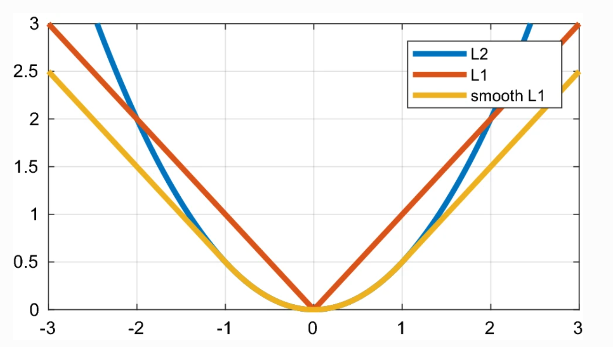
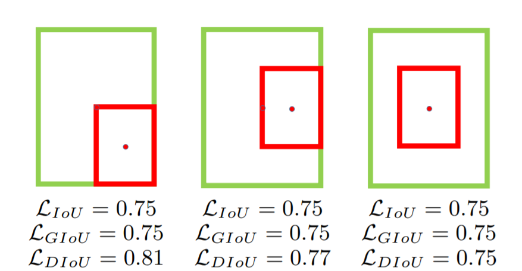
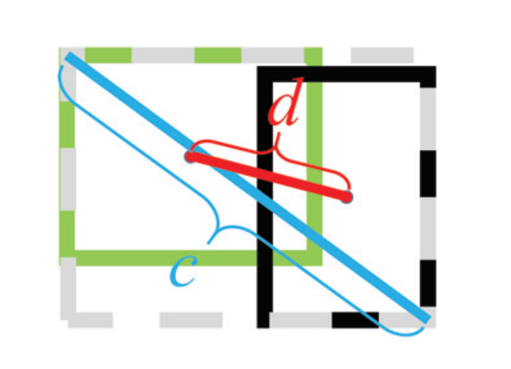
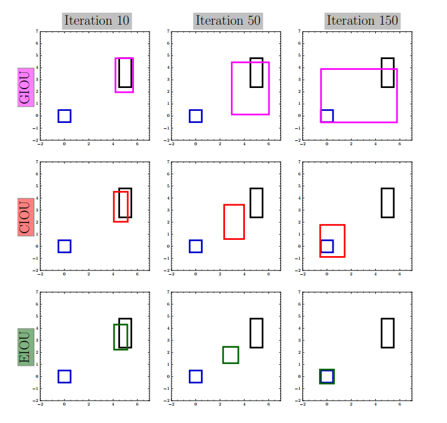

# 目标检测中的边框回归(I0U)损失函数总结

## 概述

目标检测的损失函数由 Classification Loss 和 BBox Regeression Loss 两部分组成。 其中 Classification Loss 通常有cross entropy loss 、focal loss、ghm loss 等 。BBox Regeression Loss 的损失函数有多个方法，按照提出的时间分别为 $Smooth\,L1\,Loss\rightarrow IoU\,Loss \rightarrow GIoU\,Loss  \rightarrow DIoU\, Loss \rightarrow CIoU\,Loss \rightarrow EIoU\,Loss$， 本文主要介绍  BBox Regression Loss.

## Smooth L1  Loss

smmoth L1 loss 是在 Fast RCNN[3] 中被首次提出的， smooth L1 Loss 可以看作是 L1 Loss 和 L2 Loss 的结合体， 因此首先介绍 L1 Loss  和 L2 Loss.

### L1 /L2 Loss

$$
L_1 = \left|x\right|， \quad  \frac{dL_1}{x} =
\begin{cases}
1 , &if\ x \geq 0 \\
-1  &if \ x < 0
\end{cases}
$$

$$
L_2 = x^2, \quad  \frac{dL_2}{x} = 2x
$$

其中 $x$ 表示 真实边框坐标值与预测边框坐标值的偏差值。

### L1/ L2 Loss 缺点

* L1 对 $x$ 的导数为常数， 在训练后期， 当$x$很小时，如果学习率不改变， 损失函数会在稳定值附近波动， 难以收敛到更高精度
* L2 Loss 为偏差$x$ 的平方， 因此在训练前期， 当$x$很大时， 导数非常大，导致初期训练不稳定 

### Smmoth L1 Loss

针对L1 Loss 和 L2 Loss 存在的缺点提出了 smmoth L1 Loss
$$
smmoth \  L_1(x) = \begin{cases}
0.5x^2 \quad &if \ |x| <1\\
|x| - 0.5 \ & otherwise
\end{cases}
$$
对应的导数为
$$
\frac {d(smmoth \  L_1(x))}{x} = \begin{cases}
x \quad &if \ |x| <1\\
\pm 1 \ & otherwise
\end{cases}
$$
Smmoth L1 Loss 同时克服 L1 loss 和 L2 loss 的缺点， **前期$x$的值较大， 可以看作采用 L1 loss 作为损失函数**，因此梯度为常数，训练更稳定； **后期$x$ 的值较小， 可以看作采用 L2 Loss 作为损失函数**， 梯度会随着$x$的值的变化自适应地调整， 利于收敛到最优值。

[Rectified Wing Loss for Efficient and Robust Facial Landmark Localisation with Convolutional Neural Networks](http://epubs.surrey.ac.uk/853396/1/IJCV_RWing.pdf)

目标检测任务中真实的的 BBox Regression Loss损失函数为(以 smooth L1 loss 为例)
$$
L_{loc}(t^u, v) = \sum_{i \in{x,y,w,h}} smooth \ L_1 (t^u - v)
$$
其中 $v=(v_x, v_y, v_w, v_h)$ 表示真实(GT)的bbox 坐标值,  $t^u = （t_x^u, t_y^u, t_w^u, t_h^u）$表示的预测的bbox的坐标值。

Smooth L1 Loss 缺陷

* 首先，Smooth L1 Loss 以边界框的坐标分别作为四个独立的变量（$x_t, x_b, x_r, x_l$）进行优化， 这个假设违背了对象的边界具有高度相关性的事实。
* 目标检测评价BBox的指标是 IoU, 与 Smooth L1 Loss 的目标不匹配。 即相同的IoU 可能对应多个不同的  Smooth L1 Loss 值。

## IoU

### 定义

IoU(Intersection over Union (IoU)  )[4] 将四个点构成bbox 看作一个整体进行回归。

IoU 表示两个 bbox 的相交的区域与以相并的区域的比例值

容易得出 IoU 的取值范围为 $[0, 1]$：当 两个bbox 不相交时 IoU 的值为 0， 当两个区域完全重合时 IoU 的值为1

对应的 $IoU\ Loss$ 可以表示为
$$
L_{IoU} = 1 - IoU(bbox_{gt}, bbox_{pred})
$$

### 特点

IoU Loss 满足了度量的所有性质，如非负性、对称性等；其次 IoU 获得了尺度不变性，意味这任意两个形状的bbox 的相似性与它们的空间比例无关。

### 缺点

* 如果两个bbox A 和 B 不相交, 即 $|A \cap B|= 0$, 此时对应的 $IoU(A, B)=0$. $IoU$ 不能反映两个bbox是在彼此附近或者彼此力的很远。在这种情况下，对于不重叠的目标， 如果使用IoU作为损失， 梯度将会等于零而不能进行优化。

## GIoU

### 定义

GIOU(Generalized IoU )[5]  可以看作是 IoU 的一种泛化， 通过 将 IoU 的概念扩展到不重叠的情况下来解决IoU 的弱点。
$$
GIoU = IoU - \frac{|C - (A \cup B)|}{|C|}
$$
其中 C 为 包含bbox A 和 B 的最小外接矩形框。

### 特点

 容易得出

* GIoU 的取值范围为为$(-1, 1]$,  当两个bbox 不相交且距离趋近无限远时 GIoU 趋近于 -1， 当两个bbox 完全重合时， GIoU的值等于1
* 与 IoU 相比GIoU 同时关注两个 bbox 的重叠区域和非重叠区域，即两个bbox的相对位置，因此能够更好地反映两个bbox 的重合程度。

对应的bbox 回归损失函数为
$$
L_{GIoU} = 1 - GIoU = 1 - IoU + \frac{|C - (A \cup B)|}{|C|}
$$

### 缺点

当目标框完全包裹预测框的时候， IoU 和 GIoU 的值都相同， 可以看作此时GIoU 退化为 IoU。此时就失去了GIoU 衡量两个 bbox 相对位置的性质。

## DIoU

论文[6] 总结了 bbox 回归的三个重要的几何因素： **重叠区域（overlap area）**， **中心点（ central point distance）**和 **横纵比（aspect ratio）**。并提出了基于IoU 的bbox 回归损失函数的范式：
$$
L =  1 - IoU + R(B, B^{gt}) = L_{IoU} + R(B, B^{gt}) 
$$
其中 $R(B, B^{gt})$ 表示 预测框 $B$ 和 真实框 $B^{gt}$ 对应的惩罚项。

### 定义

为了克服 GIoU 对于bbox在非重叠的情况下梯度损失消失的问题， DIoU(Distance IoU) 在IoU 损失上增加惩罚项， 直接去最小化两个bbox中心点之间的标准化距离。此时$R_{DIoU}$可以表示为

$$
R_{DIoU} = \frac{\rho^2(b, b^{gt})}{c^2}
$$
式中 $b$ 和$b^{gt}$表示分别预测框和真实框, 分别对应图中黑色框和绿色框

​		$\rho(\cdot)$ 表示 欧式距离，$\rho^2(b, b^{gt})$表示预测框和真实框中心点之间的欧氏距离的平方

​		$c$ 表示两个bbox 的最小外接矩形的对角线距离， 

对应的bbox 回归损失函数 $L_{DIoU}$表示为
$$
L_{DIoU} = 1 - IoU + R_{DIoU}
$$

### 特点

DIoU 继承了 IoU 和 GIoU 损失的一些性质：

* 尺度不变性
* 与 GIoU 一样， DIoU 可以通过$R_{DIoU}$提供BBox 的移动（偏移）方向
* 当两个bbox 完全重合时 $L_{IoU} =  L_{GIoU} = L_{DIoU} = 0$, 当两个bbox 不重叠且距离无限远时$L_{GIoU} = L_{DIoU} = 2$

DIoU 的几个优点超过了 IoU 和 GIoU

* DIoU 损失直接最小化两个bbox 之间的距离，因此会比GIoU获得更快的收敛速度
* 对于两个bbox 互相包含的情况下， DIoU 损失使得回归速度更快；而GIoU 损失退化为 IoU 损失函数，丢失了两个bbox 的相对位置信息, 收敛速度较慢。

### 缺点

DIoU 同时考虑两个bbox的重叠区域和中心点的距离， **但是 DIoU  没有考虑横纵比因素。**

## CIoU

### 定义

由于方框的横纵比也是一个重要的几何因子， 因此CIoU(Complete IoU) 在DIoU 的基础施加了横纵比的一致性
$$
R_{CIoU} = \frac{\rho^2(b, b^{gt})}{c^2} + \alpha v
$$
式中 $v$ 用于度量横纵比的一致性，可以表示为
$$
v = \frac{4}{\pi^2}\left(arctan \frac{w^{gt}}{h^{gt}} + arctan \frac{w}{h} \right)^2
$$
 $\alpha$ 是一个正的横纵比的权衡因子
$$
\alpha = \frac{v}{(1-IoU) + v }
$$
 $L_{CIoU}$ 可以表示为
$$
L_{CIoU} = 1 - IoU + R_{CIoU}
$$

### 特点

CIoU 同时考虑了两个bbox的重叠区域、边框中心距离和边框横纵比一致性。

### 缺点

* 在CIoU 中 $v$ 只能反映横纵比的一致性， 而不是真实的长和宽之间各自的比率。 比如$w=kw^{gt}$, $h=kh^{gt}$, 对有任意取值的$k$, $v$ 都等于0， 而实际上，两个 bbox 的形状大小比率为k,这显然是不合理的.
* 从$v$ 的导数可以得到 $\frac{\partial v} {\partial w} = -\frac{h}{w}\frac{\partial v} {\partial h}$, 这说明 $\frac{\partial v} {\partial w}$ 与 $\frac{\partial v} {\partial h}$在优化中意义相反
*  CIOU 损失函数可能会用一种不合理的方式优化，如下图中， 目标bbox $w^{gt} =1, h^{gt} =1$ ,, 初始的预测bbox $w=1, h=2.4$, ， 经过50次迭代之后，预测bbox 变为$w=1.64, h=2.84$. 这种情况下， CIoU 的确增加了目标bbox 和 预测bbox 之间的横纵比一致性，**但它阻碍了模型有效地减小$(w, h)$和$(w^{gt}, h^{gt})$之间的真实差异**。

## EIoU

### 定义

针对 CIoU 的问题， EIoU(Efficient IOU)提出了一种更有效的IoU 损失函数的版本
$$
\begin{align}
	
L_{CIoU} & = L_{IoU} + L_{dis} + L_{asp} \\
        & =  1 - IoU +  \frac{\rho^2(b, b^{gt})}{c^2} +  \frac{\rho^2(w, w^{gt})}{c_w^2} + \frac{\rho^2(h, h^{gt})}{c_h^2}

\end{align}
$$
式中 $L_{dis}=\frac{\rho^2(b, b^{gt})}{c^2}$表示距离损失，

​        $L_{asp}= \frac{\rho^2(w, w^{gt})}{c_w^2} + \frac{\rho^2(h, h^{gt})}{c_h^2}$ 表示横纵比损失

​		$c_w$ 和 $c_h$ 是覆盖两个两个bbox 最小矩形外接边框的宽和高

### 特点

EIOU损失直接减小了目标 bbox 和 预测 bbox的宽度和高度的差异，从而提高了收敛速度和定位效果。

## 参考资料

1. <https://zhuanlan.zhihu.com/p/94799295>
2. <https://zhuanlan.zhihu.com/p/104236411>
3. [Faster RCNN](<https://arxiv.org/search/cs?searchtype=author&query=Girshick%2C+R>)
4. [UnitBox: An Advanced Object Detection Network](https://arxiv.org/pdf/1608.01471.pdf)
5. [Generalized Intersection over Union: A Metric and A Loss for Bounding Box Regression](https://arxiv.org/pdf/1902.09630.pdf)
6. [Distance-IoU Loss: Faster and Better Learning for Bounding Box Regression](https://arxiv.org/pdf/1911.08287.pdf)
7. [Focal and Efficient IOU Loss for Accurate Bounding Box Regression](https://arxiv.org/pdf/2101.08158.pdf)