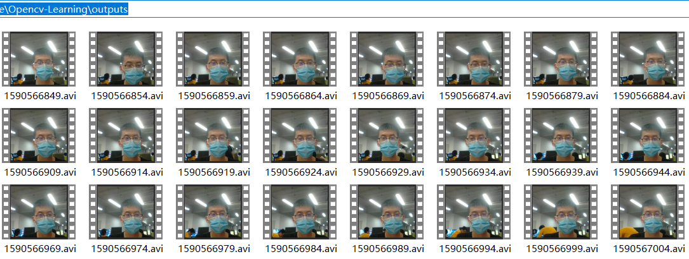
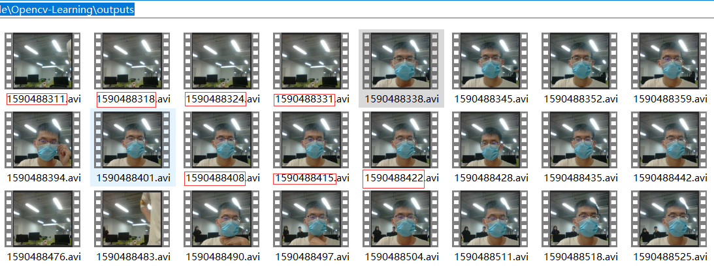
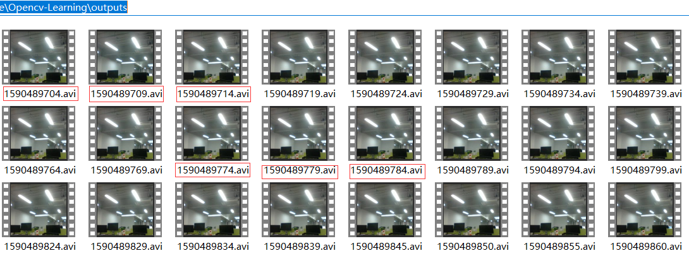
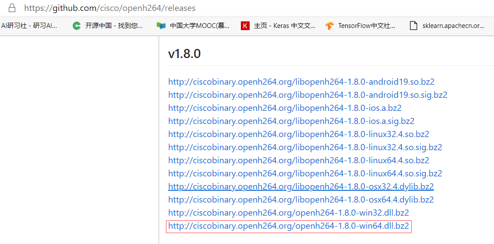
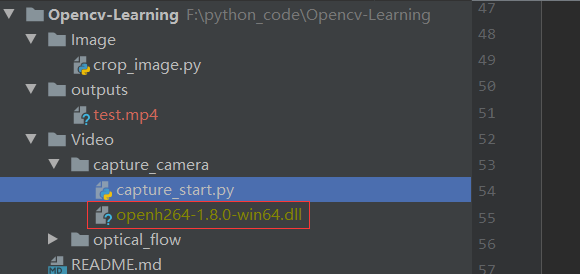

# 基于opencv实现视频流的编解码和存储

## 前置条件

### 视频编解码

​	   参考另一篇博客[视频的编解码格式](https://zhuanlan.zhihu.com/p/143720720)

### 多线程

​		参考另一篇博客基于python的多线程实现， 本文主要使用python多线程处理IO密集型应用的特性。参考博客基于python的多线程实现（先挖坑）

### 时间戳	

​	    参考某度的说明，时间戳(time stamp)时是指格林威治(GMT)时间1970年01月01日08时00分00秒起至当下的总秒数， 因此时间戳一定时大于或等于0。时间戳作为一个能表示一份数据在某个特定时间之前已经存在的、 完整的、 可验证的数据。时间戳通常是一个字符序列，唯一地标识某一刻的时间。 它的提出主要是为用户提供一份电子证据， 以证明用户的某些数据的产生时间。

* 示例代码

```python
import time


if __name__ == "__main__":
    print("convert time to stamp:")
    local_time = time.localtime()
    format_local_time = time.strftime("%Y-%m-%d %H:%M:%S", local_time)
    print(format_local_time)
    local_stamp = time.mktime(local_time)
    print(local_stamp)

    print("convert stamp to time:")
    stamp_local_time = time.localtime(local_stamp)
    stamp_format_time = time.strftime("%Y-%m-%d %H:%M:%S", stamp_local_time)
    print(stamp_format_time)

    # get GMT start time by stamp
    print("Greenwich Mean Time start:")
    gmt_start_stamp = 0
    gmt_local_time = time.localtime(gmt_start_stamp)
    gmt_format_time = time.strftime("%Y-%m-%d %H:%M:%S", gmt_local_time)
    print(gmt_format_time)
```

* 运行结果

  ```
  convert time to stamp:
  2020-05-27 10:15:44
  1590545744.0
  convert stamp to time:
  2020-05-27 10:15:44
  Greenwich Mean Time start:
  1970-01-01 08:00:00
  ```

  

###  ffourcc

​	   FourCC是英文Four-Character Codes的缩写，可以翻译为四字符代码。一个字符在上下文中占一个字节(byte)/8位(bit), 因此fourccs占一个4字节或32位的长度大小。ffourcc是视频编解码器、压缩格式、媒体文件中使用的颜色或像素格式的标识符。

​	  opencv 中使用fourcc作为编解码器image的标识符。关于fourcc支持的编解码器列表可以参考 [fourcc.org](http://www.fourcc.org/codecs.php)


### requirement enviroment

* opencv==1.1
* windows OS(带摄像头)

##  视频流的编解码

​        在实际场景中，我们经常需要捕获现场摄像头传输的视频流数据，然后讲数据输入到我们训练好的模型进行预测，并返回结果。

​        视频信号由于信息量大，传输网络带宽要求高。为了节省传送带宽和存储空间 ，传输的数据流，一般都是经过特定编解码器编码后的数据流，编解码器的作用本质上就是图像的压缩。因此对于视频流的处理，首先依赖于视频流的编解码处理。

​        在图像/视频处理中通常使用的工具库有[ffmpeg](https://ffmpeg.org/)和[opencv](https://opencv.org/)，都支持对视频流的编解码。本文使用opencv 完成视频流的编解码操作。

​		opencv 中视频流数据的编解码可以分为两个步骤：

   * 使用 **VideoCapture**视频捕获对象，去捕获视频流， **opencv会自动完成视频流的解码操作**，**并返回视频流的编码格式、帧率等信息**。VideoCapture支持的数据源接口有设备序号(如,本机摄像头的设备序号，0)、视频文件（如本地视频文件, “*.avi”)，RTSP协议数据流（如hikvision网络网络摄像头，“ rtsp://{user}:{pwd}@{ip}//Streaming/Channels/{channel}”）等
   * **VideoWriter_fourcc**获取对应编解码器的fourcc字节码标识符，**VideoWrite 生成一个写入器**

### 获取视频流的编码格式

​	    参考fourcc编码规范，可以得到解码方式

```python
def get_video_format(cap):
    """
    get video format
    """
    raw_codec_format = int(cap.get(cv.CAP_PROP_FOURCC))
    decoded_codec_format = (chr(raw_codec_format & 0xFF), chr((raw_codec_format & 0xFF00) >> 8),
                            chr((raw_codec_format & 0xFF0000) >> 16), chr((raw_codec_format & 0xFF000000) >> 24))
    return decoded_codec_format
```

###  捕获视频并显示

​		捕获本机摄像头并显示

```python
stream_path = 0
cap = cv.VideoCapture(stream_path)
# get fps
fps = cap.get(cv.CAP_PROP_FPS)

while cap.isOpened():
    ret, frame = cap.read()
    if not ret:
        print("Can't receive frame (stream end?). Exiting ...")
        break
    frame = cv.resize(frame, (dst_width, dst_height))
    wait_time = int(1000/fps)
    cv.imshow("video", frame)
    if cv.waitKey(wait_time) == ord('q'):
        break
```

### 转换视频编码格式

* 设置编码器格式(设置目标编码器格式为H.264编码对应的[fourcc](http://www.fourcc.org/codecs.php)字节码为‘X264’)

  ```python
  # format 1
  fourcc = cv.VideoWriter_fourcc('X', '2', '6', '4')  # H.264 codec
  # format 2
  fourcc = cv.VideoWriter_fourcc(*'X264')
  ```

* 设置视频写入器

  ```python
  out = cv.VideoWriter(filename=output_video, fourcc=fourcc, fps=dst_fps, frameSize=(dst_width, dst_height),isColor=True)
  ```

   fourcc 设置编码器格式， fps设置输出视频的帧率， frameSize设置输出视频每帧的尺寸大小

* 转化视频编码格式完整代码

  ```python
  import os
  import cv2 as cv
  
  
  video_dataset = 'F:/python_code/dataset/video_demo'
  rafting_video = os.path.join(video_dataset, 'rafting.avi')
  
  output_path = "../../outputs"
  output_video = os.path.join(output_path, 'test.avi')
  
  
  def get_video_format(cap):
      """
      get video format
      """
      raw_codec_format = int(cap.get(cv.CAP_PROP_FOURCC))
      decoded_codec_format = (chr(raw_codec_format & 0xFF), chr((raw_codec_format & 0xFF00) >> 8),
                              chr((raw_codec_format & 0xFF0000) >> 16), chr((raw_codec_format & 0xFF000000) >> 24))
      return decoded_codec_format
  
  
  def convert_video_format(video_stream, output_path, dst_height=None, dst_width=None, dst_fps=None,  is_show=False):
      """
      convert video format
      Args:
          video_stream:
          output_path:
          dst_height:
          dst_width:
          dst_fps:
          is_show:
  
      Returns:
  
      """
      cap = cv.VideoCapture(video_stream)
      # step get video info
      fps = cap.get(cv.CAP_PROP_FPS)
      height = int(cap.get(cv.CAP_PROP_FRAME_HEIGHT))
      width = int(cap.get(cv.CAP_PROP_FRAME_WIDTH))
  
      if dst_height is None:
          dst_height = height
      else:
          dst_height = dst_height
      if dst_width is None:
          dst_width = width
      else:
          dst_width = dst_width
  
      if dst_fps is None:
          dst_fps = fps
  
      # fourcc = cv.VideoWriter_fourcc('a', 'v', 'c', '1')  # avc1 is one of format of h.264
      # fourcc = cv.VideoWriter_fourcc(*'X264')
      fourcc = cv.VideoWriter_fourcc('X', '2', '6', '4')  # H.264 codec
      out = cv.VideoWriter(filename=output_path, fourcc=fourcc, fps=fps, frameSize=(dst_width, dst_height),
                           isColor=True)
      try:
          show_time_per_frame = int(1000 / dst_fps)
          while cap.isOpened():
              ret, frame = cap.read()
              if not ret:
                  print("Can't receive frame (stream end?). Exiting ...")
                  break
              frame = cv.resize(frame, (dst_width, dst_height))
              out.write(frame)
              if is_show:
                  cv.imshow("video", frame)
                  if cv.waitKey(show_time_per_frame) == ord('q'):
                      break
          cap.release()
      except cv.error as e:
          print(f"Failed to save video, due to {e}")
          raise e
  
  
  if __name__ == "__main__":
      video_stream = rafting_video
      #----------------------get input video info------------------------------
      cap = cv.VideoCapture(video_stream)
      # cap.set(cv.CAP_PROP_FPS, 25)
      # get fps
      fps = cap.get(cv.CAP_PROP_FPS)
      print(fps)
      # get frame count
      count_frame = cap.get(cv.CAP_PROP_FRAME_COUNT)
      print(count_frame)
      # get frame height and width
      height = cap.get(cv.CAP_PROP_FRAME_HEIGHT)
      width = cap.get(cv.CAP_PROP_FRAME_WIDTH)
      print(f'Frame height {height}')
      print(f'Frame width {width}')
      # get codec format
      src_codec_format = get_video_format(cap)
      print(f'Video codec format: {src_codec_format}')
      #-------------------convert video fomat
      convert_video_format(video_stream=video_stream, output_path=output_video, is_show=True)
  
      #----------------get target video codec format-------------------------
      cap_output = cv.VideoCapture(output_video)
      # get codec format
      dst_codec_format = get_video_format(cap_output)
      print(f'Video codec format: {dst_codec_format}')
      print('Done!')
  ```

* 运行结果

  ```
  Video FPS: 25.0
  Number frames of video: 248.0
  Frame height: 240.0
  Frame width: 320.0
  Video codec format: ('X', 'V', 'I', 'D')
  Can't receive frame (stream end?). Exiting ...
  Target video codec format: ('X', '2', '6', '4')
  Done!
  ```

  

## 视频流的存储	

​		在实际的场景中我们需要接受实时的视频流，利用训练好的离线模型预测或者进行在线训练。但是这样就会遇到一个棘手的问题，不同模型的预测或推理的的最大帧率有很大区别，比如对于目标检测来说Faster RCNN 在GPU上的处理帧率约5FPS，而YOLO V3可以达到接近50FPS的处理帧率，而通常摄像头传输的视频流为25FPS或30FPS，帧率的不匹配导致我一般无法直接对视频流进行处理。

​	   针对上述问题，可以使用[kafka](https://kafka.apache.org/)去处理视频流，然后再去消费；或者将视频先保存到本地，再进行处理。本文针对后一种情形。

### 存储实时视频流为单个文件

​		实时视频流存储为单个文件，参考上述编码转换实现。只需要把数据流接口修改为实时数据流即可实现。

```python
def save_video_stream(video_stream, output_path):
    """
    save online video stream
    Args:
        video_stream:
        output_path:

    Returns:

    """
    cap = cv.VideoCapture(video_stream)
    # step get video info
    fps = cap.get(cv.CAP_PROP_FPS)
    height = int(cap.get(cv.CAP_PROP_FRAME_HEIGHT))
    width = int(cap.get(cv.CAP_PROP_FRAME_WIDTH))
    
    fourcc = cv.VideoWriter_fourcc('X', '2', '6', '4')  # H.264 codec
    out = cv.VideoWriter(filename=output_path, fourcc=fourcc, fps=fps, frameSize=(width, height),
                         isColor=True)
    try:
        while cap.isOpened():
            ret, frame = cap.read()
            if not ret:
                print("Can't receive frame (stream end?). Exiting ...")
                break
            out.write(frame)
        cap.release()
    except cv.error as e:
        print(f"Failed to save video, due to {e}")
        raise e
```

### 存储实时视频流为多个文件

​		场景需求:直接将视频流保存为单个文件虽然简单可行，但是这意味着视频文件会一直被保存接口占用，我们无法实时地去消费视频去进行进一步处理或预测。因此考虑，将视频保存为小的片段。

* 主要步骤处理步骤分为两步：

  * 创建一个全局缓冲队列
    * 将实时数据流，分段存储到一个队列（queue）缓存（Buffer）中
    * 消费队列中保存的视频段，并存储到设备

  采用了多线程策略，第一步和第二步分别分配一个线程，完成存储。

* 创建缓冲队列

  ```python
  # video buffer
  video_buffer = queue.Queue()
  ```

* 视频缓冲（捕获视频流并存储到buffer）

  **现在的关键点为如何将5秒的视频数据保存为一个视频片段，或者说如何获取5秒的视频流数据。我们知道视频本质上是由一帧帧的数据组成的，那么获取5秒的数据流数据，本质上就是获取5秒内所有的视频帧，那么问题就转换为获取5秒内的视频帧的数量**，对应计算公式容易得到：
  $$
  \text{num_frames} = \text{fps} \times \text{num_second}
  $$
  式中$\text{fps}$表示视频帧率

  ​        $\text{num_second}$表示视频的时间长度(秒/second)

  对应的计算代码：

  ```python
   fps = cap.get(cv.CAP_PROP_FPS)
   num_frame_per_clip = int(num_second_per_clips * fps)
  ```

  ​        **保存到缓冲队列的数据采用(tmp_stamp, frames)为单位，其中tmp_stamp 表示当前片段的初始时间戳，frames为存储包含整个视频片段内视频帧的列表**

  视频缓冲的关键代码如下

  ```python
  global video_buffer
  
  while cap.isOpened():
      frames = []
  
      tmp_stamp = int(time.mktime(time.localtime()))
      for _ in range(num_frame_per_clip):
          ret, frame = cap.read()
          if not ret:
              print("Can't receive frame (stream end?). Exiting ...")
              break
              frame = cv.resize(frame, (dst_width, dst_height))
              frames.append(frame)
          video_buffer.put((tmp_stamp, frames))
          break
  ```

* 视频存储（获取buffer中的数据并存储到本地）

  video_stream 为输入的视频流

  save_path 为输出视频片段保存的设备文件夹

  ```python
  def save_buffer_to_device(video_stream, save_path):
      """
      save buffer video to hardware device
      Args:
          video_stream:
          save_path:
  
      Returns:
  
      """
      global video_buffer
  
      if video_buffer.empty() is False:
          video_name, video = video_buffer.get()
          dst_height = video[0].shape[0]
          dst_width = video[0].shape[1]
          save_video(video_stream, save_path, video_name, video, dst_height, dst_width)
  ```

* 应用多线程处理

  stream_path 为输入视频流的路径

  **num_second_per_clips 为每个视频流片段的长度，默认值5，表示每5秒的视频流数据保存为一个视频片段**

  多线程处理，采用多线程的高级接口**concurrent.futures**

  ```python
  def save_video_stream(stream_path=0, num_second_per_clips=5):
      """
  	save video stream
      Args:
          stream_path:
          num_second_per_clips:number second of per video clips
  
      Returns:
  
      """
  
      cap = cv.VideoCapture(stream_path)
      while cap.isOpened():
          with concurrent.futures.ThreadPoolExecutor() as executor:
              executor.submit(save_video_to_buffer, cap, num_second_per_clips)
              executor.submit(save_buffer_to_device, stream_path, output_path)
      cap.release()
  ```

* 完整代码

  **输出视频的采用H.264编码格式进行存储，帧率和帧的尺度大小与视频流保持一致**

  ```python
  import os
  import queue
  import cv2 as cv
  import time
  import concurrent.futures
  
  
  output_path = "../../outputs"
  
  # video buffer
  video_buffer = queue.Queue()
  
  
  def save_video_to_buffer(cap, num_second_per_clips=None, frame_height=None, frame_width=None):
      """
      save video to buffer
      Args:
          cap:
          num_second_per_clips:
          frame_height:
          frame_width:
  
      Returns:
  
      """
      global video_buffer
  
      # step get video info
      fps = cap.get(cv.CAP_PROP_FPS)
      height = int(cap.get(cv.CAP_PROP_FRAME_HEIGHT))
      width = int(cap.get(cv.CAP_PROP_FRAME_WIDTH))
      num_frame_per_clip = int(num_second_per_clips * fps)
  
      if frame_height is None:
          dst_height = height
      else:
          dst_height = frame_height
      if frame_width is None:
          dst_width = width
      else:
          dst_width = frame_width
  
      try:
          while cap.isOpened():
              frames = []
  
              tmp_stamp = int(time.mktime(time.localtime()))
              for _ in range(num_frame_per_clip):
                  ret, frame = cap.read()
                  if not ret:
                      print("Can't receive frame (stream end?). Exiting ...")
                      break
                  frame = cv.resize(frame, (dst_width, dst_height))
                  frames.append(frame)
              video_buffer.put((tmp_stamp, frames))
              break
          # cap.release()
      except cv.error as e:
          print(f"Failed to save video, due to {e}")
          raise e
  
  
  def save_video(video_stream, save_path, video_name, video, dst_height, dst_width):
      """
      save one clips video to device
      Args:
          stream:
          save_path:
          video_name:
          video:
          dst_height:
          dst_width:
  
      Returns:
  
      """
      cap = cv.VideoCapture(video_stream)
      # step get video info
      fps = cap.get(cv.CAP_PROP_FPS)
      fourcc = cv.VideoWriter_fourcc('X', '2', '6', '4')  # H.264 codec
  
      video_path = os.path.join(save_path, str(video_name) + '.avi')
      out = cv.VideoWriter(filename=video_path, fourcc=fourcc, fps=fps, frameSize=(dst_width, dst_height),
                           isColor=True)
      try:
          for i in range(len(video)):
              out.write(video[i])
          out.release()
          cap.release()
      except cv.error as e:
          print(f"Failed to save video, due to {e}")
          raise e
  
  
  def save_buffer_to_device(video_stream, save_path):
      """
      save buffer video to hardware device
      Args:
          video_stream:
          save_path:
  
      Returns:
  
      """
      global video_buffer
  
      if video_buffer.empty() is False:
          # video_names = sorted(video_buffer.keys())
          # videos = [video_buffer.pop(video_name) for video_name in video_names]
          # dst_height = videos[0][0].shape[0]
          # dst_width = videos[0][0].shape[1]
  
          # with concurrent.futures.ThreadPoolExecutor() as executor:
          #     for video_name, video in zip(video_names, videos):
          #         executor.submit(save_video, fps, save_path, video_name, video, dst_height, dst_width)
  
          video_name, video = video_buffer.get()
          dst_height = video[0].shape[0]
          dst_width = video[0].shape[1]
          save_video(video_stream, save_path, video_name, video, dst_height, dst_width)
  
  
  def save_video_stream(stream_path, output_path, num_second_per_clips=5):
      """
      save video stream
      Args:
          stream_path:
          output_path:
          num_second_per_clips: number second of per video clips
  
      Returns:
  
      """
  
      cap = cv.VideoCapture(stream_path)
      while cap.isOpened():
          with concurrent.futures.ThreadPoolExecutor() as executor:
              executor.submit(save_video_to_buffer, cap, num_second_per_clips)
              executor.submit(save_buffer_to_device, stream_path, output_path)
      cap.release()
  
  
  if __name__ == "__main__":
      stream_path = 0
      save_video_stream(stream_path, output_path, num_second_per_clips=5)
  
  ```

  

* 运行结果

  

## 视频流保存过程中出现丢帧的原因和解决

* 丢帧现象



​	  视频片段的名称片段开始时的时间戳，本文采用5秒为间隔进行视频的存储。**那么理论上每个视频片段的名称所代表的时间戳应该是以5为等差中项的等差数列，但是当前的差值为7，这意味着丢失了每隔5秒就会丢失2秒的时间帧。**这显然是有问题的。

* 导致丢帧的视频流缓存原代码

```python
def save_video_to_buffer(video_stream, num_second_per_clips=None, frame_height=None, frame_width=None):
    """
    save video to buffer
    Args:
        video_stream:
        num_second_per_clips:
        frame_height:
        frame_width:

    Returns:

    """
    global video_buffer
    
    cap = cv.VideoCapture(video_stream)
    # step get video info
    fps = cap.get(cv.CAP_PROP_FPS)

    height = int(cap.get(cv.CAP_PROP_FRAME_HEIGHT))
    width = int(cap.get(cv.CAP_PROP_FRAME_WIDTH))
    num_frame_per_clip = int(num_second_per_clips * fps)

    if frame_height is None:
        dst_height = height
    else:
        dst_height = frame_height
    if frame_width is None:
        dst_width = width
    else:
        dst_width = frame_width

    try:
        while cap.isOpened():
            frames = []

            tmp_stamp = int(time.mktime(time.localtime()))
            for _ in range(num_frame_per_clip):
                ret, frame = cap.read()
                if not ret:
                    print("Can't receive frame (stream end?). Exiting ...")
                    break
                frame = cv.resize(frame, (dst_width, dst_height))
                frames.append(frame)
            video_buffer.put((tmp_stamp, frames))
            break
        # cap.release()
    except cv.error as e:
        print(f"Failed to save video, due to {e}")
        raise e
```

* 获取初始化VideoCapture所需时间

  ```python
  start = time.perf_counter()
  cap = cv.VideoCapture(stream_path)
  finish = time.perf_counter()
  print(f'Finished in {round(finish - start, 2)} second(s)')  # Finished in 2.77 second(s)
  ```

  输出结果

  ```
  Finished in 2.92 second(s)
  ```

  视频捕获对象的创建过程，竟然耗时2.92秒，因此我们需要解决视频捕获对象创建方式，去解决丢帧问题

* 解决思路

  ​        丢帧是因为每次启动视频缓冲线程时，调用VideoCapture接口创建视频捕获对象的过程太多的时间损耗，导致创建过程过程中的视频流不能被写入缓冲，而导致丢帧。

  ​		其实并不需要每次启动线程都去创建一个视频捕获对象，可以通过使用全局视频捕获对象， 在视频流写缓冲阶段调用已经创建的的全局视频捕获器。通过这种措施，实现只进行一次视频捕获对象创建，多次使用，从而避免多次创建的时间损耗，解决丢帧。

* 优化后的视频流缓冲代码

  与前一种方法的差别：

  入口参数：用cap 替换 video_stream， cap代表一个全局的视频捕获模块

  代码块内部：删除视频捕获模块对应代码```cap = cv.VideoCapture(video_stream)```

```python
def save_video_to_buffer(cap, num_second_per_clips=None, frame_height=None, frame_width=None):
    """
    save video to buffer
    Args:
        cap:
        num_second_per_clips:
        frame_height:
        frame_width:

    Returns:

    """
    global video_buffer

    # step get video info
    fps = cap.get(cv.CAP_PROP_FPS)

    height = int(cap.get(cv.CAP_PROP_FRAME_HEIGHT))
    width = int(cap.get(cv.CAP_PROP_FRAME_WIDTH))
    num_frame_per_clip = int(num_second_per_clips * fps)

    if frame_height is None:
        dst_height = height
    else:
        dst_height = frame_height
    if frame_width is None:
        dst_width = width
    else:
        dst_width = frame_width

    try:
        while cap.isOpened():
            frames = []

            tmp_stamp = int(time.mktime(time.localtime()))
            for _ in range(num_frame_per_clip):
                ret, frame = cap.read()
                if not ret:
                    print("Can't receive frame (stream end?). Exiting ...")
                    break
                frame = cv.resize(frame, (dst_width, dst_height))
                frames.append(frame)
            video_buffer.put((tmp_stamp, frames))
            break
        # cap.release()
    except cv.error as e:
        print(f"Failed to save video, due to {e}")
        raise e
```

* 正常测试结果

  

  可以看到，输出的每两个视频片段之间所时间戳大小差距为5，符合预期。

## 错误异常

* 错误一

  * 错误描述

    Failed to load OpenH264 library: openh264-1.8.0-win64.dll
    	Please check environment and/or download library: https://github.com/cisco/openh264/releases

    

    由于H.264 相关库，不会随opencv默认安装，需要手动下载添加。

  * 错误解决

    * 下载对应版本库，注意版本库必须一致（这里根据提示下载openh264-1.8.0-win64.dll）

    

    * 解压下载的压缩包到python执行脚本的同一目录下

      

## 参考资料

* [参考资料一](https://docs.opencv.org/master/dd/d43/tutorial_py_video_display.html "opencv")
* [参考资料二](https://docs.opencv.org/3.4/dd/d9e/classcv_1_1VideoWriter.html#afec93f94dc6c0b3e28f4dd153bc5a7f0 "opencv")
* [参考资料三](http://www.fourcc.org/codecs.php "fourcc")

* [参考资料四](https://www.geeksforgeeks.org/saving-operated-video-from-a-webcam-using-opencv/ "geekforgeeks")

* [参考资料五](https://stackoverflow.com/questions/22393875/how-to-use-cv-cap-prop-fourcc "stackoverflow")

