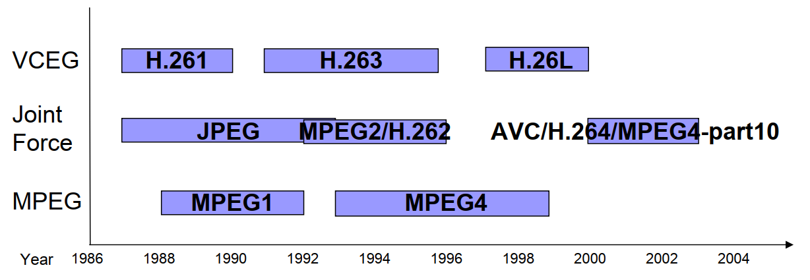
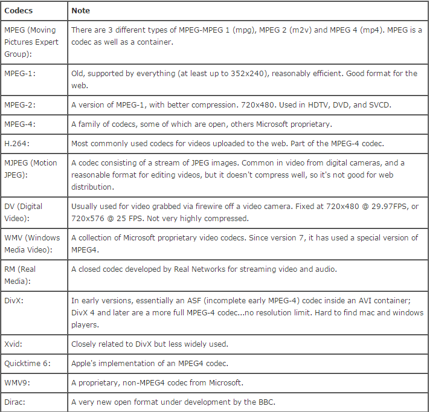

# 视频的编解码格式

## 概念术语

* 两大组织主导视频压缩的组织及其联合(joint)组织
  * ITU-T(VCEG) 

    ITU-T的中文名称是国际电信联盟远程通信标准化组织(ITU-T for ITU Telecommunication Standardization Sector), 它是国际电信联盟管理下的专门制定远程通信相关国际标准的组织。**ITU-T下属的第16研究组( ITU-T Study Group 16)，又称为VCEG(Video Coding Experts Group )**。它制定的标准有H.261、H.263、H.263+等，对于目前流行最广的，影响也是最大的H.264和H.265也有部分贡献。

  * ISO/IEC(MPEG) 

    国际标准化组织（ISO）是由各国标准化团体（ISO成员团体）组成的世界性的联合会，负责各种标准的制定。ISO/IEC下属的**ISO/IEC JTC 1 SC 29 / WG 11**组织，又称为**MPEG(Moving Picture Experts Group)**。它制定的关于视频编码方面标准有MPEG-1、MPEG-2、MPEG-4等。并且已经制定出来了最新的MPEG-7，并且计划公布MPEG-21。

  * [JVT](https://www.itu.int/en/ITU-T/studygroups/com16/video/Pages/jvt.aspx)

    联合视频小组**JVT( Joint Video Team )**成立于2001年，**由来组VCEG和MEPG的视频编码专家组成**，旨在开发高级视频编码规范。主要的工作成果是**ITU-T Rec. H.264 | ISO/IEC 14496-10**，即H.264/AVC/MPEG-4 part 10。
  
  * [JCT-VC](https://www.itu.int/en/ITU-T/studygroups/2013-2016/16/Pages/video/jctvc.aspx)
  
    视频编码联合协作团队**JVT-VC(Joint Collaborative Team on Video Coding)**，**是由VCEG和MPEG于2010年成立的视频编码专家组**，旨在开发**HEVC（High Efficiency Video Coding** ）标准。HEVC标准与当时最先进的AVC标准相比，新一代视频编码标准将进一步降低高质量视频编码所需的数据速率的50％。主要成果是**H.265/HEVP part 2**
  
  
  
* **JPEG**

  1986 年， ISO 和 CCITT 成立了联合图像专家组(Joint(ITU+ISO) Photographic Experts Group , **JPEG**)，研究连续色调静止图像压缩算法国际标准， 1992 年 7 月通过了 JPEG 标准。

* **MPEG**

  1988 年 ISO/IEC 信息技术联合委员会成立了活动图像专家组（**MPEG**， Moving Picture Expert Group）。 1991 年公布了 MPEG-1 视频编码标准，  1994 年 11 月，公布了 MPEG-2 标准 。

* **H.263**

  1995 年， ITU-T 推出 H.263 标准，用于低于 64 Kbps 的低码率视频传输 。

* **MPEG-4**

  1999 年 12 月份， ISO/IEC 通过了“视听对象的编码标准”——MPEG-4，它除了定义视频压缩编码标准外，还强调了多媒体通信的交互性和灵活性。

* **H.264/AVC**

  2003 年 3 月， JVT正式公布了 H.264/AVC(Advanced Video Coding)视频压缩标准，**H.264/AVC**/**MEPG-10 part 10是MPEG-4标准的一部分(MPEG-4 part10)**。H.264能够在低码率情况下提供高质量的视频图像，在较低带宽上提供高质量的图像传输；H.264可以根据不同的环境使用不同的传输和播放速率，并且提供了丰富的错误处理工具，可以很好的控制或消除丢包和误码。

* **H.265/HEVC**

  2013年6月和11月， ITU-T 和 ISO/IEC 分别正式公布了新一代视频压缩标准**H.265/HEVC(High Efficiency Video Coding)/MPEG-H part 2**，H.265旨在在有限带宽下传输更高质量的网络视频，与H.264相比，同样的视觉质量的视频只占用一半的空间，仅需原先的一半带宽即可播放相同质量的视频，或者具有相同文件大小和比特率的视频可能看起来更好。

## 视频处理流程

​       一 个基本的视频处理和通信系统通常包括采集、预处理、视频编码、通信、图像处理以及显示等几个步骤。

## 视频封装格式

> 视频文件格式（或者视频封装格式）是一种用于在计算机系统上存储数字视频数据的文件格式。视频格式实质是视频文件的编码方式，几乎都会使用有损压缩的方式来存储视频，以减小文件的大小。

​		一个视频文件通常由包含视频编码格式（如VP9）的视频数据和音频编码格式（如Opus）的音频数据的容器（例如Matroska格式）组成。容器还可以包含同步信息、字幕和元数据（如标题）等。视频文件容器内的编码(encode)的视频和音频称为本质(essence)。

​		视频封装格式就是将已经编码处理的[视频数据](https://baike.baidu.com/item/视频数据/21410609)、[音频数据](https://baike.baidu.com/item/音频数据/20723495)以及字幕数据按照一定的方式放到一个文件中。我们现在看到的大部分视频文件，除了视频数据以外，还包括音频、字幕等数据，为了将这些信息有机地组合在一起，就需要一个容器进行封装，这个容器就是封装格式。严格意义上说，我们通常所说的是视频格式，指的就是视频封装格式

​      编码格式与封装格式的名称有时是一致的，例如MPEG、WMV、DivX、XviD、RM、RMVB等格式，既是编码格式，也是封装格式；有时却不一致，例如MKV是一种能容纳多种不同类型编码的视频、音频及字幕流的“万能”视频封装格式，同样以mkv为扩展名的视频文件，可能封装了不同编码格式的视频数据。

​		目前常见的**视频封装格式**如下：

|视频文件格式|&nbsp; &nbsp; &nbsp; &nbsp; &nbsp; &nbsp; &nbsp; &nbsp; &nbsp; &nbsp;Corporation/Organization&nbsp; &nbsp; &nbsp; &nbsp; &nbsp; &nbsp; &nbsp; &nbsp; &nbsp; &nbsp;|
|:--:|:--:|
|**.WEBM**|Google|
|**.MPG**, **.MP2**, **.MPEG**, **.MPE**, **.MPV**|MPEG|
|**.OGG**|OGGVobis(oggVorbis)|
|**.MP4**, **.M4P**, **.M4V**|MPEG|
|**.AVI**|Microsoft|
|**.WMV**|Microsoft|
|**.MOV**,**.QT**|Apple|
|**.FLV**, **.SWF**|Adobe|
|**AVCHD**|Sony & Panasonic|

## 视频编码格式

​		**视频编码方式**就是指通过特定的压缩技术，将某个视频格式的文件转换成另 一种视频格式文件的方式。视频编码格式来源于有关国际组织、民间组织和企业制定的视频编码标准。研究视频编码的主要目的是在保证一定视频清晰度的前提下缩小视频文件的存储空间。

​	   由于视频编码的主要任务是缩小视频文件的存储空间，因此，视频编码又称视频压缩编码或视频压缩，简单地说就是去除视频数据中的冗余信息。可以对视频或音频进行编码(encode)和解码(decode )的程序（或硬件）称为编解码器( codec)。

​	 目前常见的视频编码格式如下

​	

| 视频编解码格式 | &nbsp; &nbsp; &nbsp; &nbsp; &nbsp; &nbsp; &nbsp; &nbsp; &nbsp; &nbsp;Corporation/Organization&nbsp; &nbsp; &nbsp; &nbsp; &nbsp; &nbsp; &nbsp; &nbsp; &nbsp; &nbsp; |
| :------------: | :----------------------------------------------------------: |
|   **MPEG-1**   |                             MPEG                             |
|   **MPEG-2**   |                             MPEG                             |
|   **MPEG-4**   |                             MPEG                             |
|   **H.264**    |                             JVT                              |
|   **H.265**    |                            JCT-VC                            |
|    **WMV**     |                          Microsoft                           |
|   **MJEPG**    |  MJEPG(Motion Joint Photographic Experts Group)/MJPG(缩写)   |
| **DivX/XviD**  |              MPEG-4的衍生编码标准(后者是免费版)              |
|    **VP9**     |                            Google                            |

## 视频编解码器，视频容器和视频文件格式之间的区别

​        视频文件由两部分组成：编解码器(**codec**)和容器( **container**)。

​        视频编解码器是用于对视频进行编码和解码的协议（单词编解码器来自“ enCOde / DECode”）。常见的编解码器包括H.264，MPEG-4和DivX。精心设计的编解码器具有很高的效率，或者可以在减小文件大小的同时保持质量。

​        容器(文件)格式(**file format**)是文件元数据和数据结构的定义，不包括视频的实际编码方式（编解码器确定）。容器文件保存使用编解码器编码的元数据和压缩视频数据。容器格式通常也称为“格式”，并反映在文件的扩展名中。常见的容器格式括.AVI，.MP4和.MOV。容器格式可以与不同的编解码器配对，这些编解码器会影响文件兼容的设备和程序。

​	

## 补充 

 ### 视频码率

​		**视频码率(bit rate)**就是数据传输时单位时间传送的数据位数，一般我们用的单位是kbps即千位每秒。通俗一点的理解就是取样率，单位时间内取样率越大，精度就越高，处理出来的文件就越接近原始文件。

​		码率计算公式：

​					
$$
码率 = \text{采样率} \times \text{位深度} \times \text{通道数}
$$
​		

 码率的单位：

  * bps

    比特率表示每秒的比特(bit)数，单位$bit/s$。**bps是$bit/s$的非标准缩写**, 其中b代表bit, p表示percent($/$), s表示second。

    具体的换算公式如下
    $$
    1Kbps = 1000bps = 1000 bit/s \\
    1Mbps = 1000Kbps = 1000000bps = 1000000bps \\
    1Gbps = 1000Mbps = 1000000Kbps = 1000000000bps
    $$
    注意：这里为近似计算，在真实的情况中响应的倍数为1024。

  * Bps

    我们可能还会遇到另一种格式的单位$Bps$，表示每秒的字节(Byte)数,  1 字节对应8比特$ Byte = 8bit $, 容易得出
    $$
    1 Bps = 1 B/s = 8 bit/s = 8bps
    $$
    同理，也可以换算成对应的单位

* 实例计算

  对于CD格式音频：使用$44.1kHz$的采样率, 每个采样深度为$16bit$，2个信道。

  码率的计算结果如下：
  $$
  44100 \times 16 \times 2 = 1411200bps = 1411.2Kbps = 1.4112Mbps
  $$
  音频数据长度（不包括文件头或其他元数据）的总的大小可以使用以下公式计算：
  $$
  {\displaystyle {\text{bits_size}}={\text{sample rate}}\times {\text{bit depth}}\times {\text{channels}}\times {\text{time}}.}
  $$
  以字节(byte)为单位的大小通过以位(bit)为单位的大小除以8得到：
  $$
  byte\_size = \frac{bit\_size}{8}
  $$
  

   因此对于一个80分钟($80\times 60 == 4800$)的音频数据，所占的存储空间的大小计算如下：
  $$
  {\displaystyle {\frac {44,100\times 16\times 2\times 4800}{8}}=846,720,000\ {\text{bytes}}\approx 847\ {\text{MB}}}
  $$
  

## 参考资料

* [参考资料一](https://blog.filestack.com/thoughts-and-knowledge/complete-list-audio-video-file-formats/ "filestack")
* [参考资料二](https://tech.ebu.ch/docs/techreview/trev_293-schaefer.pdf "H.264")
* [参考资料三](https://www.ece.ucsb.edu/courses/ECE241/241_S07Gibson/H264_MultimediaClass.pdf )
* [参考资料四](https://www.jianshu.com/p/9522c4a7818d "简书")
* [参考资料五](https://medium.com/advanced-computer-vision/h-264-vs-h-265-a-technical-comparison-when-will-h-265-dominate-the-market-26659303171a "medium")
* [参考资料六](https://www.jianshu.com/p/4def60dd594f "简书")
* [参考资料七](https://en.wikipedia.org/wiki/MPEG-4 "MPEG-4")

